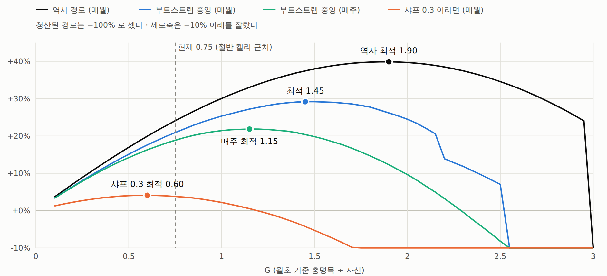

# 최종 전략 — 시계열 추세(TSMOM) + α

← [README](../README.md) · [실험 카탈로그](INDEX.md) · [용어집](GLOSSARY.md)

> **투자 권유가 아니다.** 아래 숫자는 전부 과거 백테스트(표본 안)다. 기준 전략의 샤프 t 값은 1.46 으로 **통계적으로 유의하지 않다.**
> 봉인 창(2026-07-05 00:05 ~ 09-24)은 아직 열지 않았다.

원문: 문서 [83](experiments/083_시계열추세-트레이딩방법-상세.md)(운용 — 최신판), [78](experiments/078_시계열추세-사이징-레버리지-결과.md)(사이징 · 레버리지), [80](experiments/080_시계열추세-복리주기-결과.md)(복리 주기), [82](experiments/082_시계열추세-매월갱신-최적G-결과.md)(최적 G).

**무엇에 돈을 거는가**: 47개 코인 각각 "28일 전보다 높으면 롱, 낮으면 숏", 매주 월 00:00 UTC 리밸런스.
ICT 단기 셋업은 비용과 표본 밖 검정을 하나도 넘지 못했고, 끝까지 남은 것은 문헌에서 가져온 이 **주간 시계열 추세**다.
47개로 나눠 들어도 베팅은 사실상 하나 — 크립토 시장 전체의 한 달 추세다([68](experiments/068_시계열추세-시장방향-분해.md)).

## 1. 규칙

| 항목 | 값 | 근거 · 판정 |
|---|---|---|
| 유니버스 | OKX USDT 무기한 **47종** 고정([데이터](DATA.md) 목록) | 문서 [61](experiments/061_OKX-47심볼-데이터감사-및-봉인규칙.md), [63](experiments/063_예전신호16종-수익곡선-변곡점.md) |
| 가격 | **UTC 일 종가** (00:00 UTC 직전 마지막 가격, 5분봉에서 만든다) | 문서 [83](experiments/083_시계열추세-트레이딩방법-상세.md) |
| 신호 | 매주 **월 00:00 UTC**(한국 월 09:00): `sign(오늘 종가 / 28일 전 종가 − 1)` → +1 롱 / −1 숏, 플랫 없음 | 문서 [40](experiments/040_시계열추세-주간리밸런스-사전등록.md) (28일은 문헌값 — 데이터에서 고르지 않았다) |
| 비중 (+α ①) | **역변동성**: 직전 60일 일간 로그수익 표준편차 σ_i (최소 20일), a_i ∝ 1/σ_i, Σa = 1 | 문서 [78](experiments/078_시계열추세-사이징-레버리지-결과.md) — 성과는 동일 명목과 같아 **채택 기준은 못 넘었다(사용자 선택)** |
| 총노출 (+α ②) | **G = 0.75** (자산 대비 총명목) | 문서 [78](experiments/078_시계열추세-사이징-레버리지-결과.md), [82](experiments/082_시계열추세-매월갱신-최적G-결과.md) — 사용자 선택. −50% 낙폭 한도 권장(0.40)보다 크고, 절반 켈리 근처 |
| 복리 (+α ③) | **B = 달력 월 첫 월요일 00:00 UTC 의 계좌 총자산**, 한 달 고정. 목표 명목_i = sign_i × a_i × G × B | 문서 [80](experiments/080_시계열추세-복리주기-결과.md) — **사전등록 판정 채택** |
| 증거금 | **교차(cross).** 청산은 G 와 유지증거금률만으로 정해진다(G = 레버리지 × (1 − 잉여 비율)) | 문서 [78](experiments/078_시계열추세-사이징-레버리지-결과.md) |
| 체결 | 신호 확정 직후 **시장가**(6bps 가정), 줄이는 주문 먼저 | 문서 [76](experiments/076_시계열추세-금신호-월시가-주말갭지정가-결과-기각.md), [83](experiments/083_시계열추세-트레이딩방법-상세.md) — 늦추는 변형은 전부 기각 |
| 보유 | 1주. 손절 · 익절 · 주중 개입 **없음** | 문서 [83](experiments/083_시계열추세-트레이딩방법-상세.md) |

## 2. 성과 (269주, 2021-05-03 ~ 2026-06-22 시작, 봉인 전, 되맞춤 수수료 6bps · 펀딩 포함)

| 구성 | 5년 | 연복리 | 최대낙폭(장중) | 샤프 | 실효 G | 섞은 연복리 중앙 | 섞은 낙폭 중앙 · 95% |
|---|---:|---:|---:|---:|---:|---:|---:|
| 역변동성 · G 0.75 · 매주 갱신 | 2.72배 | +21.3% | −36.5% | 0.68 | 0.75 고정 | +18.9% | −49% · −72% |
| **역변동성 · G 0.75 · 매월 갱신 (최종)** | **3.05배** | **+24.1%** | **−35.5%** | **0.73** | 0.57 ~ 0.93 | **+20.9%** | **−48% · −70%** |
| 역변동성 · G 1.0 · 매월 | 3.90배 | +30.1% | −45% | | 최대 1.34 | +25.3% | −59% · −82% |
| 역변동성 · G 1.45 · 매월 (복리 최대) | 5.19배 | +37.5% | −59% | | 최대 2.29 | +29.2% | −76% · −94% |

- 비교 기준(문서 [83](experiments/083_시계열추세-트레이딩방법-상세.md)): 동일 명목 · G 1 · 270주 — 샤프 0.64 (t 1.46), 연복리 22.5%, 최대낙폭 −46.1%. 온전한 269주만 쓰면 샤프 0.68.
- 매월 갱신이 이긴 이유(사후 서술): 전략 손익이 몇 달 단위로 되돌아온다 — 분산비 13주 0.52 (p 0.014) · 26주 0.36 (p 0.015).
  주 순서를 무작위로 섞으면 차이가 0(−0.03%p) — **잃을 건 거의 없고, 되돌림이 이어지면 연 1 ~ 3%p 를 더 얻는다.**
- G 에 따라: 샤프가 0.5 면 복리 최대 G 는 1.10, 0.3 이면 0.60. G 2.2 부터 섞은 경로의 22.5% 가 청산된다.

*문서 [80](experiments/080_시계열추세-복리주기-결과.md) — 갱신 주기별 누적 자산 (로그 축). 보고서: [`out/tsmom_compound.html`](../out/tsmom_compound.html)*

*문서 [82](experiments/082_시계열추세-매월갱신-최적G-결과.md) — G 별 연복리. 보고서: [`out/tsmom_optg.html`](../out/tsmom_optg.html)*

## 3. 확정되지 않은 것

1. **통계적으로 유의하지 않다.** 샤프 0.64 (t 1.46), 표준오차 약 0.45 — 진짜 샤프는 0 근처일 수도, 1 을 넘을 수도 있다. t 2 로 확인하려면 약 10년이 필요하다.
2. **lookback 띠**: 26 ~ 36일에서만 샤프 0.42 ~ 0.65. 14일 0.00 · 56일 0.16 — 이 띠가 앞으로도 유지되는지가 가장 큰 위험.
3. **매월 갱신의 이점은 사후에 찾은 성질**(되돌림)에 기댄다.
4. **펀딩 이력이 없다** — 과거 5년에 실측 3개월 평균을 고정했다. 강세장 롱 구간에선 비용이 된다.
5. **생존 편향** — 47종은 2026 년에도 OKX 에 남은 코인이다.
6. **분산 효과가 작다** — 사실상 시장 추세 베팅 하나. 한 주 −22.3%(G 1), 67주 수면 아래 구간이 있었다.
7. **봉인 창(2026-07-05 00:05 ~ 09-24)은 열지 않았다** — 사용자 확인 뒤 한 번만, 큰 실패를 거르는 용도.

## 4. 코드

- 기준 전략: [`qbot/research/legacy.py`](../qbot/research/legacy.py) 의 `tsmom_weekly`
- 비중 · 장부 · 복리 주기 · 장중 경로 · 교차 증거금 청산: [`qbot/research/sizing.py`](../qbot/research/sizing.py)
- 재현 순서: [README 의 재현](../README.md#재현)

실거래 구현은 이 저장소의 범위가 아니다(별도 핸드오프가 맡는다).
