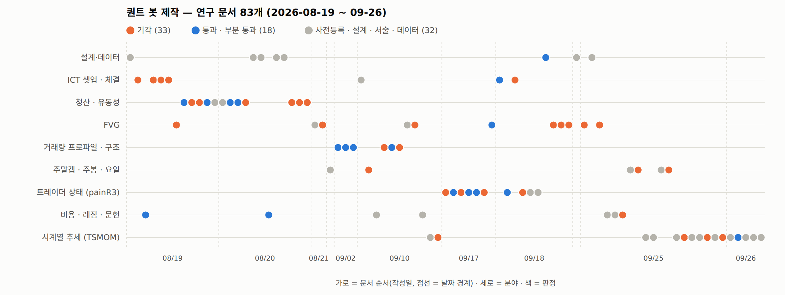

# 연구 여정 — 9단계

← [README](../README.md) · [실험 카탈로그](INDEX.md)

괄호 안 숫자는 실험 문서 번호(링크). 2026-08-19 ~ 09-26, 5주, 문서 83개.

*가로 = 문서 순서(작성일), 세로 = 분야, 색 = 판정. 주황 = 기각(33), 파랑 = 통과 · 부분 통과(18), 회색 = 사전등록 · 설계 · 서술 · 데이터(32).*

## 1단계 · 08-19 — 백테스트 코어와 ICT 단기 셋업 (1 ~ 14)

- **코어**([1](experiments/001_backtest-core-설계.md)): 피보나치 좌표로 TP/SL 을 관리하는 엔진, 진입은 플러그인. 합성 데이터에서 벌써 **수수료가 1R 의 47%**.
- **실데이터 4H**([2](experiments/002_실데이터-4H-검증결과.md)): 60개 조합의 총R 이 전부 ±0.05R — 피보 TP/SL 틀은 엣지가 아니라 위험 관리 그릇이다.
- **ATR 상위 봉 선별**([3](experiments/003_ATR-봉선별-검증결과.md)): 총R 을 약 3배(+0.020 → +0.061R)로 올렸지만 순R −0.006R, 손익분기 직전.
- **피보 레벨**([4](experiments/004_피보레벨-진입승률-분석.md)): 되돌림 진입은 음수. 극단 레벨 돌파는 10/10 심볼에서 견고하지만 비용 후 +0.71bps.
- **장대봉 → CHoCH**([5](experiments/005_장대봉-CHoCH-검증결과.md), [6](experiments/006_장대봉-합성봉-CHoCH-검증결과.md)): 같은 1R 의 무작위 진입과 같다(50.41% vs 50.51%) → **무작위 진입 대조군을 상설 기준선으로.**
- **FVG mid 진입**([7](experiments/007_FVG-mid진입-검증결과.md)): +2.36%p 는 1R 이 5분봉보다 작아 생긴 측정 아티팩트 → **측정해상도 규칙**의 기원.
- **청산 이벤트**([8](experiments/008_청산이벤트-거래량복귀-검증결과.md), [9](experiments/009_청산이벤트+CHoCH-결합-검증결과.md), [10](experiments/010_청산이벤트-트리거비교-CISD포함.md), [11](experiments/011_청산이벤트-상위컷-부호반전.md), [12](experiments/012_청산극단재테스트-펀딩반영-최종.md), [13](experiments/013_청산-좁힌컷-트리거3종-전면비교.md), [14](experiments/014_청산-되돌림지정가진입-검증결과.md)): 캐스케이드 뒤 거래량이 가라앉을 때의 반전은 실재(t ≈ 8.5, 10/10 심볼)하지만 +3.2bps vs 비용 10bps.
  CHoCH 를 붙이면 확정 지연(중앙 21.6봉) 동안 엣지가 사라지고, CISD 는 83% 를 되살린다. 소진량 상위 컷에서 부호가 뒤집혀 '연속 방향' 으로 바꾸고,
  되돌림 지정가 진입까지 얹어 **순R +0.1125 (t 3.10, 9/10 심볼)** — 그러나 144셀 탐색의 기대 최대 |t| 가 2.8 ~ 3.3 이다.
- **교훈**: 비용이 엣지와 같은 자릿수다. 탐색한 셀 수만큼 기준을 올려야 한다.

## 2단계 · 08-20 — 청산 히트맵 · OKX 데이터 · 첫 표본 밖 검정 (15 ~ 24)

- **청산 히트맵**([15](experiments/015_청산히트맵-설계검증.md), [16](experiments/016_청산히트맵-수정완료-v3.md), [24](experiments/024_청산히트맵-실측검증-기각.md)): v2 의 자석 신호(+2.28%p)는 시간순서 버그였다. 실측 검정에서 **거울 대조군이 효과의 125% 를 재현** → 레벨 정보 없음, 기각.
- **OKX API**([17](experiments/017_OKX-추가데이터-수집설계.md), [18](experiments/018_OKX-probe결과-가용성판정.md), [20](experiments/020_OKX-추가데이터-가용성판정.md), [21](experiments/021_OKX-보존한계-실측-전방기록전환.md)): 펀딩 이력은 약 94일, OI · 롱숏비율 · 테이커 거래량은 보존이 며칠 → 소급 불가, 전방 기록만.
- **펀딩 실측**([19](experiments/019_펀딩-실측결과-가정검증.md)): 평균 **+0.137bps / 8h**(양수 67%) — 가정보다 유리. TRX 제외 결정([19](experiments/019_펀딩-실측결과-가정검증.md))은 근거 부족으로 철회([22](experiments/022_TRX제외-재집계-기록.md)).
- **표본 밖(OOS)**([23](experiments/023_OOS검증-결과-후보3종-기각.md)): IS 최고 후보 3종이 OOS 에서 **전부 음수**(−0.0119 · −0.0568 · −0.0301R). IS 성과는 144셀 탐색의 선택 편향(사실상 2024년 한 해).
- **교훈**: 표본 안 최고 t 3.1 도 표본 밖에선 사라진다.

## 3단계 · 08-21 ~ 09-02 — 사전등록 도입 · 추세추종 FVG · 주말 갭 · 거래량 프로파일 (25 ~ 30)

- **사전등록 시작**([25](experiments/025_추세추종-FVG-사전등록.md)): 규칙 · 판정을 실행 전에 고정. **추세추종 FVG**([26](experiments/026_추세추종-FVG-IS결과-기각.md)) 15셀 전부 순R 음수(최고 t −0.58) — 다만 4H 정렬 필터의 기여를 처음 확인.
- **주말 갭**([27](experiments/027_주말갭-사전등록-및-IS결과.md)): 200bps 넘는 주말 갭은 60.73% 메워지고 순R +0.151 (t 2.57, 9/10 심볼) → OOS 를 사전등록.
- **거래량 프로파일(VP)**([28](experiments/028_VP검증-자석은약하게-지지저항은반대.md), [29](experiments/029_VP검증-TF별-5m15m1H4H.md), [30](experiments/030_VP검증-전구간-TF별-최종.md)): 고거래량 구간으로 끌리는 '자석' 은 약하게 있다(5m +0.059, t 8.9). **지지저항은 교과서와 반대** — 고밀도일수록 더 잘 뚫린다(통로).
  POC 는 목표물로 무효. 표본을 두 배로 늘리자 4H 결과가 잡음으로 드러나 결론을 정정했다([30](experiments/030_VP검증-전구간-TF별-최종.md)).

## 4단계 · 09-10 — 구조 센서스 · 우선순위 · 연쇄 기각 · 문헌 (31 ~ 39)

- **스윙 센서스**([31](experiments/031_스윙센서스-5m15m1H-lb3.md)): 스윙 1,293,676개. 구조는 TF 에 걸쳐 같고(스케일 불변), 되돌림은 고전 fib 레벨에 뭉치지 않는다.
- **주말 갭 OOS**([32](experiments/032_주말갭-OOS결과-기각.md)): **+0.0070R (t 0.13) — 기각.** IS 성과는 2025년 한 해 현상. (이 문서에 산수 오류 정정이 함께 있다.)
- **종합 우선순위**([33](experiments/033_종합-트레이딩적용-우선순위.md)) → 1위 '큰 레그 + 두꺼운 VP 돌파' 는 **거울이 79 ~ 89% 재현**, 거래량이 필요 없는 레인지 기하 효과로 기각([34](experiments/034_1위후보-심층검정-기각.md), [35](experiments/035_4항목-전면재검증-및-결합.md), [36](experiments/036_vp돌파-HTF정렬결합-기각.md)).
- **1H 레그 × 4H 정렬**([37](experiments/037_1H레그-4H정렬-사전등록.md), [38](experiments/038_1H레그-1단계결과-기각.md)): 1R 이 1.44배만 커져 순R 제자리(−0.0123) → 1단계에서 기각.
- **외부 문헌 조사**([39](experiments/039_외부문헌조사-다음가설-후보.md)): "문제는 1R 이 아니라 **보유 기간**" — 시간 단위에선 수수료 / 이동폭이 7.8%, 7일이면 0.9%. 시계열 추세(Han · Kang · Ryu, 28일)를 다음 후보로.

## 5단계 · 09-10 — 시계열 추세 첫 검정 (40 ~ 41)

- 사전등록 2단계(대형5 개발 → 소형5 확인)([40](experiments/040_시계열추세-주간리밸런스-사전등록.md), [41](experiments/041_시계열추세-시뮬레이션결과.md)): 대형5 **샤프 0.99 (t 2.26)** 통과 → 소형5 0.46 · 숏 신호 구간 음수로 **2단계 기각.** 원문 표현으로 "가장 아까운 기각".

## 6단계 · 09-17 ~ 09-18 — 합성 트레이더 집단 · painR3 · 같은 잣대 재측정 (42 ~ 54)

- **합성 트레이더 집단**([42](experiments/042_합성트레이더집단-풍부도사다리-결과.md), [43](experiments/043_트레이더집단-지표별손절-재설계.md), [44](experiments/044_손절밀도맵-거래량실증-기각.md)): 지표마다 자기 손절을 가진 가상 참가자. '손절 군집 → 반전' 가설은 기각, 대기 손절이 많을수록 이후 거래량이 오히려 준다(t −56.9).
  남은 것은 **물림(미실현손실) 상태**.
- **painR3**([45](experiments/045_포지션객체-미실현손실총량-검정.md), [50](experiments/050_painR3-해부-TF시차용량반응독립성.md)): Σ|미실현손실| 의 롱/숏 불균형. t 5.73 (10/10) → 추세 · 변동성 · 개수불균형을 다 빼도 **+0.2797 (t 7.32)** — 이 프로젝트에서 가장 견고한 신호.
- 그러나 ICT 필터로 얹은 '통과'([46](experiments/046_미실현손실-ICT조건변수-검정.md))는 **진입봉 오염**이었고([47](experiments/047_ICT조건변수-TF복제및시차프로파일-기각.md)), 배리어 · 시간청산 · 워크포워드 · 횡단면 롱숏 · IC 어디서도 **1 ~ 2bps vs 비용 8bps**([51](experiments/051_체결모델확정-및-painR3-3종검정.md), [52](experiments/052_painR3-횡단면롱숏-IC-최종기각.md)) → **최종 기각.**
  실체는 자체 설계 지표 pivot_break 한 부류의 효과였다([53](experiments/053_painR3-트레이더명부-및-타당성의심지점.md), [54](experiments/054_painR3-심층분해-집단이아니라부류.md)).
- **규칙 전수 감사 · 같은 잣대**([48](experiments/048_규칙적용-전수감사-및-FVG기준선.md), [49](experiments/049_신호군3종-동일잣대-재측정.md)): FVG 는 1h ~ 4h 에서 치환 대조군 대비 +0.06 ~ 0.07R — 작지만 일관된 양수, 비용 후 손익분기. 청산 이벤트 +0.01R, CHoCH 0 이하.
- **체결 모델 확정**([51](experiments/051_체결모델확정-및-painR3-3종검정.md)): 지정가 진입 · 지정가 익절 · 스톱 시장가 손절, 6 / 2bps.

## 7단계 · 09-18 — 코드 유실 → 재구축 (55)

- 코드베이스가 유실돼 **문서의 정의대로 다시 짰다**([55](experiments/055_코드베이스-유실-및-재구축-검수.md)). 데이터 행 수 완전 일치(BTC · ETH · SOL 552,960), FVG 거래 수 오차 0.03%, painR3 +0.3045 vs 문서 +0.3030. 테스트 163개.
  **문서 1 ~ 54 가 가리키는 스크립트 일부는 이때 사라졌다** — 재구축된 것은 `qbot/research/legacy.py` 등.

## 8단계 · 09-18 ~ 09-25 — FVG 마지막 시도 · 47심볼 · 체제 변화 · 비용 스위치 (56 ~ 67)

- **FVG**: 1R 확대는 엣지를 줄이지 않는 유효한 레버(손익분기 1R ≈ 150bps)지만 홀드아웃 12개월에서 붕괴([56](experiments/056_FVG-1R확대-3레버-기각.md)). 관통 후 CHoCH 진입 기각([57](experiments/057_FVG관통-스윕CHoCH-기각-및-엣지부재.md)). 1R 게이트 불안정([58](experiments/058_FVG-1R게이트-안정성검사-불안정.md)), 47심볼로도 불안정([60](experiments/060_FVG-47심볼-게이트안정성-재검사.md)).
- **데이터**: OKX 47심볼 5분봉 수집기([59](experiments/059_OKX-5분봉-수집기-사용법.md)) · 수집 · 감사 · **봉인 규칙**([61](experiments/061_OKX-47심볼-데이터감사-및-봉인규칙.md)).
- **체제 변화**([62](experiments/062_FVG-2024분할-체제변화와-최근창-워크포워드.md)): 4h FVG 엣지는 2021 ~ 23 년 +0.09 ~ +0.11R → **2024 년부터 소멸.** 반대로 걸기 · 최근 창으로 고르기(워크포워드)도 실패.
- **예전 신호 16종 변곡점**([63](experiments/063_예전신호16종-수익곡선-변곡점.md)): 2022 여름 꺾임은 변동성 하락으로 1R 이 줄어 고정 수수료 부담이 커진 탓. **수수료 후 꾸준히 오른 건 시계열 추세뿐**(47심볼 샤프 0.641).
- **비용 상태 스위치**([64](experiments/064_비용상태스위치-사전등록.md), [65](experiments/065_비용상태스위치-결과-기각.md)): 15개 신호 전부 기각. **주말 갭 × 4H 정렬 × 15m CISD**([66](experiments/066_주말갭-4H정렬-CISD-사전등록.md), [67](experiments/067_주말갭-4H정렬-CISD-결과-기각.md)): 5개 전부 기각.

## 9단계 · 09-25 ~ 09-26 — 시계열 추세 심화와 운용안 (68 ~ 83)

- **수익 분해**([68](experiments/068_시계열추세-시장방향-분해.md)): 수수료 전 주 +70.5bps = **시장 방향 +72.7** + 코인 선별 −2.1 (t −0.27). 47개로 나눠 들어도 베팅은 하나 — 크립토 시장 전체의 한 달 추세.
- **코인별**([69](experiments/069_시계열추세-코인별-변동성.md)): 변동성으로 나누면 코인 간 차이가 사라진다 — '같은 베팅, 다른 크기'.
- **얹어 본 규칙 — 전부 기각**: 주봉 캔들 · TGIF 요일 패턴([70](experiments/070_주봉캔들-꼬리몸통-및-TGIF-사전등록.md), [71](experiments/071_주봉캔들-꼬리몸통-및-TGIF-결과-기각.md)) · 뒤집기 보류 k 0.5 · 1 · 2 ATR([72](experiments/072_시계열추세-뒤집기보류-ATR-사전등록.md), [73](experiments/073_시계열추세-뒤집기보류-ATR-결과-기각.md); 샤프 0.64 → 0.04 · −0.46 · −0.46) ·
  금 종가 신호 → 월 시가 체결 · 주말갭 지정가([74](experiments/074_시계열추세-금신호-월시가-주말갭지정가-사전등록.md), [76](experiments/076_시계열추세-금신호-월시가-주말갭지정가-결과-기각.md); 0.30 · 0.42 · 0.25). **신호가 바뀐 직후를 늦추거나 놓치는 규칙은 모두 졌다.**
- **체결 시각 지도**([75](experiments/075_시계열추세-체결시각-168시간-지도.md), 서술): 주 168개 시각의 샤프 평균 0.70 · 표준편차 0.20. 금 장마감 0.78 vs 현행 0.68 은 주 +11.2bps (t 0.42) — 바꿀 근거 없음.
- **사이징 · 레버리지**([77](experiments/077_시계열추세-사이징-레버리지-사전등록.md), [78](experiments/078_시계열추세-사이징-레버리지-결과.md)): 코인 비중 방식(동일 · 역변동성 · 변동성 비례 · 변동성 타깃)은 성과가 같다 — 셋 다 채택 안 됨. **결과를 정하는 건 총노출 G.**
  교차 증거금 청산 G ≥ 2.61, 낙폭 한도로 정한 권장 G: −30% → 0.20, −50% → 0.40.
- **복리 주기**([79](experiments/079_시계열추세-복리주기-사전등록.md), [80](experiments/080_시계열추세-복리주기-결과.md)): 명목 기준 자산 B 를 **매월** 갱신 — 사전등록 세 조건 모두 통과해 **채택**(3.05배 vs 매주 2.72배).
- **최적 G**([81](experiments/081_시계열추세-매월갱신-최적G-사전등록.md), [82](experiments/082_시계열추세-매월갱신-최적G-결과.md)): 매월 갱신의 연복리 꼭대기 G ≈ **1.45**(부트스트랩 중앙 29.2%), 사용자 값 0.75 는 **절반 켈리**(최대의 72%).
- **운용 방법 상세**([83](experiments/083_시계열추세-트레이딩방법-상세.md)): 최종 전략의 규칙 · 절차 · 한계를 한 문서에.
