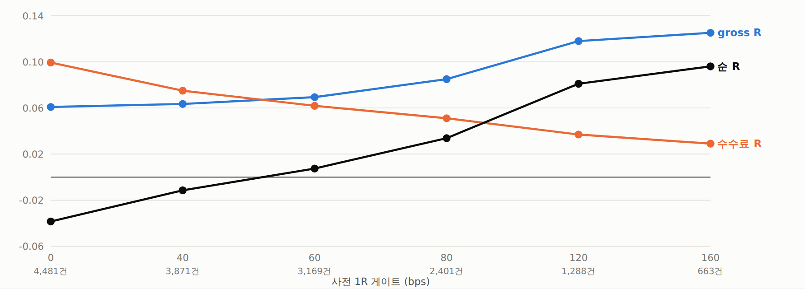
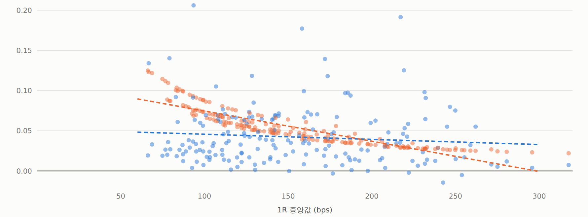
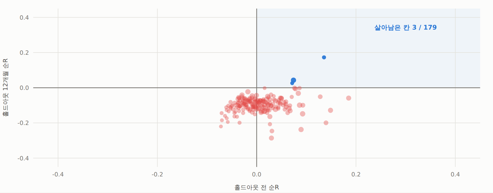

# FVG 1R 확대 — 기계는 도는데 홀드아웃이 없다

2026-09-18 · 10심볼 OKX 5분봉 2021-04-02 ~ 2026-07-05 · 192칸 × 10심볼 · 검정 163 통과

## 배경 — 왜 이걸 했나

[`규칙적용-전수감사-및-FVG기준선.md`](048_규칙적용-전수감사-및-FVG기준선.md): 측정해상도 규칙을 걸면 FVG 는 1h~4h 에서
치환 대조군 대비 **+0.06~0.07R** 이 일관되게 나온다. 비용이 거의 같은 크기라
4H 가 손익분기, 1D 가 +0.009R.

[`1H레그-1단계결과-기각.md`](038_1H레그-1단계결과-기각.md): **TF 사다리는 이미 기각됐다.** 15m→1H 로 올렸더니
수수료 −33%, 총R −31% 로 둘이 같은 비율로 줄어 순R 이 제자리였다.

[`추세추종-FVG-IS결과-기각.md`](026_추세추종-FVG-IS결과-기각.md) 가 남긴 다음 가설 #2: *"1R ≥ 손익분기 bps × k 라는
**사전** 게이트를 규칙의 일부로 넣는다(사후 분위 선택이 아니라)."* — 이번에 실행한 것.

## 사전등록 (탐색 전 고정)

| | |
|---|---|
| 레버 L1 | 진입 깊이 `entry_level` ∈ {0.0, 0.25, 0.5(기존), 0.75} |
| 레버 L2 | 손절 확장 `stop_ext` ∈ {0.0(기존), 0.25, 0.5, 1.0} — 먼 끝에서 갭×m 만큼 더 |
| 레버 L3 | 사전 1R 게이트 `min_risk_bps` ∈ {0, 40, 60, 80, 120, 160} |
| 고정 | TF ∈ {1h, 4h} 둘뿐 · TP 2R / SL 1R · 측정해상도 규칙 상시 · 지평 2016봉 |
| 비용 | 진입 maker 2 + 승 maker 2 / 패·모호·미해결 taker 6 bps |
| 대조군 | 치환(1R bps 분포·방향·심볼 고정, 진입 시점만 섞음) |
| **주 지표** | **4h × entry_level 0.5 × stop_ext 0 × 게이트 120bps** — 비용 산술로 정한 한 칸 |
| 판정 | 순R > 0 · 월 클러스터 t > 2 · 심볼+ ≥ 7/10 · 홀드아웃 12개월도 양수, **넷 다** |

TP 1R 은 금지했다 — 진입봉 편향에 취약하다(추세추종 FVG 문서에서 승률 54.6% → 51.5%).

## 판정: 기각 (4개 중 1개 통과)

| 기준 | 결과 | |
|---|---|---|
| 순R > 0 | **+0.0810** (거래가중) / +0.0971 (월평균) | 통과 |
| 월 클러스터 t > 2 | **1.20** | 미달 |
| 심볼+ ≥ 7/10 | **6/9** | 미달 |
| 홀드아웃 12개월 양수 | +0.0168 (t 0.08, 5/13월) | 사실상 0 |

거래 1,288건 · 1R 중앙 173.6bps · 승률 37.1% · 무승부 0.5% · 치환 대조군 −0.0043.

## 그런데 기각의 이유가 예상과 다르다

### 1R 을 키워도 엣지가 줄지 않는다 — TF 사다리와 정반대

거래 500건 이상인 **181칸**에서:

| 상관 | 값 |
|---|---:|
| 1R 중앙 ↔ gross | **−0.098** (사실상 0) |
| 1R 중앙 ↔ 수수료 | −0.883 |
| 1R 중앙 ↔ 순R | **+0.402** |

1R 구간별 평균:

| 1R 구간 | 칸 | 1R중앙 | gross | 대조군 | 수수료 | 순R |
|---|---:|---:|---:|---:|---:|---:|
| 0~70bps | 3 | 67.2 | +0.0621 | −0.0089 | 0.1232 | −0.0611 |
| 70~100 | 30 | 89.2 | +0.0435 | +0.0083 | 0.0882 | −0.0448 |
| 100~140 | 52 | 119.2 | +0.0406 | +0.0076 | 0.0621 | −0.0215 |
| **140~200** | 54 | 166.7 | +0.0454 | +0.0010 | 0.0436 | **+0.0018** |
| **200~** | 40 | 236.1 | +0.0374 | −0.0060 | 0.0285 | **+0.0089** |

> **손익분기 1R ≈ 150bps.** gross 는 1R 과 무관하게 평평하고 수수료만 쌍곡선으로 떨어진다.
> `1H레그` 에서 총R 이 수수료와 같은 비율로 줄었던 것과 **결정적으로 다르다** —
> TF 를 올리는 것과 같은 TF 에서 큰 갭만 고르는 것은 전혀 다른 일이었다.

### 게이트 사다리 (4h · mid · 손절확장 0)

| 게이트 | 거래수 | 1R(bps) | gross | 수수료 | 순R | t(월) | 홀드아웃 전 | t | 홀드아웃 12개월 | t |
|---|---:|---:|---:|---:|---:|---:|---:|---:|---:|---:|
| 0 | 4,481 | 84.0 | +0.0609 | 0.0994 | −0.0384 | 0.24 | +0.0192 | 0.61 | −0.0304 | −0.37 |
| 40 | 3,871 | 94.2 | +0.0635 | 0.0750 | −0.0114 | 0.10 | +0.0244 | 0.68 | −0.0572 | −0.84 |
| 60 | 3,169 | 108.0 | +0.0694 | 0.0619 | +0.0075 | −0.13 | +0.0102 | 0.27 | −0.0561 | −0.53 |
| 80 | 2,401 | 129.4 | +0.0850 | 0.0511 | +0.0338 | 1.14 | +0.0463 | 0.95 | +0.0830 | 0.46 |
| **120** | 1,288 | 173.6 | +0.1180 | 0.0370 | +0.0810 | 1.20 | +0.1117 | 1.29 | +0.0168 | 0.08 |
| 160 | 663 | 219.2 | +0.1252 | 0.0291 | +0.0961 | 1.84 | **+0.2720** | **2.45** | **−0.2198** | −1.25 |

게이트 160 에서 홀드아웃 전 t 2.45 로 처음 유의해진다. **같은 칸의 홀드아웃이 −0.2198 이다.**

## 홀드아웃 붕괴 — 여기서 끝난다

179칸(전체 거래 500건 이상 + 홀드아웃 표본 존재):

| | |
|---|---:|
| 홀드아웃 전 평균 순R | **+0.0064** (89칸 양수) |
| 홀드아웃 12개월 평균 순R | **−0.0972** (양수는 **3칸**, 무작위 기대 1) |
| 두 구간 상관 | +0.244 |

1R 구간을 어떻게 잘라도 홀드아웃 평균은 −0.09 언저리다. **1R 문제가 아니다.**

### 시장 기하 탓인가 — 15% 만

주 지표 칸에서 치환 대조군을 **그 구간 안에서만** 다시 추첨했다:

| 구간 | 거래수 | 실측 R | 승률 | 치환 대조군 | 차이 |
|---|---:|---:|---:|---:|---:|
| 홀드아웃 전 | 1,090 | +0.1780 | 39.1% | +0.0222 | **+0.1557** |
| 홀드아웃 12개월 | 228 | −0.1316 | 28.9% | −0.0263 | **−0.1053** |

대조군은 +0.022 → −0.026 (−0.048) 움직였고 실측은 +0.178 → −0.132 (**−0.310**) 움직였다.
**기하가 설명하는 건 15% 뿐이고 나머지는 FVG 고유의 붕괴다.**

다만 홀드아웃 표본이 228건이다. 승률 28.9% vs 손익분기 33.3% 는 −1.6σ 수준으로
**실패를 증명한 게 아니라 성공을 증명하지 못한 것**이다.

> 참고: 이 12개월(2025-07~2026-07)은 **painR3 계열에서도 똑같이 죽었다** —
> 횡단면 롱숏 −0.38bps · 시간청산 −1.21bps · 횡단면 IC +0.0007(t 0.57).
> 서로 독립인 신호 넷이 같은 12개월에 동시에 사라졌다.

## 새로 확정된 것

| 확정 | 근거 |
|---|---|
| **1R 확대는 유효한 레버다** | 1R↔gross 상관 −0.098 (181칸). TF 를 올릴 때와 달리 엣지가 따라 줄지 않는다 |
| **손익분기 1R ≈ 150bps** | 구간별 평균 순R: 67bps −0.061 → 167bps +0.002 → 236bps +0.009 |
| **손절 확장은 해롭다** | `stop_ext` 0.5·1.0 은 거의 모든 칸에서 음수. 1R 은 키우되 **손절 위치는 구조를 지켜야** 한다 |
| **진입 깊이는 약한 레버** | `entry_level` 0.0(갭 경계)은 1R 이 2배지만 gross 가 그만큼 낮다. mid 가 낫다 |
| **새 벽은 표본이다** | 게이트 0→160 에서 순R/거래는 25배 오르지만 거래가 4,481→663 (−85%). t 가 못 따라온다 |

## 다음에 할 수 있는 것 (우선순위)

1. **표본을 늘린다 — 심볼 축.** 1R ≥ 150bps 를 만족하는 4H FVG 는 심볼당 연 25건꼴이다.
   10심볼로는 t 를 못 만든다. OKX 상장 영구선물이 100개가 넘으므로 **심볼을 30~50개로
   늘리면** 같은 규칙에서 표본이 3~5배가 된다. 데이터 수집이 필요하다.
2. **전방 기록.** 홀드아웃 붕괴가 잡음인지 레짐인지는 2026-08~ 전방 데이터로만 갈린다.
   기존 `collect_forward.py` 설계를 5m OHLCV 로 확장하면 된다.
3. **하지 말 것**: 192칸에서 순R 상위 칸을 고르는 것. 사후 선택이고,
   상위 8칸 중 홀드아웃이 양수인 칸은 하나도 없다.

## 산출물

- `qbot/research/fvg.py` — `entry_level` · `stop_ext` · `min_risk_bps` 추가
- `examples/fvg_r_levers.py` → `results_fvg_levers.csv` (108,478행)
- `examples/fvg_r_levers_report.py`
- `out/fvg_levers.html`

## 그림

보고서: [FVG 1R 레버](../../out/fvg_levers.html) (`out/fvg_levers.html`)

*절: 게이트 사다리 — 기계는 정확히 예측대로 돈다*

*절: 1R 을 키우면 엣지도 줄어드는가 — 아니다*

*절: 홀드아웃 붕괴 — 여기서 끝난다*
