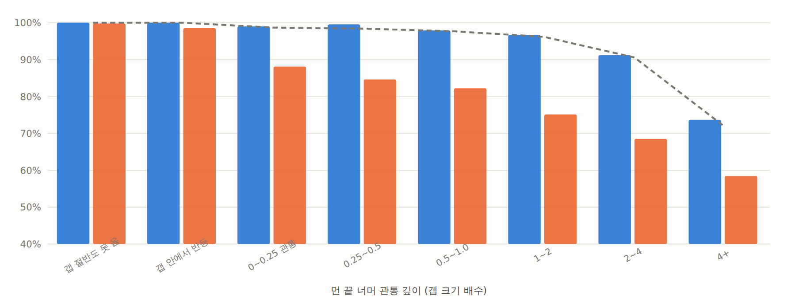
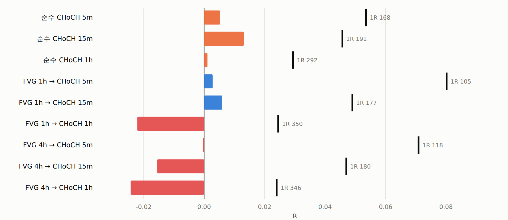

# FVG 는 뚫린다 — 전제는 틀렸고, 고쳐도 거래가 안 된다

2026-09-18 · 10심볼 OKX 5분봉 2021-04-02 ~ 2026-07-05 · 검정 184 통과

## 문제 제기

기존 FVG 셋업은 **"갭 관통 = 손절"** 을 전제로 손절을 먼 끝에 둔다.
실거래 관찰은 반대다 — 갭이 뚫린 **아래에서** 쓸고, CHoCH 가 난 뒤 반등하는 경우가 많다.
그렇다면 먼 끝 손절은 **반등이 시작되는 바로 그 자리에서 털리는** 규칙이다.

1R 을 키우는 레버를 더 돌리기 전에 이 전제부터 확인했다.

## 1단계 — 기하 (기술통계, 판정 없음)

갭의 가까운 끝을 처음 터치한 뒤, **회복 직전까지**의 최대 역행을 갭 크기 배수로 잰다.
(지평 전체의 최저를 쓰면 며칠간의 드리프트가 깊이로 잡혀 "스윕" 과 구분이 안 된다.)

| | 4h FVG | 1h FVG |
|---|---:|---:|
| 이벤트 | 16,874 | 66,915 |
| 갭 중앙 | 57.5bps | 25.3bps |
| **먼 끝을 뚫는 비율** (12시간) | **71.9%** | 85.1% |
| **먼 끝을 뚫는 비율** (7일) | **91.9%** | 96.1% |
| **뚫린 뒤 돌아오는 비율** (12시간) | **73.9%** | 82.0% |
| **뚫린 뒤 돌아오는 비율** (7일) | **90.3%** | 94.6% |

> **전제는 확실히 틀렸다.** 4H FVG 는 7일 안에 92% 가 뚫리고, 뚫린 것의 90% 가
> 가까운 끝까지 돌아온다. 먼 끝 손절은 반등 자리에 정확히 놓여 있다.

### 그런데 되돌림은 FVG 의 성질이 아니다

같은 크기·방향의 **가짜 갭**(무작위 시점)과 비교 (4h, 7일):

| 관통 깊이 | 건수 | 비중 | 실측 회복률 | 가짜갭 | 차이 |
|---|---:|---:|---:|---:|---:|
| 갭 절반도 못 옴 | 672 | 4.0% | 100.0% | 100.0% | +0.0%p |
| 갭 안에서 반등 | 663 | 3.9% | 100.0% | 100.0% | +0.0%p |
| 0~0.25 관통 | 2,258 | 13.4% | 99.0% | 98.7% | +0.3%p |
| 0.25~0.5 | 1,605 | 9.5% | 99.6% | 98.4% | +1.2%p |
| 0.5~1.0 | 2,302 | 13.6% | 97.9% | 97.7% | +0.2%p |
| 1~2 | 2,675 | 15.9% | 96.6% | 96.2% | +0.5%p |
| 2~4 | 2,392 | 14.2% | 91.2% | 90.6% | +0.7%p |
| 4+ | 4,307 | 25.5% | 73.7% | 71.8% | +1.9%p |
| **뚫린 전체** | **15,515** | | **90.3%** | **89.2%** | **+1.1%p** |

어느 구간에서도 차이가 +1.2%p 를 넘지 않는다.
**"뚫리고 돌아온다" 는 가격의 성질이지 FVG 의 성질이 아니다.**
그래서 2단계에는 **FVG 맥락이 없는 CHoCH 대조군**을 반드시 넣었다.

## 2단계 — 관통 뒤 CHoCH 진입 (사전등록)

| | |
|---|---|
| 신호 | FVG(1h/4h)가 먼 끝을 뚫은 뒤 **같은 방향 CHoCH 확정 봉** |
| CHoCH | 확정 스윙(lb=3) 종가 돌파 중 **추세 상태가 바뀔 때만**. TF ∈ {5m, 15m, 1h} |
| 손절 | 갭 첫 터치 ~ 진입 사이의 **스윕 극단**. 버퍼 {0, 0.25 ATR} |
| 진입 | CHoCH 봉 종가 지정가(maker 2bps), 12봉 체결창 |
| TP | 2R. TP 1R 금지(진입봉 편향) |
| 규칙 | 1R / 일간중앙 ATR ≥ 2 상시 |
| 중복 | 한 봉에 여러 FVG 가 같은 신호를 내면 **한 번만** 센다(1h 에서 중복 35%) |
| 대조군 A | 치환 — 1R bps 분포·방향 고정, 진입 시점만 섞음 |
| **대조군 B** | **FVG 무관 순수 CHoCH** — 같은 TF 의 모든 CHoCH, 손절은 직전 144봉 극단 |
| **주 지표** | **4h FVG × CHoCH 15m × 버퍼 0** |
| 판정 | 순R>0 · 월 t>2 · 심볼+ ≥ 7/10 · 홀드아웃 양수 · **대조군 B 를 이길 것** (다섯 다) |

### 판정: 기각 — 다섯 기준 전부 미달

| 기준 | 결과 | |
|---|---|---|
| 순R > 0 | −0.0625 | 미달 |
| 월 클러스터 t > 2 | −5.42 | 미달 |
| 심볼+ ≥ 7/10 | 0/10 | 미달 |
| 홀드아웃 12개월 양수 | −0.0829 | 미달 |
| 대조군 B 를 이길 것 | gross **−0.0155** vs **+0.0131** | **역전** |

거래 11,989건 · 체결률 99% · 1R 중앙 180bps · 승률 32.2% · 치환 대조군 +0.0003.

### 전체 격자 — FVG 조건은 음의 가치를 갖는다

| 셋업 | 거래수 | 1R(bps) | 승률 | gross | 치환대조 | 수수료 | 순R | t(월) | 심볼+ | 홀드아웃 |
|---|---:|---:|---:|---:|---:|---:|---:|---:|---:|---:|
| 순수 CHoCH 5m | 171,074 | 168 | 32.6% | +0.0053 | +0.0004 | 0.0535 | −0.0483 | −11.86 | 0/10 | −0.0357 |
| **순수 CHoCH 15m** | 58,211 | 191 | 33.0% | **+0.0131** | −0.0013 | 0.0457 | −0.0326 | −5.66 | 0/10 | −0.0421 |
| 순수 CHoCH 1h | 14,415 | 292 | 31.0% | +0.0011 | −0.0215 | 0.0294 | −0.0283 | −1.36 | 2/10 | −0.0422 |
| FVG 1h → CHoCH 5m | 45,956 | 105 | 33.3% | +0.0028 | +0.0118 | 0.0802 | −0.0773 | −12.09 | 0/10 | −0.0987 |
| FVG 1h → CHoCH 15m | 36,597 | 177 | 32.8% | +0.0060 | +0.0033 | 0.0490 | −0.0430 | −6.15 | 0/10 | −0.0364 |
| FVG 1h → CHoCH 1h | 13,644 | 350 | 28.6% | −0.0221 | −0.0339 | 0.0245 | −0.0466 | −3.75 | 0/10 | −0.0404 |
| FVG 4h → CHoCH 5m | 12,350 | 118 | 33.1% | −0.0004 | +0.0032 | 0.0709 | −0.0713 | −5.68 | 0/10 | −0.0816 |
| **FVG 4h → CHoCH 15m** | 11,989 | 180 | 32.1% | **−0.0155** | +0.0003 | 0.0470 | −0.0625 | −5.42 | 0/10 | −0.0829 |
| FVG 4h → CHoCH 1h | 7,242 | 346 | 28.9% | −0.0243 | −0.0272 | 0.0240 | −0.0483 | −1.94 | 1/10 | −0.0579 |

- **순R 은 9칸 전부 음수.** 홀드아웃도 9칸 전부 음수.
- **FVG 조건을 걸면 나빠진다.** 순수 CHoCH 15m 의 gross +0.0131 이 FVG 4h 를 걸면
  −0.0155 로 떨어진다. 표본은 58,211 → 11,989 로 1/5 이 되면서 품질까지 내려간다.
- 방향성이 있다: FVG 1h(약한 조건)는 gross +0.006, FVG 4h(강한 조건)는 −0.016.
  **조건을 세게 걸수록 나빠진다.**

가능한 기전: "갭을 뚫었다" 는 조건은 **모멘텀이 강한 국면**을 고른다.
그 안에서 역방향 CHoCH 진입은 더 자주 실패한다.

## 가장 중요한 발견 — 이제 막는 것은 비용이 아니다

**CHoCH 1h 에서 비용 문제가 사실상 풀린다.** 1R 이 292~350bps 로 커져
수수료가 **0.024~0.029R** 까지 내려간다. 그런데 그 칸의 gross 가
+0.0011(순수) / −0.0221~−0.0243(FVG) 다.

| 셋업 | 1R | 거래수 | gross | 수수료 | 막는 것 |
|---|---:|---:|---:|---:|---|
| FVG mid · 4h · 게이트 160bps | 219bps | 663 | **+0.1252** | 0.0291 | **표본** (홀드아웃 −0.22) |
| FVG mid · 4h · 게이트 0 | 84bps | 4,481 | +0.0609 | 0.0994 | **비용** |
| FVG 관통 → CHoCH 1h | 346bps | 7,242 | −0.0243 | 0.0240 | **엣지** (비용은 풀렸다) |
| 순수 CHoCH 1h | 292bps | 14,415 | +0.0011 | 0.0294 | **엣지** |

> FVG mid 는 큰 1R 에서 gross +0.125 를 내지만 5.3년에 663건이다.
> CHoCH 계열은 14,415건까지 표본이 나오지만 gross 가 0 이다.
> **표본과 엣지를 같은 칸에 함께 가진 적이 없다.**

이전 문서([`규칙적용-전수감사-및-FVG기준선.md`](048_규칙적용-전수감사-및-FVG기준선.md))의 "비용에 딱 막힌 작은 엣지" 라는
표현은 **FVG mid 셋업에 한정된 진단**이었다. 1R 이 큰 다른 셋업을 열어 보니
비용이 아니라 엣지 쪽이 먼저 사라진다.

## 이번에 만든 것 / 고친 것

- `qbot/research/choch.py` — `structure_events()` 추가. CHoCH(추세 전환) 와
  BOS(추세 연장)를 구분한다. 같은 방향 연속 돌파는 한 번만 센다.
- `qbot/research/fvg_sweep.py` — `excursion()` · `choch_on_tf()` · `sweep_choch()`
- **깊이 정의를 고쳤다.** 처음엔 지평 전체의 최저를 깊이로 썼는데,
  7일이면 25bps 갭 기준 4갭 이상 움직이는 게 보통이라 관통 깊이가 아니라
  **드리프트**를 재고 있었다(4+ 구간이 82%를 차지). → **회복 시점까지로 잘랐다.**
- **진입 중복을 제거했다.** 한 봉에 여러 FVG 가 같은 신호를 내는 경우가
  1h 에서 35% 였다. 그냥 두면 표본이 부풀고 t 가 과장된다.
  (봉, 방향)으로 묶어 **가장 넓은 손절**(가장 깊은 스윕)을 남긴다.
- 검정 163 → **184 통과**.

## 다음

FVG 선에서 남은 문은 하나뿐이다 — **표본**. 1R ≥ 150bps 인 4H FVG mid 는
10심볼 5.3년에 663건이다. 심볼을 30~50개로 늘리면 3~5배가 된다.
그 전에는 어떤 칸도 t 를 만들 수 없다.

CHoCH 계열은 표본이 충분한데 gross 가 0 이므로 **이 축은 닫는다**.

## 산출물

- `examples/fvg_excursion.py` → `results_fvg_excursion.csv`
- `examples/fvg_sweep_choch.py` → `results_fvg_sweep_choch.csv`
- `examples/fvg_sweep_choch_report.py`
- `out/fvg_sweep.html`

## 그림

보고서: [FVG 관통과 반등](../../out/fvg_sweep.html) (`out/fvg_sweep.html`)

*절: 1단계 — 관통 깊이별 회복률 (기술통계, 판정 없음)*

*절: 엣지 vs 비용 — 막대가 눈금에 닿아야 거래가 된다*
