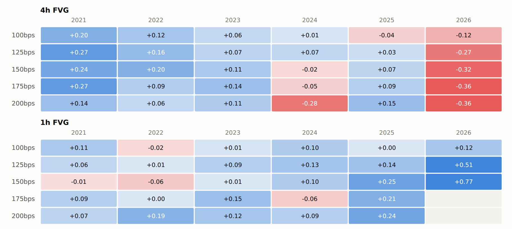
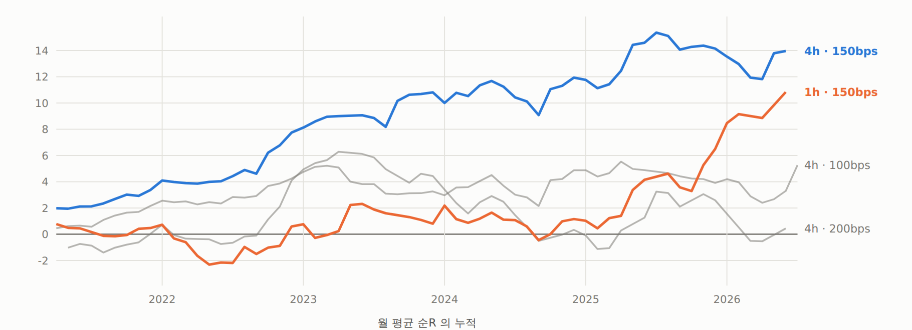
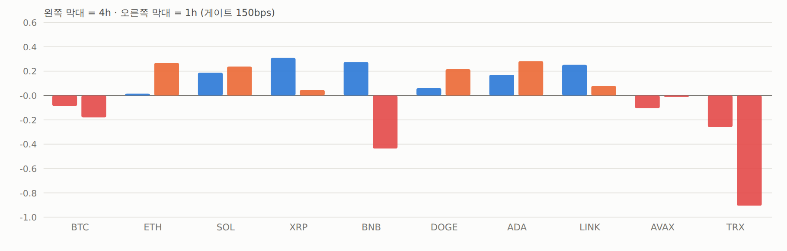

# 1R 게이트 150bps 는 안정적인가 — 아니다

2026-09-18 · 10심볼 OKX 5분봉 2021-04-02 ~ 2026-07-05 · 검정 184 통과

## 설계 — 최적 컷을 찾지 않는다

[`FVG-1R확대-3레버-기각.md`](056_FVG-1R확대-3레버-기각.md) 에서 181칸을 한 번에 본 평균으로 **1R ≈ 150bps 손익분기**가
관측됐다. 이 문서는 **그 관측이 쪼갰을 때 유지되는지만** 본다.

- 게이트를 **100 / 125 / 150 / 175 / 200 bps** 다섯 개로 **미리 못 박았다**.
- 표에서 제일 좋은 칸을 골라 후보로 삼지 않는다.
- 판정 축은 하나 — **연도별로 같은 부호인가.**

셋업은 전부 고정: 4h FVG · mid 진입 · 손절확장 0 · TP 2R/SL 1R ·
측정해상도 규칙 1R/일간중앙ATR ≥ 2 · 지평 2016봉 ·
비용 진입 maker 2 + 승 maker 2 / 패·모호·미해결 taker 6 bps.
**1h 은 같은 레버의 두 번째 축**으로 함께 낸다(고르기 위한 것이 아니라 일관성 검사용).

## 판정: 안정적이지 않다 — 다섯 항목 중 넷이 미달

| 확인 항목 | 결과 |
|---|---|
| **연도별 부호 유지** | **아니오.** 4h 게이트150: 2021 +0.236 · 2022 +0.200 · 2023 +0.111 · **2024 −0.023** · 2025 +0.068 · **2026 −0.319**. 2026 은 다섯 게이트 전부 음수 |
| **게이트에 단조** | **아니오.** 월 t 1.22 / 1.74 / **2.42** / 2.02 / **0.07** — 175→200 한 칸에 붕괴 |
| **TF 간 일관** | **아니오.** 연도별 net 상관 **−0.93** (게이트 125·150 둘 다). 4h 는 감쇠, 1h 는 증가 |
| **홀드아웃 유지** | **아니오.** 다섯 게이트 전부 음수 (−0.098 ~ −0.151) |
| 심볼 분산 | 4h 7/10 양수지만 **BTC·ETH·AVAX·TRX 가 음수** |

## 1. 게이트별 요약

### 4h FVG · mid

| 게이트 | 거래수 | 1R중앙 | 승률 | gross | 치환대조 | 비용 | 순R | 순R(월평균) | t(월) | 양수월 |
|---|---:|---:|---:|---:|---:|---:|---:|---:|---:|---:|
| 100 | 1,772 | 149 | 36.4% | +0.0959 | +0.0142 | 0.0430 | +0.0529 | +0.0823 | 1.22 | 57.8% |
| 125 | 1,241 | 177 | 37.6% | +0.1338 | +0.0197 | 0.0358 | +0.0980 | +0.1303 | 1.74 | 61.9% |
| **150** | **876** | **205** | 37.4% | **+0.1301** | −0.0232 | 0.0308 | **+0.0993** | **+0.2252** | **2.42** | 62.9% |
| 175 | 634 | 229 | 36.9% | +0.1167 | +0.0077 | 0.0273 | +0.0894 | +0.2072 | 2.02 | 55.7% |
| 200 | 462 | 253 | 34.8% | +0.0584 | +0.0210 | 0.0249 | +0.0336 | +0.0077 | **0.07** | 49.1% |

### 1h FVG · mid

| 게이트 | 거래수 | 1R중앙 | 승률 | gross | 치환대조 | 비용 | 순R | 순R(월평균) | t(월) | 양수월 |
|---|---:|---:|---:|---:|---:|---:|---:|---:|---:|---:|
| 100 | 1,241 | 134 | 36.3% | +0.0886 | +0.0022 | 0.0470 | +0.0416 | +0.0885 | 1.38 | 54.7% |
| 125 | 739 | 163 | 37.9% | +0.1380 | +0.0156 | 0.0382 | +0.0998 | +0.1703 | 1.94 | 59.0% |
| 150 | 450 | 192 | 36.9% | +0.1089 | +0.0074 | 0.0325 | +0.0764 | +0.1836 | 1.73 | 52.5% |
| 175 | 300 | 218 | 37.0% | +0.1133 | −0.0143 | 0.0285 | +0.0848 | +0.2259 | 1.82 | 48.1% |
| 200 | 207 | 237 | 38.6% | +0.1643 | −0.0491 | 0.0251 | +0.1391 | +0.1951 | 1.40 | 52.1% |

치환 대조군이 +0.021 ~ −0.049 사이를 오간다(추첨 12회). **대조군 자체의 부호가 일정하지 않다** —
표본이 얇아서 대조군으로 정밀도를 더 얻지 못하는 상태다.

## 2. 연도별 순R — 판정 축

### 4h (괄호는 거래 수)

| 게이트 | 2021 | 2022 | 2023 | 2024 | 2025 | 2026 |
|---|---:|---:|---:|---:|---:|---:|
| 100 | **+0.201** (282) | +0.123 (423) | +0.056 (232) | +0.014 (310) | **−0.043** (405) | **−0.123** (120) |
| 125 | +0.274 (208) | +0.164 (300) | +0.073 (165) | +0.066 (208) | +0.034 (286) | **−0.272** (74) |
| **150** | **+0.236** (151) | +0.200 (212) | +0.111 (113) | **−0.023** (141) | +0.068 (213) | **−0.319** (46) |
| 175 | +0.273 (117) | +0.095 (147) | +0.143 (82) | **−0.046** (105) | +0.088 (156) | **−0.365** (27) |
| 200 | +0.144 (89) | +0.061 (105) | +0.106 (61) | **−0.281** (74) | +0.150 (115) | **−0.362** (18) |

### 1h — **정확히 반대 방향**

| 게이트 | 2021 | 2022 | 2023 | 2024 | 2025 | 2026 |
|---|---:|---:|---:|---:|---:|---:|
| 100 | +0.111 | **−0.021** | +0.012 | +0.100 | +0.004 | +0.117 |
| 125 | +0.063 | +0.005 | +0.090 | +0.128 | +0.136 | **+0.506** |
| 150 | **−0.008** | **−0.064** | +0.007 | +0.104 | +0.251 | **+0.767** (15건) |
| 175 | +0.090 | +0.003 | +0.146 | **−0.058** | +0.206 | — |
| 200 | +0.071 | +0.192 | +0.123 | +0.092 | +0.241 | — |

> **4h 는 해가 갈수록 나빠지고 1h 는 좋아진다. 연도별 net 상관 −0.93.**
> 같은 신호·같은 레버·같은 잣대인데 시간 프로파일이 정반대다.
> 실재하는 효과라면 이럴 수 없다 — **표본 잡음의 서명**이다.

2026 은 7월까지 반년이고 거래도 얇다(4h 게이트150 에서 46건, 1h 는 15건).
그 얇음 자체가 문제의 크기다.

## 3. 심볼별 순R (게이트 150)

| | BTC | ETH | SOL | XRP | BNB | DOGE | ADA | LINK | AVAX | TRX | 양수 |
|---|---:|---:|---:|---:|---:|---:|---:|---:|---:|---:|---:|
| 4h | −0.085 | +0.016 | +0.188 | +0.309 | +0.275 | +0.061 | +0.170 | +0.252 | −0.104 | −0.258 | 7/10 |
| 1h | −0.180 | +0.268 | +0.238 | +0.046 | **−0.436** | +0.216 | +0.283 | +0.078 | −0.006 | **−0.905** | 6/10 |

- 4h 에서 가장 잘 되는 **BNB(+0.275)가 1h 에서는 −0.436** 으로 뒤집힌다.
- **BTC 는 양쪽 다 음수.** 가장 유동적인 심볼에서 효과가 없다는 건
  미시구조가 느슨한 쪽에만 있다는 뜻이고, 보통 좋은 신호가 아니다.
- 심볼별 net 상관은 +0.48 로 연도만큼 어긋나지는 않는다.

## 4. 홀드아웃 (4h)

| 게이트 | 구간 | 거래수 | gross | 비용 | 순R | t(월) | 양수월 | 심볼+ |
|---|---|---:|---:|---:|---:|---:|---:|---:|
| 100 | 홀드아웃 전 | 1,449 | +0.1373 | 0.0423 | +0.0950 | 1.03 | 63.5% | 7/10 |
| 100 | 홀드아웃 12개월 | 323 | −0.0898 | 0.0462 | **−0.1360** | 0.37 | 38.5% | 3/10 |
| 125 | 홀드아웃 전 | 1,028 | +0.1848 | 0.0351 | +0.1497 | 1.81 | 64.7% | 7/10 |
| 125 | 홀드아웃 12개월 | 213 | −0.1127 | 0.0387 | **−0.1514** | 0.17 | 46.2% | 4/9 |
| **150** | 홀드아웃 전 | 727 | +0.1761 | 0.0303 | +0.1458 | **2.94** | 68.0% | 6/10 |
| **150** | 홀드아웃 12개월 | 149 | −0.0940 | 0.0335 | **−0.1275** | −0.22 | 41.7% | 3/9 |
| 175 | 홀드아웃 전 | 531 | +0.1525 | 0.0268 | +0.1257 | 2.35 | 58.0% | 7/10 |
| 175 | 홀드아웃 12개월 | 103 | −0.0680 | 0.0296 | **−0.0975** | −0.07 | 45.5% | 4/9 |
| 200 | 홀드아웃 전 | 386 | +0.0648 | 0.0245 | +0.0402 | 0.25 | 52.2% | 5/10 |

**다섯 게이트 전부 홀드아웃 음수.** 게이트를 어디에 놓아도 마지막 12개월은 안 된다.

## 결론

> **"150bps 부근 손익분기" 는 전체 표본을 한 번에 본 평균이었다.**
> 쪼개면 유지되지 않는다 — 연도로도, 게이트로도, TF 로도, 홀드아웃으로도.
> **이 관측 위에 셋업을 세우면 안 된다.**

가장 무거운 증거는 TF 간 −0.93 이다. 4h 와 1h 는 같은 규칙을 같은 데이터에 다른
해상도로 적용한 것뿐인데 연도별 성과가 거울처럼 반대로 간다. 이건 두 축이 서로
**독립적인 표본 잡음**을 보고 있다는 뜻이고, 어느 쪽도 신호로 볼 근거가 없다.

## 이 결과가 바꾸는 것

[`FVG-1R확대-3레버-기각.md`](056_FVG-1R확대-3레버-기각.md) 에 적은 두 줄을 정정한다.

- ~~"손익분기 1R ≈ 150bps"~~ → **전체 평균으로만 성립하고 쪼개면 안 유지된다.**
- ~~"1R 확대는 유효한 레버다"~~ → 1R↔gross 상관이 0 이라는 관측 자체는 그대로지만,
  **그 위에서 얻은 순R 양수는 연도·TF 를 가르면 사라진다.**

FVG 선에서 "심볼을 늘리면 표본이 해결된다" 는 다음 수순도 **재검토가 필요하다.**
표본이 3~5배가 돼도 연도별 부호가 뒤집히는 구조라면 t 만 커질 뿐이다.
심볼 확장을 하려면 **왜 연도별로 부호가 뒤집히는지** 먼저 설명해야 한다.

## 산출물

- `examples/fvg_gate_stability.py` → `results_fvg_gate_trades.csv` (9,264건) · `results_fvg_gate_ctrl.csv`
- `examples/fvg_gate_stability_report.py`
- `out/fvg_gate.html`

## 그림

보고서: [1R 게이트 안정성](../../out/fvg_gate.html) (`out/fvg_gate.html`)

*절: 연도 × 게이트 — 판정 축*

*절: 월별 누적 순R — 한 방향으로 쌓이는가*

*절: 심볼별 · 홀드아웃*
