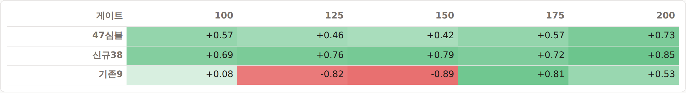
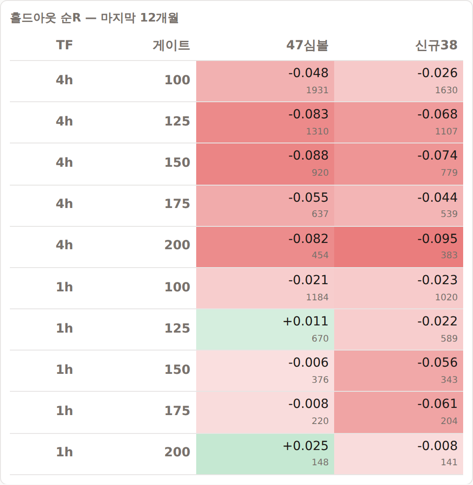
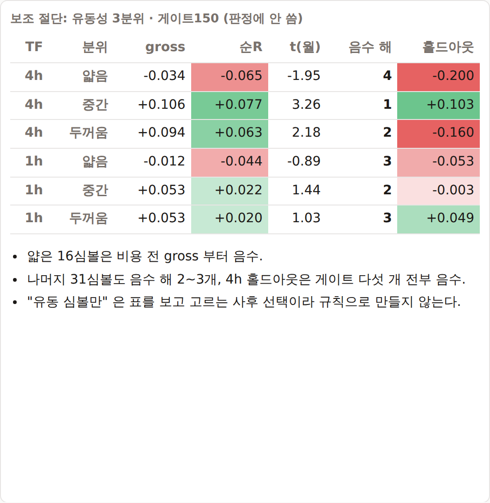

# FVG 1R 게이트 — 47심볼로 다시 봐도 안정적이지 않다

2026-09-25 · OKX 47심볼 5분봉 2021-04-02 ~ 2026-07-05 (이후 81일 봉인) · 검정 229 통과

## 왜 다시 봤나

[`FVG-1R게이트-안정성검사-불안정.md`](058_FVG-1R게이트-안정성검사-불안정.md)(10심볼)에서 연도별 부호가 뒤집혔고, 4h↔1h 연도 상관이
**−0.93** 이었다. 해석은 둘 중 하나였다.

- (가) 10심볼이 좁아서 생긴 잡음 → 심볼을 늘리면 사라진다
- (나) 구조적 불안정 → 늘려도 남는다

직접 수집한 47심볼(기존 9 + **신규 38**)로 가른다. 셋업·게이트·비용은 10심볼 검사와
**글자 하나 다르지 않다**: 4h/1h FVG · mid 진입 · 손절확장 0 · TP 2R/SL 1R ·
1R/일간중앙ATR ≥ 2 · 지평 2016봉 · 비용 진입 maker 2 + 승 maker 2 / 패·모호·미해결 taker 6 bps ·
게이트 100/125/150/175/200 고정. **최적 컷 탐색 없음.**

## 사전 등록 (47심볼 결과를 보기 전에 적음)

| | 질문 | 통과 조건 |
|---|---|---|
| Q1 | 신규 38심볼(독립 횡단면)에서 재현되는가 | 4h 게이트150 순R > 0 **그리고** 월 t ≥ 2 |
| Q2 | 연도별 부호가 같은가 | 47심볼 4h 게이트150 순R 이 2021~2026H1 **모든 해**에서 같은 부호 |
| Q3 | −0.93 은 잡음이었나 | 4h↔1h 연도별 순R 상관이 양수로 돌아서는가 (판정 보조) |
| Q4 | 홀드아웃 | 마지막 12개월(2025-07-05~2026-07-05) 순R > 0 |

**"안정적" = Q1·Q2·Q4 모두 예.** 유동성 3분위·롱/숏은 보조 절단이고 판정에 쓰지 않는다.

## 판정: 기각 유지 — 필수 세 항목 모두 미달

| 항목 | 결과 |
|---|---|
| **Q1 신규 38 재현** | **아니오.** 순R +0.013 · 월 t 1.75. gross +0.043 — 10심볼(+0.130)의 1/3 |
| **Q2 연도별 부호** | **아니오.** 2021 +0.099 · 2022 +0.011 · 2023 +0.167 · **2024 −0.022 · 2025 −0.080 · 2026H1 −0.057** — 음수 해 3개 |
| Q3 TF 일관 | **−0.93 은 잡음이었다.** 게이트150 에서 47심볼 +0.42, 신규38 +0.79. 기존9 만 −0.89 |
| **Q4 홀드아웃** | **아니오.** 4h 다섯 게이트 전부 음수(−0.048 ~ −0.088). 신규38 만 봐도 전부 음수 |

> 표본은 이제 충분하다(4h 게이트150 에서 876건 → 6,334건). 그래서 답이 더 분명해졌다 — **아니오.**

## 1. 게이트별 요약

#### 4h · 47심볼 전체

| 게이트 | 거래수 | 1R중앙 | 승률 | gross | 치환대조 | 비용 | 순R | 순R(월평균) | t(월) | 양수월 |
|---|---:|---:|---:|---:|---:|---:|---:|---:|---:|---:|
| 100 | 11,883 | 155 | 35.3% | +0.0644 | +0.0033 | 0.0415 | **+0.0229** | +0.0448 | 1.74 | 57.8% |
| 125 | 8,687 | 182 | 35.5% | +0.0692 | +0.0058 | 0.0350 | **+0.0342** | +0.0684 | 2.12 | 59.4% |
| 150 | 6,334 | 209 | 34.9% | +0.0554 | -0.0007 | 0.0302 | **+0.0252** | +0.0904 | 2.06 | 62.5% |
| 175 | 4,657 | 238 | 34.3% | +0.0387 | +0.0022 | 0.0265 | **+0.0122** | +0.0991 | 2.07 | 54.7% |
| 200 | 3,546 | 265 | 33.3% | +0.0110 | -0.0050 | 0.0239 | **-0.0129** | +0.0642 | 1.45 | 50.8% |

#### 4h · 신규 38심볼 (독립 재현)

| 게이트 | 거래수 | 1R중앙 | 승률 | gross | 치환대조 | 비용 | 순R | 순R(월평균) | t(월) | 양수월 |
|---|---:|---:|---:|---:|---:|---:|---:|---:|---:|---:|
| 100 | 10,078 | 156 | 35.1% | +0.0578 | +0.0030 | 0.0413 | **+0.0165** | +0.0419 | 1.65 | 59.4% |
| 125 | 7,408 | 183 | 35.1% | +0.0578 | +0.0046 | 0.0349 | **+0.0229** | +0.0562 | 1.85 | 62.5% |
| 150 | 5,421 | 210 | 34.5% | +0.0433 | +0.0010 | 0.0301 | **+0.0132** | +0.0797 | 1.75 | 54.7% |
| 175 | 3,988 | 240 | 34.0% | +0.0286 | +0.0008 | 0.0264 | **+0.0022** | +0.0893 | 1.79 | 50.0% |
| 200 | 3,053 | 266 | 33.1% | +0.0052 | -0.0070 | 0.0238 | **-0.0185** | +0.0592 | 1.28 | 49.2% |

#### 4h · 기존 9심볼 (10심볼 결과와 비교용 — BNB 없음, ADA 등은 2021-04 부터)

| 게이트 | 거래수 | 1R중앙 | 승률 | gross | 치환대조 | 비용 | 순R | 순R(월평균) | t(월) | 양수월 |
|---|---:|---:|---:|---:|---:|---:|---:|---:|---:|---:|
| 100 | 1,805 | 151 | 36.6% | +0.1008 | +0.0051 | 0.0425 | **+0.0583** | +0.0712 | 1.05 | 54.7% |
| 125 | 1,279 | 179 | 37.7% | +0.1353 | +0.0128 | 0.0353 | **+0.0999** | +0.1146 | 1.50 | 61.9% |
| 150 | 913 | 207 | 37.3% | +0.1271 | -0.0113 | 0.0305 | **+0.0966** | +0.1699 | 1.98 | 60.7% |
| 175 | 669 | 232 | 36.3% | +0.0987 | +0.0114 | 0.0271 | **+0.0716** | +0.1459 | 1.53 | 55.0% |
| 200 | 493 | 257 | 34.5% | +0.0467 | +0.0080 | 0.0246 | **+0.0220** | +0.0121 | 0.12 | 46.6% |

#### 1h · 47심볼 전체

| 게이트 | 거래수 | 1R중앙 | 승률 | gross | 치환대조 | 비용 | 순R | 순R(월평균) | t(월) | 양수월 |
|---|---:|---:|---:|---:|---:|---:|---:|---:|---:|---:|
| 100 | 9,295 | 142 | 33.9% | +0.0202 | +0.0068 | 0.0453 | **-0.0251** | +0.0058 | 0.15 | 46.9% |
| 125 | 6,099 | 169 | 34.1% | +0.0266 | +0.0027 | 0.0376 | **-0.0110** | +0.0321 | 0.80 | 57.8% |
| 150 | 4,050 | 197 | 34.2% | +0.0306 | -0.0053 | 0.0319 | **-0.0013** | +0.0084 | 0.15 | 53.1% |
| 175 | 2,778 | 226 | 34.6% | +0.0421 | +0.0003 | 0.0277 | **+0.0144** | +0.0330 | 0.53 | 45.3% |
| 200 | 1,935 | 259 | 34.7% | +0.0475 | +0.0086 | 0.0242 | **+0.0233** | +0.0528 | 0.83 | 46.0% |

#### 1h · 신규 38심볼

| 게이트 | 거래수 | 1R중앙 | 승률 | gross | 치환대조 | 비용 | 순R | 순R(월평균) | t(월) | 양수월 |
|---|---:|---:|---:|---:|---:|---:|---:|---:|---:|---:|
| 100 | 8,002 | 143 | 33.5% | +0.0069 | +0.0063 | 0.0451 | **-0.0382** | -0.0058 | -0.16 | 48.4% |
| 125 | 5,311 | 169 | 33.4% | +0.0053 | +0.0028 | 0.0376 | **-0.0324** | +0.0082 | 0.20 | 53.1% |
| 150 | 3,550 | 197 | 33.6% | +0.0124 | -0.0066 | 0.0320 | **-0.0196** | -0.0148 | -0.28 | 48.4% |
| 175 | 2,436 | 226 | 33.8% | +0.0205 | -0.0009 | 0.0277 | **-0.0072** | +0.0077 | 0.13 | 45.3% |
| 200 | 1,695 | 261 | 33.6% | +0.0165 | +0.0068 | 0.0242 | **-0.0077** | +0.0181 | 0.28 | 42.9% |

- 47심볼·신규38 의 치환 대조군은 −0.007 ~ +0.009 로 0 근처다. 4h 에서 gross 가 대조군을 넘는 폭은
  +0.01 ~ +0.06R 이고 비용(0.024 ~ 0.042R)과 같은 크기다.
- **1h 는 47심볼에서 게이트 100~150 이 순R 음수**, 신규38 에서는 다섯 게이트 전부 음수다.
  10심볼에서 보였던 1h 의 양수(+0.04 ~ +0.14)는 기존 9심볼에만 있다.

## 2. 연도별 순R — 판정 축

#### 4h · 47심볼 전체  (괄호 = 거래 수, 굵게 = 음수)

| 게이트 | 2021 | 2022 | 2023 | 2024 | 2025 | 2026H1 | 음수 해 |
|---|---:|---:|---:|---:|---:|---:|---:|
| 100 | +0.117 (2316) | +0.001 (2671) | +0.083 (1710) | +0.015 (2060) | **-0.066** (2349) | **-0.028** (777) | 2 |
| 125 | +0.120 (1865) | +0.007 (1927) | +0.132 (1206) | +0.036 (1512) | **-0.085** (1689) | **-0.019** (488) | 2 |
| 150 | +0.099 (1463) | +0.011 (1391) | +0.167 (833) | **-0.022** (1093) | **-0.080** (1250) | **-0.057** (304) | 3 |
| 175 | +0.058 (1152) | +0.019 (985) | +0.206 (600) | **-0.112** (824) | **-0.073** (913) | +0.037 (183) | 2 |
| 200 | +0.026 (923) | +0.019 (746) | +0.214 (456) | **-0.169** (636) | **-0.123** (664) | +0.066 (121) | 2 |

#### 4h · 신규 38심볼  (괄호 = 거래 수, 굵게 = 음수)

| 게이트 | 2021 | 2022 | 2023 | 2024 | 2025 | 2026H1 | 음수 해 |
|---|---:|---:|---:|---:|---:|---:|---:|
| 100 | +0.100 (1947) | **-0.023** (2244) | +0.089 (1484) | +0.015 (1770) | **-0.066** (1969) | **-0.008** (664) | 3 |
| 125 | +0.096 (1587) | **-0.022** (1624) | +0.142 (1046) | +0.034 (1317) | **-0.104** (1418) | +0.021 (416) | 2 |
| 150 | +0.080 (1254) | **-0.021** (1177) | +0.175 (723) | **-0.017** (960) | **-0.106** (1049) | **-0.011** (258) | 4 |
| 175 | +0.035 (985) | +0.008 (836) | +0.217 (520) | **-0.115** (727) | **-0.102** (764) | +0.106 (156) | 2 |
| 200 | +0.019 (792) | +0.015 (639) | +0.227 (396) | **-0.153** (568) | **-0.178** (555) | +0.140 (103) | 2 |

#### 4h · 기존 9심볼  (괄호 = 거래 수, 굵게 = 음수)

| 게이트 | 2021 | 2022 | 2023 | 2024 | 2025 | 2026H1 | 음수 해 |
|---|---:|---:|---:|---:|---:|---:|---:|
| 100 | +0.211 (369) | +0.126 (427) | +0.045 (226) | +0.015 (290) | **-0.064** (380) | **-0.145** (113) | 2 |
| 125 | +0.259 (278) | +0.162 (303) | +0.070 (160) | +0.047 (195) | +0.016 (271) | **-0.250** (72) | 1 |
| 150 | +0.216 (209) | +0.189 (214) | +0.114 (110) | **-0.053** (133) | +0.059 (201) | **-0.319** (46) | 2 |
| 175 | +0.190 (167) | +0.080 (149) | +0.135 (80) | **-0.089** (97) | +0.080 (149) | **-0.365** (27) | 2 |
| 200 | +0.068 (131) | +0.040 (107) | +0.125 (60) | **-0.304** (68) | +0.159 (109) | **-0.362** (18) | 2 |

#### 1h · 47심볼 전체  (괄호 = 거래 수, 굵게 = 음수)

| 게이트 | 2021 | 2022 | 2023 | 2024 | 2025 | 2026H1 | 음수 해 |
|---|---:|---:|---:|---:|---:|---:|---:|
| 100 | +0.051 (1978) | **-0.074** (2253) | **-0.017** (1375) | +0.005 (1606) | **-0.115** (1546) | +0.047 (537) | 3 |
| 125 | +0.057 (1440) | **-0.067** (1410) | +0.019 (907) | +0.026 (1091) | **-0.139** (977) | +0.132 (274) | 2 |
| 150 | +0.086 (1016) | **-0.077** (891) | +0.099 (621) | **-0.023** (771) | **-0.158** (597) | +0.175 (154) | 3 |
| 175 | +0.154 (732) | **-0.090** (578) | +0.134 (439) | **-0.022** (543) | **-0.234** (397) | +0.287 (89) | 3 |
| 200 | +0.192 (543) | **-0.059** (388) | +0.169 (301) | **-0.091** (379) | **-0.254** (269) | +0.285 (55) | 3 |

#### 1h · 신규 38심볼  (괄호 = 거래 수, 굵게 = 음수)

| 게이트 | 2021 | 2022 | 2023 | 2024 | 2025 | 2026H1 | 음수 해 |
|---|---:|---:|---:|---:|---:|---:|---:|
| 100 | +0.036 (1687) | **-0.084** (1929) | **-0.023** (1192) | **-0.015** (1396) | **-0.129** (1341) | +0.036 (457) | 4 |
| 125 | +0.040 (1247) | **-0.078** (1230) | +0.005 (800) | +0.001 (947) | **-0.176** (845) | +0.076 (242) | 2 |
| 150 | +0.073 (878) | **-0.082** (788) | +0.108 (547) | **-0.050** (673) | **-0.210** (525) | +0.111 (139) | 3 |
| 175 | +0.132 (632) | **-0.105** (516) | +0.130 (383) | **-0.028** (477) | **-0.302** (343) | +0.243 (85) | 3 |
| 200 | +0.168 (466) | **-0.092** (350) | +0.171 (262) | **-0.125** (330) | **-0.338** (232) | +0.285 (55) | 3 |

**어느 게이트도, 어느 코호트도 모든 해에서 같은 부호가 아니다.** 4h 47심볼은 게이트마다 음수 해가 2~3개,
1h 47심볼은 2~3개. 신규38 4h 게이트150 은 음수 해 4개.

## 3. −0.93 의 정체 — 4h↔1h 연도별 순R 상관

| 게이트 | 47심볼 | 신규38 | 기존9 |
|---|---:|---:|---:|
| 100 | +0.568 | +0.686 | +0.076 |
| 125 | +0.459 | +0.757 | -0.821 |
| 150 | +0.425 | +0.789 | -0.895 |
| 175 | +0.568 | +0.723 | +0.811 |
| 200 | +0.733 | +0.853 | +0.532 |

- 10심볼에서 본 "4h 는 해마다 나빠지고 1h 는 좋아진다" 는 **그 9~10개 심볼에만 있던 모양**이다.
  기존9 는 게이트 125·150 에서 여전히 −0.82·−0.89 이다(175·200 에서는 양수). 신규38 은 다섯 게이트 모두 +0.69 ~ +0.85.
- 넓게 보면 두 TF 는 **같은 시간 모양을 공유한다** — 게이트150 기준 2021·2023 양수, 2024·2025 음수
  (1h 는 2022 도 음수). 거울처럼 반대로 가던 건 잡음이었고, 걷어내자 **공통 시간 요인**이 보인다.
- 그 공통 요인이 **2024 년 이후 음수**다. 이게 이번 검사의 핵심 관측이다.

## 4. 홀드아웃 — 마지막 12개월 (2025-07-05 ~ 2026-07-05)

#### 4h

| 게이트 | 코호트 | 구간 | 거래수 | gross | 비용 | 순R | t(월) | 양수월 | 심볼+ |
|---|---|---|---:|---:|---:|---:|---:|---:|---:|
| 100 | 47 | 이전 | 9,952 | +0.0777 | 0.0410 | +0.0367 | 1.12 | 62% | 29/47 |
| 100 | 47 | 홀드아웃 | 1,931 | -0.0041 | 0.0443 | **-0.0484** | 0.59 | 46% | 20/47 |
| 100 | 신규38 | 이전 | 8,448 | +0.0656 | 0.0408 | +0.0247 | 0.93 | 62% | 23/38 |
| 100 | 신규38 | 홀드아웃 | 1,630 | +0.0178 | 0.0439 | **-0.0261** | 0.79 | 54% | 18/38 |
| 125 | 47 | 이전 | 7,377 | +0.0896 | 0.0346 | +0.0550 | 1.64 | 60% | 29/47 |
| 125 | 47 | 홀드아웃 | 1,310 | -0.0458 | 0.0373 | **-0.0831** | 0.67 | 54% | 17/46 |
| 125 | 신규38 | 이전 | 6,301 | +0.0733 | 0.0345 | +0.0388 | 1.26 | 60% | 23/38 |
| 125 | 신규38 | 홀드아웃 | 1,107 | -0.0307 | 0.0370 | **-0.0677** | 0.65 | 69% | 14/38 |
| 150 | 47 | 이전 | 5,414 | +0.0743 | 0.0298 | +0.0444 | 1.47 | 60% | 25/47 |
| 150 | 47 | 홀드아웃 | 920 | -0.0554 | 0.0323 | **-0.0877** | 1.13 | 69% | 18/46 |
| 150 | 신규38 | 이전 | 4,642 | +0.0577 | 0.0298 | +0.0279 | 0.91 | 52% | 19/38 |
| 150 | 신규38 | 홀드아웃 | 779 | -0.0424 | 0.0320 | **-0.0744** | 1.22 | 62% | 16/38 |
| 175 | 47 | 이전 | 4,020 | +0.0490 | 0.0263 | +0.0228 | 1.06 | 50% | 25/47 |
| 175 | 47 | 홀드아웃 | 637 | -0.0267 | 0.0279 | **-0.0546** | 1.79 | 69% | 21/46 |
| 175 | 신규38 | 이전 | 3,449 | +0.0357 | 0.0262 | +0.0095 | 0.62 | 46% | 19/38 |
| 175 | 신규38 | 홀드아웃 | 539 | -0.0167 | 0.0276 | **-0.0443** | 1.79 | 62% | 18/38 |
| 200 | 47 | 이전 | 3,092 | +0.0210 | 0.0237 | **-0.0027** | 0.75 | 46% | 24/47 |
| 200 | 47 | 홀드아웃 | 454 | -0.0573 | 0.0250 | **-0.0822** | 1.52 | 67% | 17/46 |
| 200 | 신규38 | 이전 | 2,670 | +0.0161 | 0.0236 | **-0.0075** | 0.53 | 46% | 19/38 |
| 200 | 신규38 | 홀드아웃 | 383 | -0.0705 | 0.0247 | **-0.0952** | 1.43 | 67% | 13/38 |

- 4h 는 47심볼·신규38 모두 **다섯 게이트 전부 홀드아웃 음수**.
- 1h 47심볼은 게이트 125·200 이 소폭 양수(+0.011, +0.026)지만 t 0.76·1.20 이고 신규38 은 전부 음수.

## 5. 심볼별 — 게이트150

- **4h**: 순R 양수 26/47심볼 (신규 19/38) · 심볼별 순R 중앙값 +0.016
- **1h**: 순R 양수 22/47심볼 (신규 15/38) · 심볼별 순R 중앙값 -0.018
- 심볼별 순R 4h↔1h 상관 +0.37 (10심볼: +0.48)

## 6. 보조 절단 — 판정에 쓰지 않음

### 유동성 3분위 (사후 절단)

- **얇음** (16): 1INCH, NEO, YFI, XTZ, KSM, EGLD, RSR, ZIL, IOTA, ONT, QTUM, BAT, BAND, IOST, ZRX, UMA
- **중간** (15): NEAR, ATOM, TRX, SUSHI, CFX, XLM, MASK, CHZ, TRB, ALGO, COMP, GRT, MANA, THETA, SNX
- **두꺼움** (16): ETH, BTC, SOL, DOGE, XRP, LTC, ADA, FIL, LINK, BCH, DOT, AVAX, ETC, CRV, AAVE, UNI

#### 정적 분위 · 게이트150 · 연도별 순R

| TF | 분위 | 거래수 | 순R | t(월) | 2021 | 2022 | 2023 | 2024 | 2025 | 2026 | 음수 해 | 홀드아웃 순R (n) |
|---|---|---:|---:|---:|---:|---:|---:|---:|---:|---:|---:|---:|
| 4h | 얇음 | 2,116 | -0.0651 | -1.95 | +0.052 (499) | **-0.122** (442) | +0.101 (273) | **-0.184** (394) | **-0.133** (405) | **-0.102** (103) | 4 | -0.1999 (311) |
| 4h | 중간 | 2,246 | +0.0770 | 3.26 | +0.108 (531) | +0.042 (499) | +0.201 (318) | +0.086 (378) | **-0.055** (422) | +0.222 (98) | 1 | +0.1025 (300) |
| 4h | 두꺼움 | 1,972 | +0.0632 | 2.18 | +0.144 (433) | +0.109 (450) | +0.197 (242) | +0.052 (321) | **-0.053** (423) | **-0.278** (103) | 2 | -0.1595 (309) |
| 1h | 얇음 | 1,395 | -0.0441 | -0.89 | +0.082 (330) | +0.040 (305) | **-0.086** (206) | **-0.141** (294) | **-0.241** (211) | +0.195 (49) | 3 | -0.0535 (133) |
| 1h | 중간 | 1,520 | +0.0219 | 1.44 | +0.038 (409) | **-0.119** (351) | +0.253 (234) | +0.103 (270) | **-0.147** (200) | +0.036 (56) | 2 | -0.0031 (134) |
| 1h | 두꺼움 | 1,135 | +0.0202 | 1.03 | +0.160 (277) | **-0.167** (235) | +0.112 (181) | **-0.018** (207) | **-0.075** (186) | +0.313 (49) | 3 | +0.0487 (109) |

#### 시점 분위(PIT — 진입 전날까지 30일 중앙 거래대금의 횡단면 순위) · 게이트150

| TF | 분위 | 거래수 | 순R | t(월) | 2021 | 2022 | 2023 | 2024 | 2025 | 2026 | 음수 해 | 홀드아웃 순R (n) |
|---|---|---:|---:|---:|---:|---:|---:|---:|---:|---:|---:|---:|
| 4h | 얇음 | 2,007 | -0.0468 | -1.03 | +0.152 (479) | **-0.171** (423) | +0.228 (253) | **-0.187** (356) | **-0.205** (400) | **-0.034** (96) | 4 | -0.1864 (299) |
| 4h | 중간 | 2,146 | +0.0498 | 1.36 | +0.050 (494) | +0.002 (488) | +0.090 (272) | +0.171 (379) | **-0.033** (423) | +0.065 (90) | 1 | +0.0130 (292) |
| 4h | 두꺼움 | 2,079 | +0.0749 | 2.50 | +0.146 (388) | +0.182 (480) | +0.185 (308) | **-0.061** (358) | **-0.008** (427) | **-0.170** (118) | 3 | -0.0876 (329) |
| 1h | 얇음 | 1,306 | -0.0600 | -0.50 | +0.031 (323) | **-0.102** (300) | +0.039 (184) | **-0.152** (250) | **-0.158** (198) | +0.085 (51) | 3 | -0.0313 (136) |
| 1h | 중간 | 1,400 | -0.0483 | -0.92 | **-0.056** (328) | **-0.095** (313) | +0.085 (214) | +0.059 (286) | **-0.293** (211) | +0.154 (48) | 3 | -0.0645 (124) |
| 1h | 두꺼움 | 1,223 | +0.0668 | 1.67 | +0.149 (244) | **-0.031** (278) | +0.162 (223) | +0.015 (235) | **-0.005** (188) | +0.275 (55) | 2 | +0.0865 (116) |

#### 중간+두꺼움 31심볼 · 게이트 다섯 개

| TF | 정의 | 게이트 | 거래수 | gross | 순R | t(월) | 음수 해 | 홀드아웃 순R |
|---|---|---:|---:|---:|---:|---:|---:|---:|
| 4h | static | 100 | 7,740 | +0.0915 | +0.0504 | 2.60 | 2 | -0.0342 |
| 4h | static | 125 | 5,748 | +0.1026 | +0.0679 | 2.92 | 2 | -0.0451 |
| 4h | static | 150 | 4,218 | +0.1005 | +0.0705 | 3.44 | 2 | -0.0305 |
| 4h | static | 175 | 3,112 | +0.0790 | +0.0526 | 3.16 | 3 | -0.0282 |
| 4h | static | 200 | 2,356 | +0.0505 | +0.0267 | 2.50 | 3 | -0.0484 |
| 4h | pit | 100 | 7,862 | +0.0841 | +0.0427 | 2.22 | 2 | -0.0339 |
| 4h | pit | 125 | 5,802 | +0.0913 | +0.0563 | 2.76 | 2 | -0.0497 |
| 4h | pit | 150 | 4,225 | +0.0923 | +0.0622 | 2.94 | 2 | -0.0403 |
| 4h | pit | 175 | 3,097 | +0.0727 | +0.0461 | 2.65 | 3 | -0.0003 |
| 4h | pit | 200 | 2,339 | +0.0312 | +0.0072 | 1.53 | 3 | -0.0482 |
| 1h | static | 100 | 5,989 | +0.0269 | -0.0183 | 0.56 | 2 | -0.0466 |
| 1h | static | 125 | 3,946 | +0.0451 | +0.0077 | 1.64 | 2 | +0.0060 |
| 1h | static | 150 | 2,655 | +0.0531 | +0.0212 | 1.18 | 2 | +0.0201 |
| 1h | static | 175 | 1,829 | +0.0875 | +0.0598 | 1.92 | 2 | +0.0916 |
| 1h | static | 200 | 1,275 | +0.0933 | +0.0690 | 2.28 | 2 | +0.1409 |
| 1h | pit | 100 | 6,092 | +0.0274 | -0.0181 | 0.73 | 2 | -0.0520 |
| 1h | pit | 125 | 3,986 | +0.0386 | +0.0008 | 1.70 | 2 | +0.0122 |
| 1h | pit | 150 | 2,623 | +0.0377 | +0.0054 | 0.76 | 2 | +0.0085 |
| 1h | pit | 175 | 1,773 | +0.0632 | +0.0351 | 1.46 | 2 | +0.1078 |
| 1h | pit | 200 | 1,206 | +0.0672 | +0.0426 | 1.92 | 2 | +0.1425 |

- **얇은 16심볼은 gross 부터 음수**(4h −0.035). 비용 모델 탓이 아니다 — 비용을 빼기 전에 이미 진다.
- 얇은 쪽을 빼면 4h 평균은 좋아진다(정적 분위 순R +0.03 ~ +0.07, 월 t 2.5 ~ 3.4 · 시점 분위 +0.01 ~ +0.06,
  t 1.5 ~ 2.9). **그래도 같은 잣대는 통과 못 한다** — 음수 해 2~3개, 홀드아웃 다섯 게이트 전부 음수.
- 1h 중간+두꺼움은 반대로 게이트 125 이상에서 홀드아웃이 양수(+0.01 ~ +0.14)지만 음수 해가 게이트마다
  2개이고 월 t 0.8 ~ 2.3 이다. 역시 기준 미달.
- 여기서 "유동 심볼만" 규칙을 만들면 표를 보고 고르는 사후 선택이 된다. **만들지 않는다.**

### 롱/숏 × 연도

| TF | 방향 | 2021 | 2022 | 2023 | 2024 | 2025 | 2026 |
|---|---|---:|---:|---:|---:|---:|---:|
| 4h | 롱 | +0.107 (759) | +0.031 (622) | +0.132 (441) | +0.100 (516) | -0.185 (631) | -0.005 (184) |
| 4h | 숏 | +0.091 (704) | -0.005 (769) | +0.207 (392) | -0.130 (577) | +0.028 (619) | -0.137 (120) |
| 1h | 롱 | +0.048 (552) | -0.019 (409) | +0.142 (296) | +0.165 (404) | -0.115 (289) | +0.136 (72) |
| 1h | 숏 | +0.130 (464) | -0.127 (482) | +0.060 (325) | -0.229 (367) | -0.198 (308) | +0.208 (82) |

같은 기간 47심볼 연간 로그수익률 중앙값: 2021 −0.41 · 2022 −1.70 · 2023 +0.61 · 2024 +0.08 · 2025 −1.09 · 2026H1 −0.54.

- 2024(숏 −0.130)·2025(롱 −0.185)는 시장 방향의 반대쪽이 졌다. 하지만 2022(하락장인데 롱 +0.031)·
  2023(상승장인데 숏 +0.207)·2026H1(하락장인데 숏 −0.137)은 그렇지 않다.
- **방향 노출로는 연도 부호가 설명되지 않는다.** 2024 이후의 음수를 설명하는 단일 변수는 찾지 못했다.

## 결론

> **심볼을 4.7배로 늘려도 "150bps 부근 손익분기" 는 안정적이지 않다.**
> 10심볼의 −0.93 은 잡음이었지만, 그걸 걷어내자 보이는 건 신호가 아니라
> **2024 년 이후 두 TF 공통의 음수 구간**이다. 마지막 12개월은 어떤 게이트·어떤 유동성 층에서도 4h 가 음수다.

## 이 결과가 바꾸는 것

- [`FVG-1R게이트-안정성검사-불안정.md`](058_FVG-1R게이트-안정성검사-불안정.md) 의 "−0.93 = 두 축이 독립적인 표본 잡음" → **반은 맞다.**
  반대로 움직인 건 잡음이었다. 대신 넓은 표본에는 **공통 시간 요인**이 있다.
- "심볼 확장으로 표본 문제를 푼다" → 표본 문제는 풀렸고, **답이 '아니오'** 다.
- FVG mid 진입(무조건부)은 **현재 체제에서 거래 대상이 아니다.**

## 다음 수 (선택지)

1. **FVG 선 종료.** 기준선 · 1R 레버 · 스윕+CHoCH · 게이트 안정성 · 47심볼 재검사까지 모든 각도가 닫혔다.
2. **"2024 이후 왜 음수인가" 를 사전등록 가설로 검정.** 단, 체제 전환이 사실상 한 번(2023→2024)뿐이라
   표본 안 검정력이 약하고, 봉인 81일은 효과 +0.05R 을 확인할 힘이 없다
   (81일 ≈ 270건 → 표준오차 ≈ 0.09R, 심볼 간 상관을 무시해도).
   **봉인 창은 큰 실패를 거를 수만 있고 작은 효과를 확인할 수는 없다.**

## 산출물 · 검수

- `examples/fvg_gate_stability.py` (개정 — 봉인 `--until`, 2프로세스 병렬, 고정 시드, `time`·`side` 열 추가)
- `examples/fvg_gate_universe_report.py` (신규 — 코호트·TF 상관·홀드아웃·보조 절단)
- `examples/fvg_liquidity_split.py` (신규 — 정적/시점 유동성 3분위) · `examples/fvg_universe_html.py` → `out/fvg_universe47.html`
- `runs/u47_trades.csv` 47,075건 · `runs/u47_ctrl.csv` · `runs/u47_info.csv` · `runs/u47_key.json` ·
  `runs/u47_dailyqv.csv` · `runs/u47_yearly_logret.csv`
- **재현 검수**: 개정 스크립트로 기존 10심볼 캐시를 다시 돌려 **9,264건 전부 동일**(모든 열 차이 0).
- **데이터 교차 검수**: 새 데이터의 겹치는 9심볼에서 기존 거래 8,664건 중 **8,657건 동일**.
  나머지 7건은 기존 캐시에 빠져 있던 봉(2023-12-18 00:00 ADA·DOGE·TRX·XRP) 주변과 XRP 시작일 경계.
- **고친 것**: 치환 대조군 시드가 `hash(sym)` 이라 **프로세스마다 바뀌었다**(PYTHONHASHSEED).
  `zlib.crc32` 로 고정했다. 거래 결과엔 영향이 없고 대조군 값만 추첨 오차 안에서 움직인다
  (4h 게이트150: −0.0232 → −0.0224). `fvg_baseline_audit`·`fvg_excursion`·`fvg_r_levers`·
  `fvg_sweep_choch` 도 같이 고쳤다 — 그 문서들의 대조군 숫자는 재실행하면 추첨 오차만큼 달라진다.

## 그림

보고서: [FVG 47심볼 재검사](../../out/fvg_universe47.html) (`out/fvg_universe47.html`)

*절: 연도별 순R — 4h (칸 아래 숫자 = 거래 수)*

*절: 연도별 순R — 1h*

*절: 4h↔1h 연도별 순R 상관*
