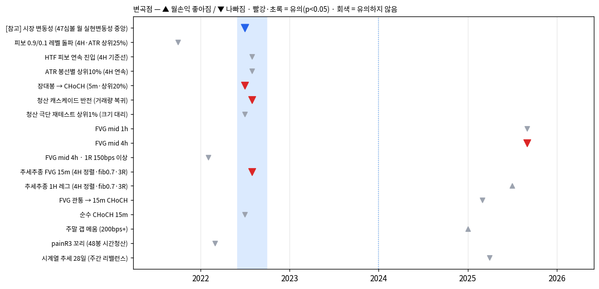
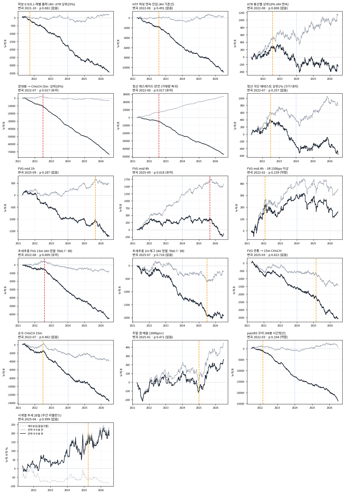

# 예전 신호 16종 — 수익 곡선과 변곡점

2026-09-25 · OKX 47심볼 5분봉 · 2021-04 ~ 2026-06 (봉인 81일 제외) · 검정 271 통과

## 무엇을 했나

- 프로젝트 문서에서 **진입·청산이 정의된 신호군 16종**을 모았다. 2026-09-18 코드 유실로 사라진 것은
  문서 정의대로 다시 짰다(`qbot/research/legacy.py`, 검정 34개 — 미래 오염 불변 · 가격 거울 대칭 포함).
- 정본 설정 = 각 문서의 사전등록 주 지표, 없으면 결론 표의 대표 셀.
  비용은 **현재 표준**(지정가 2 / 시장가·스톱 6 bps), 측정해상도 규칙 1R/일간ATR ≥ 2 를 **전부에** 건다.
  원래 문서와 비용·규칙이 다른 신호는 절대 수준이 문서와 다르다 — 여기서는 **곡선의 모양과 꺾임**을 본다.
- **변곡 = 월별 순손익(Σ 순R) 평균의 변화점.** 모든 분할점(양쪽 최소 6개월)을 훑어 차이가 가장 큰 곳을
  고르고, 3개월 블록을 섞은 귀무분포로 p 를 낸다 — "가장 큰 곳을 골랐다" 는 효과까지 보정된다
  (`qbot/research/changepoint.py`, 검정 5개).
- 보조로 **거래당 gross**(수수료 전) 수열의 변화점도 냈다 — 신호의 질이 바뀌었는지.
- 원인 분해: 변곡 전후 거래당 gross 변화와 비용 변화 중 어느 쪽이 순손익 변화의 60% 이상을 설명하나.

## 요약

- **변곡이 유의한 신호는 16개 중 4개** — 장대봉 CHoCH(2022-07) · 청산 반전(2022-08) · 추세추종 FVG 15m(2022-08) ·
  FVG 4h(2025-09). 전부 **나빠지는** 방향.
- 개별 p 는 16개 동시 검정 보정을 통과하지 못한다(최소 0.009 × 16 = 0.15). 다만 유의 4개는 우연 기대치 0.8개보다
  많고(이항 p ≈ 0.007), **그중 셋은 사실상 같은 사건**이다.
- **2022년 여름 변곡은 신호가 아니라 시장이 바꾼 것이다.** 47심볼 월 실현변동성이 2022-07 에 연율 125% → 80% 로
  내려앉았다(p 0.013). 그 뒤 1R(bps)이 대부분 33~38% 줄고 고정 bps 수수료의 R 부담이 60~70% 늘었다.
  청산 반전은 거래당 gross 가 +0.047 → +0.045 로 그대로인데 순손익만 꺾였다.
- **거래당 gross 만 보면 16개 중 유의한 변화점이 0개.** 신호 자체가 어느 날 뒤집힌 흔적은 없다.
- **2024년에 공통 변곡은 없다.** 2024 전후 순R 이 나빠진 신호와 좋아진 신호가 반반이다.
  FVG 4h 만 2024 부터 엣지가 줄고 2025-09 에 꺾였다(거래당 gross +0.094 → −0.044).
- 비용 후에도 꾸준히 오른 곡선은 **시계열 추세 하나**(샤프 0.64, 변곡 없음, 롱 +83 / 숏 +63 bps/주 수수료 전).
  주말 갭은 2025 이후에만 올랐다.

## 요약표

| 신호 | 진입 | 거래수 | 거래당 순R (t) | gross | 비용 | 변곡 | p | 월손익 전→후 | 원인 | 2024 전→후 순R |
|---|---|---:|---:|---:|---:|---|---:|---:|---|---:|
| 피보 0.9/0.1 레벨 돌파 (4H·ATR 상위25%) | 스톱 | 89,007 | -0.0386 (-8.18) | +0.0020 | 0.041 | 2021-10 | 0.881 없음 | -22.7 → -57.8 | 비용 ↑ (1R 축소) | -0.0392 → -0.0380 |
| HTF 피보 연속 진입 (4H 기준선) | 시장가 | 200,874 | -0.0545 (-8.48) | +0.0009 | 0.055 | 2022-08 | 0.491 없음 | -111.3 → -195.0 | 비용 ↑ (1R 축소) | -0.0580 → -0.0510 |
| ATR 봉선별 상위10% (4H 연속) | 시장가 | 46,604 | -0.0056 (-0.42) | +0.0241 | 0.030 | 2022-08 | 0.808 없음 | +18.6 → -11.8 | 엣지 ↓ | -0.0099 → -0.0009 |
| 장대봉 → CHoCH (5m·상위20%) | 시장가 | 679,422 | -0.1082 (-17.06) | -0.0047 | 0.104 | 2022-07 | 0.017 **유의** | -701.1 → -1312.7 | 비용 ↑ (1R 축소) | -0.0999 → -0.1176 |
| 청산 캐스케이드 반전 (거래량 복귀) | 시장가 | 601,706 | -0.0791 (-12.18) | +0.0452 | 0.124 | 2022-08 | 0.017 **유의** | -318.3 → -904.5 | 비용 ↑ (1R 축소) | -0.0721 → -0.0871 |
| 청산 극단 재테스트 상위1% (크기 대리) | 시장가 | 19,403 | -0.0290 (-1.16) | +0.0411 | 0.070 | 2022-07 | 0.257 없음 | +25.2 → -19.6 | 엣지 ↓ | -0.0313 → -0.0263 |
| FVG mid 1h | 지정가 | 24,161 | -0.0715 (-3.34) | +0.0201 | 0.092 | 2025-09 | 0.287 없음 | -19.5 → -69.5 | 엣지 ↓ | -0.0753 → -0.0671 |
| FVG mid 4h | 지정가 | 22,835 | -0.0059 (-0.29) | +0.0695 | 0.075 | 2025-09 | 0.018 **유의** | +7.8 → -54.6 | 엣지 ↓ | +0.0346 → -0.0483 |
| FVG mid 4h · 1R 150bps 이상 | 지정가 | 6,333 | +0.0249 (0.72) | +0.0551 | 0.030 | 2022-02 | 0.159 약함 | +20.6 → -0.9 | 엣지 ↓ | +0.0814 → -0.0538 |
| 추세추종 FVG 15m (4H 정렬·fib0.7·3R) | 지정가 | 62,932 | -0.1039 (-7.94) | -0.0129 | 0.091 | 2022-08 | 0.009 **유의** | -35.6 → -126.9 | 엣지·비용 둘 다 | -0.0989 → -0.1093 |
| 추세추종 1H 레그 (4H 정렬·fib0.7·3R) | 지정가 | 27,019 | -0.0706 (-3.40) | -0.0077 | 0.063 | 2025-07 | 0.716 없음 | -37.6 → +0.9 | 엣지 ↑ | -0.0862 → -0.0531 |
| FVG 관통 → 15m CHoCH | 지정가 | 61,447 | -0.0581 (-4.39) | -0.0230 | 0.035 | 2025-03 | 0.822 없음 | -46.3 → -87.3 | 엣지 ↓ | -0.0508 → -0.0660 |
| 순수 CHoCH 15m | 지정가 | 286,400 | -0.0474 (-7.11) | -0.0136 | 0.034 | 2022-07 | 0.462 없음 | -103.6 → -250.2 | 엣지·비용 둘 다 | -0.0474 → -0.0473 |
| 주말 갭 메움 (200bps+) | 시장가 | 8,976 | +0.0285 (0.82) | +0.0495 | 0.021 | 2025-01 | 0.471 없음 | -2.2 → +19.8 | 엣지 ↑ | +0.0212 → +0.0366 |
| painR3 꼬리 (48봉 시간청산) | 지정가 | 162,856 | -0.1465 (-7.68) | +0.0037 | 0.150 | 2022-03 | 0.104 약함 | -72.6 → -443.5 | 엣지·비용 둘 다 | -0.1601 → -0.1331 |
| 시계열 추세 28일 (주간 리밸런스) | 시장가 | 270주 | 주 +0.69% (t 1.46) · 샤프 0.64 | — | — | 2025-04 | 0.999 | +3.64% → +0.70% | — | 주 +0.72% → +0.65% |

월손익 단위는 "그 달 모든 거래에 1R 씩 건 합계(R)" 라 크기는 비현실적이다. 방향과 꺾임만 본다.

## 변곡 원인 분해

| 신호 | 변곡 | 1R 중앙 전→후 (bps) | 거래당 gross 전→후 | 거래당 비용 전→후 | 거래당 순R 전→후 |
|---|---|---:|---:|---:|---:|
| 피보 0.9/0.1 레벨 돌파 (4H·ATR 상위25%) | 2021-10 | 520 → 303 | +0.0049 → +0.0018 | 0.023 → 0.042 | -0.0185 → -0.0404 |
| HTF 피보 연속 진입 (4H 기준선) | 2022-08 | 328 → 202 | +0.0033 → +0.0000 | 0.037 → 0.062 | -0.0337 → -0.0619 |
| ATR 봉선별 상위10% (4H 연속) | 2022-08 | 555 → 374 | +0.0461 → +0.0168 | 0.020 → 0.033 | +0.0257 → -0.0159 |
| 장대봉 → CHoCH (5m·상위20%) | 2022-07 | 167 → 109 | +0.0112 → -0.0102 | 0.071 → 0.115 | -0.0602 → -0.1249 |
| 청산 캐스케이드 반전 (거래량 복귀) | 2022-08 | 144 → 89 | +0.0465 → +0.0448 | 0.081 → 0.139 | -0.0344 → -0.0937 |
| 청산 극단 재테스트 상위1% (크기 대리) | 2022-07 | 251 → 190 | +0.1463 → +0.0133 | 0.053 → 0.075 | +0.0935 → -0.0613 |
| FVG mid 1h | 2025-09 | 89 → 70 | +0.0350 → -0.0455 | 0.087 → 0.110 | -0.0525 → -0.1551 |
| FVG mid 4h | 2025-09 | 107 → 84 | +0.0938 → -0.0435 | 0.072 → 0.091 | +0.0219 → -0.1348 |
| FVG mid 4h · 1R 150bps 이상 | 2022-02 | 223 → 206 | +0.1594 → +0.0208 | 0.028 → 0.031 | +0.1311 → -0.0100 |
| 추세추종 FVG 15m (4H 정렬·fib0.7·3R) | 2022-08 | 125 → 79 | +0.0244 → -0.0255 | 0.060 → 0.101 | -0.0358 → -0.1269 |
| 추세추종 1H 레그 (4H 정렬·fib0.7·3R) | 2025-07 | 140 → 114 | -0.0273 → +0.0730 | 0.061 → 0.071 | -0.0882 → +0.0021 |
| FVG 관통 → 15m CHoCH | 2025-03 | 242 → 198 | -0.0146 → -0.0470 | 0.033 → 0.040 | -0.0480 → -0.0868 |
| 순수 CHoCH 15m | 2022-07 | 334 → 218 | +0.0018 → -0.0189 | 0.023 → 0.037 | -0.0214 → -0.0562 |
| 주말 갭 메움 (200bps+) | 2025-01 | 551 → 506 | +0.0051 → +0.1614 | 0.021 → 0.022 | -0.0157 → +0.1399 |
| painR3 꼬리 (48봉 시간청산) | 2022-03 | 85 → 57 | +0.0611 → -0.0046 | 0.100 → 0.157 | -0.0388 → -0.1621 |

- 2022-07~08 에 꺾인 신호들은 **1R 중앙값이 한꺼번에 대부분 33~38% 줄었다** — 변동성 하락이 모든 레그를 줄였다.
- 1R 이 작은(~100bps) 신호일수록 타격이 크다: 청산 반전 비용 0.081 → 0.139R, 장대봉 0.071 → 0.115R.
- 4h 봉 기반 신호(1R 300~500bps)는 비용 증가가 0.01~0.03R 로 작아 유의한 꺾임이 없다.

## 시장 변동성 — 모든 2022 변곡의 공통 원인

47심볼 **월 실현변동성**(그 달 일간 로그수익 표준편차 × √365)의 횡단면 중앙값:
**2022-07 에 변화점, 연율 125% → 80%, p 0.013.** 2021 초고변동 구간을 빼고 2021-10 부터 봐도 2022-08, p 0.029.
(처음엔 30일 롤링 변동성으로 쟀다가 달끼리 겹친 자기상관 때문에 변화점이 2021-10 으로 끌려갔다 — 겹치지 않는 월 단위로 고쳤다.)

## 출처 · 재구축 상태

| 신호 | 출처 문서 | 재구축 상태 |
|---|---|---|
| 피보 0.9/0.1 레벨 돌파 (4H·ATR 상위25%) | [`피보레벨-진입승률-분석.md`](004_피보레벨-진입승률-분석.md) | 재현 ✓ 승률 59.29% (문서 59.25%) |
| HTF 피보 연속 진입 (4H 기준선) | [`실데이터-4H-검증결과.md`](002_실데이터-4H-검증결과.md) | 정의 복원 불완전 — 문서 숫자와 불일치 |
| ATR 봉선별 상위10% (4H 연속) | [`ATR-봉선별-검증결과.md`](003_ATR-봉선별-검증결과.md) | 정의 복원 불완전 — 문서 숫자와 불일치 |
| 장대봉 → CHoCH (5m·상위20%) | [`장대봉-CHoCH-검증결과.md`](005_장대봉-CHoCH-검증결과.md) | 재현 ✓ 거래수 −3% · 승률 ±0.3%p |
| 청산 캐스케이드 반전 (거래량 복귀) | [`청산이벤트-거래량복귀-검증결과.md`](008_청산이벤트-거래량복귀-검증결과.md) | 근사 — 거래수 −23% · 승률 +1.9%p |
| 청산 극단 재테스트 상위1% (크기 대리) | [`청산-좁힌컷-트리거3종-전면비교.md`](013_청산-좁힌컷-트리거3종-전면비교.md) | 대리 변수 — 원본은 히트맵 소진량 순위 |
| FVG mid 1h | [`규칙적용-전수감사-및-FVG기준선.md`](048_규칙적용-전수감사-및-FVG기준선.md) | 47심볼 실측 |
| FVG mid 4h | [`규칙적용-전수감사-및-FVG기준선.md`](048_규칙적용-전수감사-및-FVG기준선.md) | 47심볼 실측 |
| FVG mid 4h · 1R 150bps 이상 | [`FVG-47심볼-게이트안정성-재검사.md`](060_FVG-47심볼-게이트안정성-재검사.md) | 47심볼 실측 |
| 추세추종 FVG 15m (4H 정렬·fib0.7·3R) | [`추세추종-FVG-IS결과-기각.md`](026_추세추종-FVG-IS결과-기각.md) | 재현 ✓ 거래수 6,172 (문서 6,189) |
| 추세추종 1H 레그 (4H 정렬·fib0.7·3R) | [`1H레그-1단계결과-기각.md`](038_1H레그-1단계결과-기각.md) | 문서 정의대로 (대형5 결과만 있어 직접 대조 불가) |
| FVG 관통 → 15m CHoCH | [`FVG관통-스윕CHoCH-기각-및-엣지부재.md`](057_FVG관통-스윕CHoCH-기각-및-엣지부재.md) | 기존 코드 그대로 |
| 순수 CHoCH 15m | [`FVG관통-스윕CHoCH-기각-및-엣지부재.md`](057_FVG관통-스윕CHoCH-기각-및-엣지부재.md) | 기존 코드 그대로 (대조군 B) |
| 주말 갭 메움 (200bps+) | [`주말갭-OOS결과-기각.md`](032_주말갭-OOS결과-기각.md) | 재현 ✓ 거래수 770 (문서 757) |
| painR3 꼬리 (48봉 시간청산) | [`체결모델확정-및-painR3-3종검정.md`](051_체결모델확정-및-painR3-3종검정.md) | 문서 정의대로 · 1R = 2×일간ATR 로 환산 |
| 시계열 추세 28일 (주간 리밸런스) | [`시계열추세-시뮬레이션결과.md`](041_시계열추세-시뮬레이션결과.md) | 재현 ✓ 대형5 샤프 0.99 (문서 0.99) |

### 재구축 검수 — 문서 숫자 대조 (10심볼 · 문서와 같은 IS 구간, `examples/legacy_validate.py`)

| 신호 | 재구축 | 문서 |
|---|---|---|
| 피보 레벨 돌파 (안쪽·ATR 상위25%·롱) | 해결 852건 · 승 59.29% · 해결률 19.8% | 849건 · 59.25% · 19.8% |
| 피보 레벨 0.9 터치 전체 (롱) | 해결 12,456건 · 승 53.65% | 12,252건 · 52.82% |
| 장대봉 → CHoCH 숏 (상위20%, 1:1) | 38,191건 · 승 50.36% · 1R 80bps | 39,260건 · 50.56% · 73bps |
| 청산 반전 vol (전체, 1:1, 규칙 없음) | 182,438건 · 승 55.12% · 1R 29.7bps | 236,134건 · 53.27% · 29.5bps |
| 추세추종 15m fib0.7 TP3R (일간ATR 규칙) | 6,172건 · 승 27.74% · gross +0.111 | 6,189건 · 28.28% · +0.132 |
| 주말 갭 200bps+ | 770건 · 메움(해결분) ≈ 60.5% · gross +0.148 | 757건 · 60.73% · +0.160 |
| 시계열 추세 대형5 / 소형5 | 샤프 0.99 · MDD −45.2% / 0.45 · −59.7% | 0.99 · −45.2% / 0.46 · −59.4% |
| HTF 피보 연속 · ATR 봉선별 | 승률 57~62% (TP 가 가까움) | 40~45%, 페이오프 1.14~1.21 — **불일치** |

HTF 피보 계열은 초기 엔진([`backtest-core-설계.md`](001_backtest-core-설계.md))의 레벨·진입 규약이 문서에 충분히 남아 있지 않다.
SPATIAL 좌표(0 = 저가, 1 = 고가)는 레벨 돌파 재현으로 확인됐지만 연속 진입의 TP/SL 해석이 문서 숫자를
재현하지 못한다. 이 두 곡선은 **"가장 자연스러운 해석"** 으로 읽을 것.

## 제외한 것

- **VP 계열(자석·지지저항·1위 후보)** — 거래로 계산한 적 없는 기술통계라 곡선이 없다.
- **청산 히트맵 피처 · 손절밀도맵 · 스윙센서스 · 미실현손실 조건변수** — 피처·진단.
- **청산 fib0.4 되돌림 지정가 '연속'(OOS 후보 3종)** — 사용자 제공 히트맵 소진량 함수가 없고, 연속 방향 지정가
  체결 규칙이 문서에 없다. 문서의 연도별 값만: IS 2024 +0.175 / 2025 +0.062 / 2026 +0.063 ·
  OOS 2021 −0.052 / 2022 +0.031 / 2023 −0.048.

## 사용자 전제("시장이 바뀌었다")와의 관계

- **바뀐 것은 맞다. 다만 2024 가 아니라 2022년 여름이고, 바뀐 것은 신호가 아니라 변동성이다.**
  경로는 하나다: 변동성 ↓ → 1R(bps) ↓ → 고정 bps 수수료의 R 부담 ↑.
- 이건 **날짜가 아니라 관측 가능한 상태**다. "최근 1~2년" 대신 "지금 변동성에서 이 신호의 1R 이 수수료를
  감당하는가" 로 쓸 수 있고, 실시간으로 알 수 있다.
- FVG 4h 는 예외적으로 엣지 자체가 줄었다(2024~ 감쇠, 2025-09 급락) — `FVG-2024분할-...` 의 결론과 같다.

## 눈에 띄는 것 둘

- **청산 반전의 수수료 전 gross 는 5년 내내 +0.045R 로 거의 일정했다**(곡선이 직선). 이 프로젝트에서 가장
  안정적인 gross 엣지다. 막는 것은 비용 하나(시장가 진입, 1R 90~140bps).
- **시계열 추세는 비용 후 유일한 우상향**이다(샤프 0.64, t 1.46, 변곡 없음). 롱·숏 양쪽이 벌었다.
  다만 47심볼 동일가중 매수보유가 −83% 인 하락 유니버스(현재 상장 종목만 — 생존 편향)라 숏에 유리했던
  환경이다. 2022·2025·2026H1 은 숏이, 2021·2023·2024 는 롱이 벌었다.

## 다음 수 (선택지)

1. **변동성 상태 조건부 사전등록** — 2022 변곡의 원인을 규칙으로: 진입 시점 1R(bps)과 비용 손익분기의 비를
   상태 변수로 두고, 고정 날짜 분할 대신 이 상태로 신호를 켜고 끈다.
2. **시계열 추세 심화** — 유일하게 곡선이 안정적인 신호. 유니버스·변동성 스케일링·숏 제한을 사전등록하고
   봉인 81일(주간 전략이라 약 11주 — 검정력은 낮다)은 큰 실패 거르기용으로만.
3. **청산 반전 비용 구조** — gross +0.045R 가 안정적이므로 체결 방식만 바꾸는 검정. 다만 과거 지정가 버전
   (fib 되돌림)은 OOS 에서 기각됐다.

## 산출물 · 검수

- `qbot/research/legacy.py` · `qbot/research/changepoint.py` · 검정 `tests/test_legacy.py`(34) ·
  `tests/test_changepoint.py`(5)
- `examples/legacy_validate.py`(문서 대조) · `examples/legacy_run.py`(47심볼 전 신호) ·
  `examples/legacy_changepoint.py`(곡선·변곡) · `examples/legacy_report.py`(원인 분해·HTML)
- `runs/legacy/*.pkl` 신호별 거래 · `runs/legacy_cp.json` · `runs/legacy_summary.csv` · `out/legacy_curves.html`
- 검수: FVG 4h 변곡(2025-09, 전 +7.76 → 후 −54.57) 독립 재계산 일치 · 청산 반전 전후 분해 독립 재계산 일치 ·
  수수료 공식 오차 0 · 시계열 추세 샤프 재계산 일치 · 모든 신호 최대 진입 2026-07-04 23:55 (봉인 준수)

## 그림

보고서: [예전 신호 변곡점](../../out/legacy_curves.html) (`out/legacy_curves.html`)

