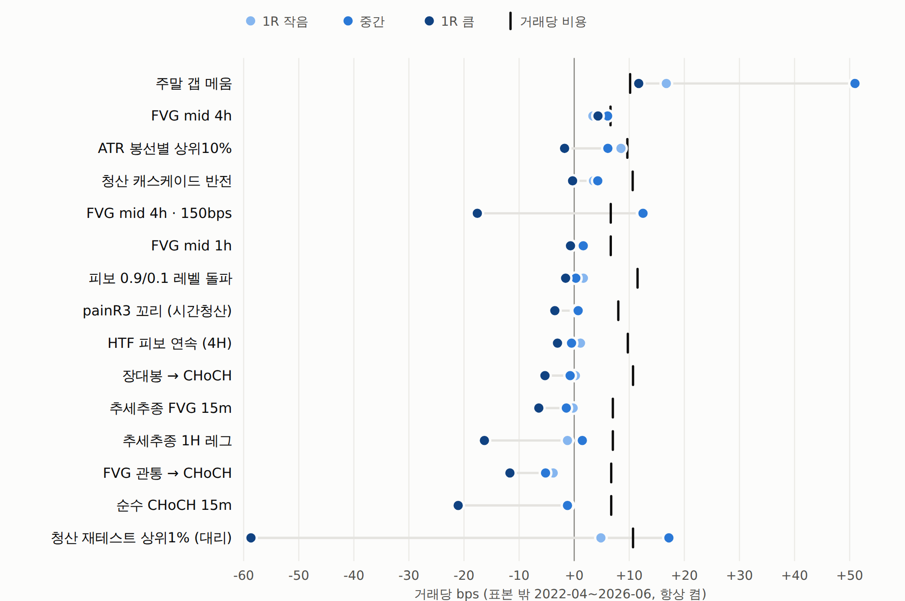

# 비용 상태 스위치 — 결과: 15개 전부 기각 (2026-09-25)

사전등록: [`비용상태스위치-사전등록.md`](064_비용상태스위치-사전등록.md) (실행 전 작성). 규칙·구간·판정 기준을 바꾸지 않고 한 번 실행했다.
봉인 창(2026-07-05~)은 **열지 않는다** — 통과한 신호가 없다.

## 판정: 기각 (15 / 15)

주 규칙 `ĝ > 0 그리고 ρ ≥ 2`, 표본 밖 2022-04 ~ 2026-06, OKX 47심볼.
네 조건(① 순R > 0 이고 월 군집 t ≥ 2 · ② 5구간 중 4개 이상 양수 · ③ 항상 켬보다 높음 · ④ 300건 이상)을
모두 만족한 신호가 없다. **①과 ②는 하나도 만족하지 못했다.**

켜진 거래가 300건 이상인 6개:

| 신호 | 항상 켬 순R | ρ≥2 거래 (비율) | ρ≥2 순R | t | 양수 구간 |
|---|---:|---:|---:|---:|---:|
| 청산 캐스케이드 반전 | −0.090 | 10,601 (2.2%) | −0.036 | −1.33 | 1/5 |
| FVG mid 4h | −0.026 | 5,464 (29.0%) | −0.004 | −0.13 | 2/5 |
| ATR 봉선별 상위10% | −0.008 | 6,481 (17.0%) | −0.031 | −1.08 | 2/5 |
| 청산 재테스트 상위1% (대리) | −0.047 | 4,279 (26.4%) | −0.107 | −2.49 | 1/5 |
| FVG mid 4h · 150bps | −0.004 | 3,865 (86.0%) | −0.008 | −0.21 | 1/5 |
| 주말 갭 메움 | +0.040 | 1,949 (27.2%) | −0.021 | −0.43 | 2/5 |

나머지 9개(피보 레벨 돌파 · HTF 피보 연속 · 장대봉→CHoCH · FVG 1h · 추세추종 FVG 15m · 추세추종 1H 레그 ·
FVG 관통→CHoCH · 순수 CHoCH 15m · painR3 꼬리)는 ĝ 가 0 이하이거나 너무 작아 **0 ~ 40건만 켜졌다.**
사전등록 실패 모드 4번("스위치가 음수 엣지를 살릴 수는 없다") 그대로다.

민감도(ρ ≥ 1 · ρ ≥ 3 · ĝ 직전 24개월)는 판정에 쓰지 않는다. 양수 칸은 주말 갭(ρ≥1 +0.001 · ĝ24 +0.032,
둘 다 항상 켬 +0.040 보다 낮다), FVG 4h·150bps ĝ24 +0.000, painR3 ĝ24 +1.134(8건)뿐이다.
전체 표는 `out/costgate_tables.md` · `out/costgate.html`.

## 왜 실패했나 — 사전등록 실패 모드 1번 (구성 효과)

스위치는 결국 **1R 이 큰 거래**를 고른다. 그런데 1R 이 클수록 거래당 gross(R) 가 작다.
가설의 전제("1R 이 커도 gross R 은 같다")가 틀렸다.

ρ 3분위별 거래당 gross R (괄호 = 1R 중앙값):

| 신호 | 낮음 | 중간 | 높음 |
|---|---:|---:|---:|
| 청산 캐스케이드 반전 | +0.071 (53bps) | +0.048 (92) | +0.013 (176) |
| 주말 갭 메움 | +0.140 (329) | +0.064 (441) | −0.020 (836) |
| ATR 봉선별 상위10% | +0.057 (224) | +0.016 (398) | −0.003 (652) |
| FVG mid 4h | +0.064 (55) | +0.064 (96) | +0.038 (178) |
| FVG mid 4h · 150bps | +0.051 (171) | +0.061 (196) | −0.031 (313) |

ρ 대신 1R 만으로 3분위를 나눠도 **15개 중 14개**에서 '큼' 의 gross R 이 '작음' 보다 낮다
(예외 FVG 관통→CHoCH 는 둘 다 음수).

## bps 로 다시 보기 (사후 진단 — 판정에 쓰지 않음)

결과를 본 뒤 만든 진단이라 판정 근거가 아니다. 표본 밖, 항상 켬, 거래당 bps:

| 신호 | gross | 비용 | 순 | gross: 1R 작음 | 중간 | 큼 |
|---|---:|---:|---:|---:|---:|---:|
| 주말 갭 메움 | +26.5 | 10.2 | +16.3 | +16.7 | +51.0 | +11.7 |
| FVG mid 4h | +4.6 | 6.6 | −2.0 | +3.4 | +6.1 | +4.3 |
| ATR 봉선별 상위10% | +4.3 | 9.7 | −5.4 | +8.5 | +6.1 | −1.7 |
| 청산 캐스케이드 반전 | +2.5 | 10.6 | −8.1 | +3.5 | +4.3 | −0.3 |
| FVG mid 4h · 150bps | +2.5 | 6.6 | −4.2 | +12.4 | +12.5 | −17.6 |
| FVG mid 1h | +0.8 | 6.6 | −5.8 | +1.6 | +1.7 | −0.7 |
| 피보 0.9/0.1 레벨 돌파 | +0.1 | 11.5 | −11.4 | +1.7 | +0.3 | −1.6 |
| painR3 꼬리 (시간청산) | −0.8 | 8.0 | −8.8 | +0.4 | +0.7 | −3.5 |
| HTF 피보 연속 (4H) | −0.8 | 9.7 | −10.5 | +1.1 | −0.5 | −3.0 |
| 장대봉 → CHoCH | −1.9 | 10.7 | −12.6 | +0.2 | −0.7 | −5.3 |
| 추세추종 FVG 15m | −2.7 | 7.0 | −9.7 | −0.2 | −1.4 | −6.4 |
| 추세추종 1H 레그 | −5.3 | 7.0 | −12.4 | −1.2 | +1.5 | −16.3 |
| FVG 관통 → CHoCH | −6.9 | 6.7 | −13.6 | −3.8 | −5.2 | −11.7 |
| 순수 CHoCH 15m | −7.8 | 6.7 | −14.5 | −1.1 | −1.2 | −21.1 |
| 청산 재테스트 상위1% (대리) | −12.2 | 10.7 | −22.9 | +4.9 | +17.2 | −58.7 |

읽는 법:

- **엣지가 bps 로 몇 bps 에 묶여 있다.** 1R 을 키워도 커지지 않는다 — 15개 중 14개에서 '1R 큼' 의 gross bps 가
  세 3분위 중 가장 작다(예외 FVG 4h). 변동성에 비례해 커지는 엣지가 아니다.
- **비용은 bps 로 고정이다**(6.6 ~ 11.5bps). 주말 갭을 빼면 gross 가 비용을 넘는 신호가 없다(최대 FVG 4h +4.6 vs 6.6).
- 그래서 1R 이나 시장 변동성으로 거래를 고르는 게이트는 **어떤 형태로도 부호를 못 바꾼다.**
  2022 변곡의 원인 진단(변동성 ↓ → 고정 수수료의 R 부담 ↑)은 그대로 유효하지만,
  그 처방("비용이 가벼울 때만 켜기")은 통하지 않는다 — **비용이 가벼운 거래는 엣지도 가볍다.**

## 시장 상태 스위치 (보조)

고변동기엔 1R 이 커져(FVG 4h 84 → 114bps) 수수료의 R 부담은 줄지만 gross 가 더 크게 줄었다:
FVG 4h +0.081 → +0.018 · ATR +0.041 → −0.007 · 주말 갭 +0.077 → +0.039 · FVG 4h·150bps +0.164 → −0.080.
저변동기에 gross 가 뚜렷했던 신호(FVG 4h · FVG 4h·150bps · ATR · 주말 갭 · 청산 재테스트 · FVG 1h)는
**고변동기에만 켜는 편이 항상 켬보다 나빴다**(예: FVG 4h −0.026 → −0.049).
청산 반전은 gross 가 거의 그대로라(+0.047 → +0.039) 수수료가 가벼워진 만큼 덜 잃었지만(−0.090 → −0.072) 여전히 음수,
gross 가 음수인 신호(장대봉 · CHoCH 계열 · painR3)도 덜 잃었을 뿐 음수다.

## 주말 갭 — 유일한 예외지만 새 증거는 아니다

항상 켬 순R +0.040 (7,162건, 구간 부호 4/5, 2024 −0.120) 은 이 표에서 유일한 양수다. 그러나

- 월 군집 t **1.04** (같은 주말끼리 묶으면 0.99)
- 2025 년을 빼면 **+0.002 (t 0.05)** — gross bps 가 2024 −68.8 → 2025 +131.7 로 요동
- 상위 10개 주말이 순이익의 **142%**

이미 기각된 신호([`주말갭-OOS결과-기각.md`](032_주말갭-OOS결과-기각.md), "IS 결과는 2025년 한 해였다")의 패턴이 47심볼에서도 반복됐다.
스위치(ρ ≥ 2)는 오히려 −0.021 로 떨어뜨렸다(ρ 상위 3분위 gross −0.020).

## 결론

- 예전 신호군을 **시기로 고르기**(최근 창 워크포워드, [`FVG-2024분할-체제변화와-최근창-워크포워드.md`](062_FVG-2024분할-체제변화와-최근창-워크포워드.md))와
  **비용 상태로 고르기**(이번) 둘 다 막혔다. 이 신호군 안에서 켜고 끄는 방식으로 살릴 길은 없다고 본다.
- 필요한 건 **거래당 엣지가 비용보다 확실히 큰 신호**다. 지금까지 그런 건 시계열 추세 하나다 —
  47심볼 주간 리밸런스, 2021-05 ~ 2026-06 누적 수수료 전 +202.0% / 후 +186.9% (동일가중 매수보유 −83.3%).
  비용이 엣지의 작은 일부다.

## 다음 후보 (사용자 결정 대기)

1. **시계열 추세** — 사용자 지시로 보류 중("기억해두기"). 이번 결과로 우선순위가 가장 높아졌다.
2. 보유 기간을 늘려 **이동 크기에 비례하는 엣지**를 노리는 설계(일봉 · 주봉 구조).
3. 봉인 창은 계속 닫아 둔다 — 한 번만 쓸 수 있으니 통과 후보가 생겼을 때 쓴다.

## 기타 — 예전신호 보고서의 시계열 추세 그래프 정정

`out/legacy_curves.html` 의 시계열 추세 28일 패널에서 "검정선(수수료 후)이 회색선 위" 로 보였다.
값은 맞았다. 회색 자리에 **매수보유**를 그리고 범례를 빠뜨린 표시 오류였다.
회색 = 수수료 전, 검정 = 수수료 후, 회색 점선 = 매수보유로 고치고 범례를 넣었다.
수수료 후 누적(로그)은 전 구간에서 수수료 전보다 아래다(최대 차 −0.0006).

## 코드 · 산출물

- `qbot/research/costgate.py` — `walkforward_edge` · `attach_rho` · `market_state` · `attach_state`
- `tests/test_costgate.py` (6) — 워크포워드 인과성(미래를 바꿔도 불변) · 최소 이력 · 창 · ρ 산술 · 시장 상태 지연
- `examples/costgate_run.py` — 판정 · 민감도 · 진단 → `runs/costgate_rules.csv` · `costgate_rho_terciles.csv` ·
  `costgate_market.csv` · `costgate_key.json` · `out/costgate_tables.md`
- `examples/costgate_report.py` — bps 진단 `runs/costgate_bps.csv`, 보고서 `out/costgate.html`
- 검정 277개 통과 · 소스 백업 갱신(`claude/code/qbot-소스-백업.md`, 57개 파일, 복원 대조 불일치 0)

## 그림

보고서: [비용 상태 스위치 결과](../../out/costgate.html) (`out/costgate.html`)

*절: 거래당 gross 엣지(bps) — 1R 크기 3분위별, 세로 눈금 = 거래당 비용*
