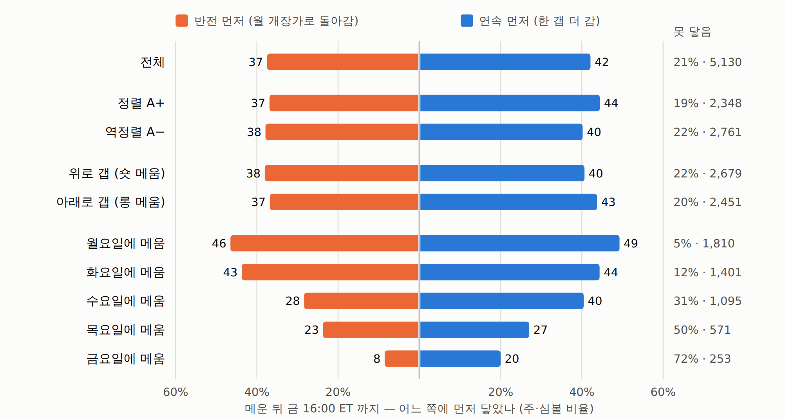

# 주말 갭 × 4H 본장정렬 × 15m CISD — 결과: 5개 전부 기각 (2026-09-25)

사전등록: [`주말갭-4H정렬-CISD-사전등록.md`](066_주말갭-4H정렬-CISD-사전등록.md) (실행 전 작성). 정의·셀·판정 기준을 바꾸지 않고 한 번 실행했다.
**봉인 창은 열지 않는다** — 통과한 셀이 없다.

OKX 47심볼 · 2021-04-05 ~ 2026-06-29 (274주) · |갭| ≥ 200bps · 주·심볼 8,980건 (측정해상도 규칙 후 기본형 8,976건).

## 판정 (사전등록 5개)

| 판정 대상 | 거래 | 순R | 월 군집 t | 양수 구간 | 2025 제외 | 비교 대상 | 판정 |
|---|---:|---:|---:|---:|---:|---|:-:|
| 4H 정렬 A+ (메움 = 추세 방향) | 4,137 | +0.009 | 0.19 | 4/6 | −0.001 | B0 +0.032 · A− +0.053 | 기각 |
| CISD 진입 확인 C | 7,462 | −0.078 | −1.03 | 2/6 | −0.110 | B0 +0.032 | 기각 |
| 4H 정렬 + CISD | 3,426 | −0.153 | −1.90 | 1/6 | −0.180 | A+ +0.009 · C −0.078 | 기각 |
| 메운 뒤 반전 + CISD 확인 | 4,408 | −0.177 | −3.64 | 0/6 | −0.149 | D1 −0.054 | 기각 |
| 메운 뒤 4H 추세 방향 D-T | 5,106 | +0.007 | 0.26 | 5/6 | +0.017 | D1 −0.054 · D2 +0.014 | 기각 |

①(순R > 0 · t ≥ 2)을 만족한 셀이 **하나도 없다.** D-T 만 ②(구간 5/6)와 ③(2025 제외 양수)을 넘었지만
t 0.26 에 연속(D2)보다 낮다.

기본형(B0)은 +0.032R (t 0.88), 2025 를 빼면 +0.003R. 구간: 2021 −0.052 · 2022 +0.086 · 2023 +0.032 ·
2024 −0.116 · 2025 +0.151 · 2026H1 +0.104. **필터가 걸러낼 알맹이 자체가 2025 한 해였다.**

만료 처리: 이번엔 전 셀을 MTM(시장가)으로 평가했다. 예전 규약(미해결 0R)의 기본형은 +0.028 (t 0.82) —
`예전신호16종` 의 주말 갭(8,976건, +0.0285)과 정확히 같다.

## 1. 4H 정렬 — 주말 봉을 빼야 필터가 되지만, 결과는 기대와 반대

| 4H 판정 | 정렬 | 역정렬 | 추세 없음 |
|---|---:|---:|---:|
| 주말 포함 24/7 | 11.3% | **88.6%** | 0.1% |
| **본장만 (주말 봉 제외)** | 46.1% | 53.6% | 0.3% |

주말 포함 4H 로는 거의 항상 '역정렬' 이 된다 — 2% 넘는 주말 움직임이 월 개장 전에 이미 4H 구조를 갭 방향으로
돌려놓기 때문이다. 주말 봉을 빼야 판정이 반반으로 갈린다(사용자 지정 방식이 옳았다).

하지만 **정렬(메움 = 추세 방향)이 +0.009R 로 기본형보다 나쁘고, 역정렬이 +0.053R (t 1.16)로 낫다.**
둘의 월별 차이는 +0.032 (t 0.56)로 유의하지 않고, 2025 를 빼면 −0.001 / +0.008 로 둘 다 0 이다.

| 구간 | 2021 | 2022 | 2023 | 2024 | 2025 | 2026H1 |
|---|---:|---:|---:|---:|---:|---:|
| 정렬 A+ | −0.115 | +0.028 | +0.011 | −0.083 | +0.043 | +0.272 |
| 역정렬 A− | −0.002 | +0.127 | +0.054 | −0.142 | +0.280 | −0.024 |

→ 4H 구조는 주말 갭이 메워질지를 가르지 못한다.

## 2. CISD 진입 확인 — 거르지 못하고 비용만 키운다

- 메우기 전 15m CISD 가 기본형 주의 **83%** 에서 나온다. 월 개장 후 중앙 **1시간**(22.7% 는 첫 15분 봉,
  75% 는 3시간 안). 거르는 힘이 거의 없다.
- 손절이 '개장 이후 고점/저점' 이라 가까워진다: 1R 중앙 **537 → 154bps**, 비용 **0.021 → 0.085R**.
  익절 배수 중앙 3.63, 익절률 24.4%. gross +0.007 로 0 이라 순 **−0.078R**.
- 4H 정렬과 합치면 −0.153R (t −1.90). 역정렬 + CISD 는 −0.014.
- 진단: 'CISD 진입이 성립하지 않은 주' 의 기본형이 +0.107 (t 1.79, 1,515건)로 'CISD 가 난 주'(+0.017)보다 좋다.
  하지만 이 구분은 메워지거나(메움 전 CISD 없음) 규칙에 걸린 뒤에야 알 수 있어 **필터로 쓸 수 없다.**

## 3. 메운 뒤 월~금 — 어디로 가나

같은 주 금 16:00 ET 전에 메운 경우는 **57.1%** (5,130건). 메움까지 중앙 25시간.
메운 요일: 월 35.3% · 화 27.3% · 수 21.3% · 목 11.1% · 금 4.9%.

F(금 종가)에서 1:1 레이스 — 한 갭 더(연속) vs 월 개장가(반전), 금 16:00 ET 까지:

| 묶음 | 건수 | 연속 먼저 | 반전 먼저 | 못 닿음 | 평균 (G 단위, 연속 +) | t |
|---|---:|---:|---:|---:|---:|---:|
| 전체 | 5,130 | 41.9% | 37.2% | 20.9% | +0.038 | 1.45 |
| 정렬 A+ | 2,348 | 44.2% | 36.6% | 19.1% | +0.072 | 1.64 |
| 역정렬 A− | 2,761 | 39.9% | 37.6% | 22.4% | +0.011 | 0.34 |
| 위로 갭 | 2,679 | 40.4% | 37.8% | 21.7% | +0.024 | 0.58 |
| 아래로 갭 | 2,451 | 43.5% | 36.6% | 20.0% | +0.053 | 1.19 |

- **되돌아가기보다 한 갭 더 가는 쪽이 조금 많다.** 6구간 중 5개에서 연속 > 반전, 2023 은 같음(323 대 323).
  금요일 종가 평균은 −0.031G — 주 끝엔 대체로 F 근처다.
- **금 종가 레벨은 메운 뒤 지지·저항이 아니다.** 메우는 순간 반대로(월 개장가 쪽) 잡는 D1 은 −0.054R
  (t −2.05, 6구간 모두 음수). 반전 CISD 를 기다려 잡으면 −0.177R (t −3.64, 6구간 모두 음수) —
  gross 부터 −0.110R 이다(무작위 보행이면 0). 정렬 주에서 더 나쁘다(−0.255, t −4.60).
- 연속 쪽(D2, 역지정가 진입)은 gross +0.038 이지만 수수료 뒤 +0.014 (t 0.51). 4H 추세 방향만 타는 D-T 는 +0.007.
- 요일별로 수요일(+0.108, t 2.32)·금요일(+0.156, t 2.06) 메움이 t 2 를 넘지만 10개 묶음 중이라 우연 범위이고,
  금요일 메움은 72% 가 시간 부족으로 미해결이다.

## 결론

- 4H 정렬(본장)도, 15m CISD 도 주말 갭 메움을 살리지 못했다. 기본형의 성과가 2025 한 해였고,
  필터는 표본을 자를 뿐 그 구조를 바꾸지 못한다.
- 새로 확인한 것 하나: **메운 뒤엔 반등보다 연속이 조금 많다.** 매매 신호로 쓸 크기는 아니지만
  "갭 메우면 금 종가에서 반등 노리기" 는 6년 내내 손해였다는 근거는 된다.
- (사후 아이디어, 판정에 안 씀) 연속을 싸게 타는 법은 새로 진입하지 않고 기본형 포지션을 F 에서 닫지 않고
  한 갭 더 들고 가는 것이다(추가 진입 수수료 없음). 다만 연속의 gross 가 +0.038G (t 1.45)라 기대가 작다.
  하려면 새 사전등록이 필요하다.

## 다음 (사용자 결정 대기)

1. **시계열 추세** — 보류 중. 비용보다 엣지가 확실히 큰 유일한 신호다.
2. 주말 갭 계열은 여기서 닫기를 권한다(세 번째 기각: IS/OOS · 비용 스위치 · 이번 필터).

## 코드 · 산출물

- `qbot/research/wgap.py` — `weekday_mask` · `weekend_events` · `htf_trend(weekday_only)` · `ltf_bars` ·
  `cisd_scan` · `first_touch` · `base_trades` · `cisd_entry_trades` · `postfill`
- `tests/test_wgap.py` (31) — DST 본장 마스크, 금 15:55/월 09:30/주 끝 ET 봉, 예전 주말 갭과 동일(0R 규약),
  주말 봉을 바꿔도 본장 4H 불변, 인과성, 월 개장 시점 = 금 마지막 본장 봉(겨울 부분 봉 포함),
  CISD 손계산(연속 첫 시가 · 스윕 봉 · 반대봉·도지가 연속을 끊음 · 거슬러 오르기 한도 · 시작 전 묶음),
  가격 거울 대칭, D1 = −D2, 메운 봉 연장 규칙, 주 끝 뒤 메움 제외
- `examples/wgap_run.py` (47심볼 약 4분) → `runs/wgap/*.pkl`
- `examples/wgap_stats.py` → `runs/wgap_cells.csv` · `runs/wgap_key.json` · `out/wgap_tables.md`
- `examples/wgap_report.py` → `out/wgap.html`
- 독립 재계산(판다스 경로, BTC·SOL·DOGE 표본 주): C 152 · D0 92 · D-CISD 80건 **불일치 0**
- 검정 308개 통과

## 그림

보고서: [주말 갭 · 4H 정렬 · CISD](../../out/wgap.html) (`out/wgap.html`)

*절: 메운 뒤 어디로 가나 — 금 종가(F)에서 한 갭 더 vs 월 개장가(O)*
