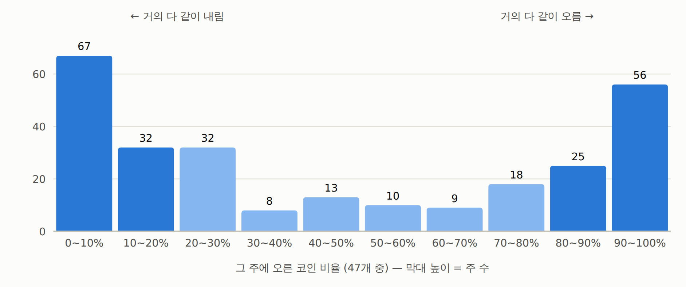
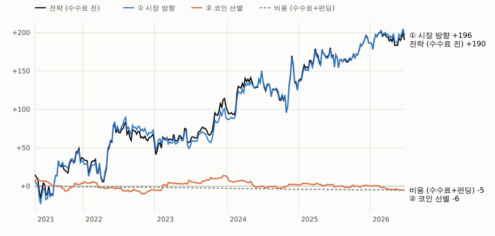
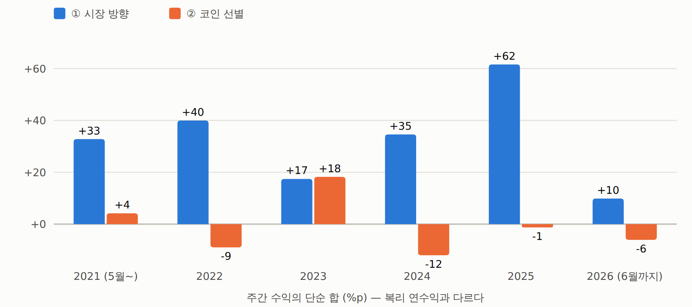

# 시계열 추세 수익 분해 — 다 같이 움직이는 부분 vs 코인별 부분 (2026-09-25)

사용자 질문: "코인은 보통 한꺼번에 같이 올라가는데, 이걸 분해해서 보여줄 수 있나?"
대상: [`시계열추세-트레이딩방법-상세.md`](083_시계열추세-트레이딩방법-상세.md) 의 기준 규칙(47심볼 · 28일 부호 · 일요일 UTC · 동일가중), 2021-05 ~ 2026-06,
270주, 봉인 전. **서술이다 — 판정 아님.** 코드 `examples/tsmom_decomp.py` · 보고서 `out/tsmom_decomp.html`.

## 결론

- **코인은 정말 같이 움직인다.** 코인 하나의 주간 변동 중 평균 **57%** 가 나머지 46개의 평균 움직임으로 설명된다
  (주간 상관 평균 0.57). **67%** 의 주에서 47개 중 80% 이상이 같은 방향으로 움직였다.
- **그래서 이 전략의 수익은 사실상 전부 '시장 방향' 에서 나왔다.** 수수료 전 주평균 +70.5bps 중
  ① 시장 방향 **+72.7bps**, ② 코인 선별 **−2.1bps (t −0.27)** — 0 이다. 주간 손익 변동의 94% 도 ① 에서 나온다.
- 47개로 나눠 들고 있어도 실제로는 **'크립토 시장 전체의 한 달 추세' 에 거는 베팅 하나**다.
  순노출 부호가 동일가중 지수의 28일 추세 부호와 92% 의 주에서 같다. 분산 효과가 작아 최대낙폭이 −46% 까지 간다.

## 분해 공식 (매주 정확히 성립 — 검산 완료)

```
전략 수익 = (1/N) Σ s_i · r_i
         = s̄ · m                          ① 시장 방향   s̄ = 순노출, m = 47개 평균 수익(동일가중 매수보유)
         + (1/N) Σ (s_i − s̄)(r_i − m)      ② 코인 선별   평균보다 더 롱인 코인이 평균보다 더 올랐으면 +
         − 수수료 − 펀딩
```

| 구성 | 주평균 bps | 연 (×52) | 몫 | t |
|---|---:|---:|---:|---:|
| 전략 (수수료 전) | +70.5 | +36.7% | 100% | 1.50 |
| **① 시장 방향** | **+72.7** | +37.8% | **103%** | 1.59 |
| **② 코인 선별** | **−2.1** | −1.1% | **−3%** | −0.27 |
| 수수료 | −2.5 | −1.3% | −4% | |
| 펀딩 | +0.6 | +0.3% | +1% | |
| 전략 (비용 후) | +68.6 | +35.7% | 97% | 1.46 |

- **정적 vs 동적.** ① 중 "평균적으로 순숏(−0.21)이었는데 시장이 평균적으로 빠져서(−5.4bps/주)" 생긴 몫은
  **+1.1bps** 뿐이고, **+71.6bps** 가 오를 때 롱 · 내릴 때 숏으로 시기를 맞춘 몫이다.
  ② 는 정적 +3.4 (계속 약했던 코인을 계속 숏) · 동적 −5.6.
- **베타 보정.** 코인별 시장 민감도(직전 90일 일간 베타, 인과)를 반영해도 시장 몫 +72.4 · 코인 고유 몫 −1.8bps.
- **분산.** 주간 손익 분산의 94% 가 ①, 3% 가 ②, 3% 가 둘의 공분산. 전략과 ①의 상관 0.99.

## 코인 동조성

| 지표 | 값 |
|---|---|
| 코인끼리 주간 수익 상관 평균 | 0.57 (일간 0.59) |
| 코인 하나의 변동 중 나머지 46개 평균으로 설명되는 몫 (R²) | 평균 57% — 최저 CFX 22%, 최고 DOT 78% |
| 첫 번째 공통 요인(PCA)이 설명하는 몫 | 59% |
| 80% 이상이 같이 오른 주 / 같이 내린 주 | 30.0% / 36.7% (합 67%) |
| 연도별 상관 | 2021 0.58 · 2022 0.64 · 2023 0.57 · 2024 0.63 · 2025 0.65 · 2026 0.63 |
| 신호의 80% 이상이 한쪽인 주 (90% 이상) | 65% (44%) |

주별 '오른 코인 비율' 분포는 U 자다(0~10%: 67주 · 90~100%: 56주, 가운데 칸은 8~13주).

## 연도별 (주간 수익 단순 합, %p — 복리 연수익과 다르다)

| 연도 | 시장 자체 | 평균 순노출 | ① 시장 방향 | ② 코인 선별 | 비용 | 전략 합 |
|---|---:|---:|---:|---:|---:|---:|
| 2021 (5월~) | +26 | −0.16 | +32.8 | +4.2 | −0.8 | +36.3 |
| 2022 | −118 | −0.40 | +40.0 | −9.0 | −0.7 | +30.3 |
| 2023 | +94 | +0.04 | +17.4 | **+18.2** | −1.4 | +34.3 |
| 2024 | +101 | −0.06 | +34.6 | −12.0 | −1.4 | +21.2 |
| 2025 | −68 | −0.39 | +61.6 | −1.2 | −0.5 | +59.8 |
| 2026 (6월까지) | −49 | −0.34 | +9.9 | −6.0 | −0.5 | +3.4 |

2023 만 코인 선별이 시장 방향만큼 벌었다. 2024 는 합 +21%p 지만 복리로는 −3% (큰 주간 등락의 복리 손실).

## 순노출 구간별 (주평균 bps, 수수료 전)

| 구간 | 주 | ① 시장 방향 | ② 코인 선별 | 합 |
|---|---:|---:|---:|---:|
| 순숏 (≤ −0.5) | 136 | +27.5 | −9.0 | +18.5 |
| 중간 | 67 | +40.4 | −12.8 | +27.6 |
| 순롱 (≥ +0.5) | 67 | **+196.6** | +22.5 | **+219.1** |

## 뜻과 다음

- 이 전략의 엣지(있다면)는 **'어떤 코인' 이 아니라 '시장 전체가 어느 쪽으로 가나'** 에 있다.
  코인별 28일 수익의 상대 차이는 돈이 되지 않았다(② ≈ 0) — 앞선 `painR3-횡단면롱숏-IC-최종기각` ·
  외부 문헌(10심볼 횡단면 실패 논문)과 같은 방향이다.
- 자연스러운 다음 질문: 같은 베팅을 **지수 하나(또는 BTC · ETH 같은 유동성 큰 코인)의 추세**로 더 싸고 단순하게
  할 수 있나. 새 규칙이라 **결과를 보기 전에 사전등록**해야 한다 — 여기서는 계산하지 않았다.
- 전략 자체의 유의성(t 1.46)과 lookback 띠(26~36일) 문제는 그대로다.

## 그림

보고서: [시계열 추세 수익 분해](../../out/tsmom_decomp.html) (`out/tsmom_decomp.html`)



*절: 1. 코인은 얼마나 같이 움직이나*



*절: 3. 누적으로 보면*



*절: 4. 연도별*
