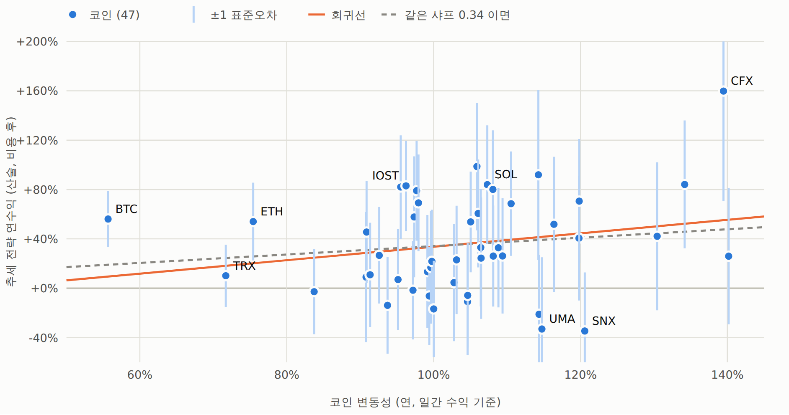
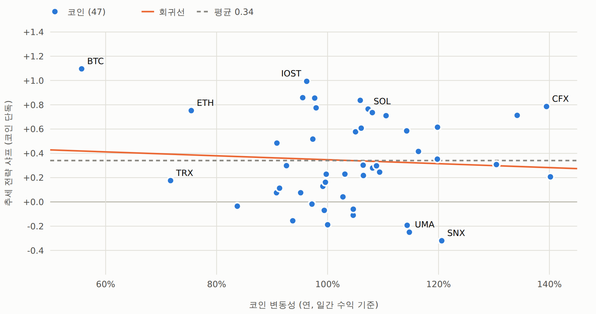

# 시계열 추세 — 코인별 수익과 변동성 (2026-09-25)

사용자 가설: **"코인들의 차이는 변동성이다."** — 코인마다 같은 베팅(시장 추세)을 크기만 다르게 하고 있어서, 원수익은
변동성에 비례하고 위험 1단위당 수익(샤프)은 비슷할 것이다.

대상: 기준 규칙(28일 부호 · 일요일 UTC · 수수료 6bps · 펀딩 0.137bps/8h)을 **코인 하나씩 명목 1배로** 본 것.
47심볼 · 2021-05 ~ 2026-06 · 270주 · 봉인 전. **서술이다 — 판정 아님.**
코드 `examples/tsmom_coins.py` · 보고서 `out/tsmom_coins.html`. 코인별 평균 = 포트폴리오 수익(검산 완료).

## 결론

- **가설과 같은 방향이다.** 매주 직전 90일 변동성으로 코인을 비교하면(인과, Fama-MacBeth) 변동성이 높을수록
  원수익이 높고(t 1.42), **변동성으로 나누면 차이가 사라진다**(t −0.33). 코인별 샤프는 변동성과 무관하다(상관 −0.07,
  95% 구간 −0.31 ~ +0.21). 샤프의 흩어짐(0.365)은 "모든 코인의 샤프가 같다" 고 가정했을 때의 잡음(0.365)과 같다(p 0.48).
- **하지만 증명은 안 된다.** 코인 하나의 5년 평균 연수익은 표준오차가 ±44%p(중앙)다. 모든 코인의 샤프가 0.34 로 같다면
  BTC(변동성 56%)와 TRB(140%)의 기대 차이는 약 29%p 로 잡음보다 작다. 그래서 "평균수익이 모두 같다" 도 기각되지
  않는다(p 0.41). 연수익-변동성 기울기(변동성 1%p 당 +0.54%p)의 95% 구간 [−0.38, +1.45] 도 0 을 포함한다.
- **쓸 수 있는 결론.** 데이터는 "같은 베팅, 다른 크기" 그림과 모순이 없다 → **코인 고르기가 아니라 변동성으로
  크기를 맞추는 것**(위험 균등)이 자연스럽다. 포트폴리오 변동성 타깃은 이미 샤프 0.64 → 0.69~0.71 로 조금 나았다
  ([`시계열추세-트레이딩방법-상세.md`](083_시계열추세-트레이딩방법-상세.md) §5). **고변동 코인만 고르는 건 근거가 없다** — 직전 90일 변동성 상위 3분위의 샤프
  0.84 vs 하위 0.61, 차이 +0.22 의 95% 구간 [−0.30, +0.75].
- **코인 하나로는 하지 말 것.** 명목 1배 숏으로 ZIL · BAND · UMA · MASK · CFX 가 한 주에 두 배 넘게 올라(주간 손실
  −103% ~ −204%) 계좌가 0 아래로 갔다. 47개에 1/47 씩 나눠서 버틴다.

## 코인별 요약

- 47개 중 **37개**가 비용 후 연수익(산술) 양수, **35개**가 자기 매수보유(연 산술)보다 높다.
- 연수익 −35% (SNX) ~ +160% (CFX), 중앙 +27%. 변동성 56% (BTC) ~ 140% (TRB). 베타 0.46 (TRX) ~ 1.25, 변동성과 베타의 상관 0.77.
- 샤프 상위: BTC 1.10 · IOST 0.99 · EGLD 0.86 · XTZ 0.86 · AVAX 0.84 / 하위: SNX −0.32 · UMA −0.25 · BAND −0.19 · ATOM −0.19 · DOT −0.16.
  **가장 변동성이 낮은 BTC 가 샤프 1위**지만 BTC 의 연수익 표준오차가 ±22%p 라 순위 자체는 잡음 범위다.

| 코인 | 변동성 | 베타 | 추세 연수익 | ±SE | 샤프 | 매수보유 연 |
|---|---:|---:|---:|---:|---:|---:|
| BTC | 56% | 0.51 | +56% | 22 | +1.10 | +16% |
| ETH | 75% | 0.78 | +54% | 31 | +0.75 | +16% |
| XRP | 93% | 0.76 | +27% | 39 | +0.30 | +29% |
| SOL | 107% | 1.04 | +84% | 48 | +0.77 | +70% |
| DOGE | 109% | 0.99 | +26% | 47 | +0.25 | +18% |

(전체 47개 표는 보고서 §4 · `runs/tsmom_coins.csv`)

## 변동성 3분위

| 묶음 | 코인 변동성 | 추세 연수익 | 묶음 변동성 | 샤프 | 최대낙폭 |
|---|---:|---:|---:|---:|---:|
| 전구간 낮음 (사후) | 89% | +35.7% | 52% | 0.69 | −41% |
| 전구간 중간 | 104% | +29.6% | 62% | 0.48 | −52% |
| 전구간 높음 | 120% | +42.1% | 64% | 0.66 | −53% |
| 직전 90일 낮음 (인과) | 75% | +33.9% | 55% | 0.61 | −43% |
| 직전 90일 중간 | 94% | +34.5% | 61% | 0.57 | −48% |
| 직전 90일 높음 | 124% | +50.2% | 60% | 0.84 | −51% |

- 묶음 변동성이 52~64% 로 비슷하다 — 묶음 안 코인들이 같이 움직여서 개별 변동성 차이가 포트폴리오에선 많이 준다.
- 동일 명목 포트폴리오에서 변동성 상위 10개가 위험의 23%, 하위 10개가 16% (비중은 각각 21%) — 쏠림은 크지 않다.
- 코인별 수익을 시장 몫(포지션 × 베타 × 시장)과 고유 몫으로 나누면 47개 합계에서 시장 몫이 100% ([`시계열추세-시장방향-분해.md`](068_시계열추세-시장방향-분해.md) 와 같은 결론).

## 다음 (사용자 결정)

- 위험 균등(코인별 변동성으로 크기 조절) 버전을 **운용 명세로 사전등록**하는 게 이 결과와 가장 잘 맞는다.
  변동성 추정 창(20일/90일)·목표 변동성·상한은 결과를 보기 전에 정한다.
- 고변동 코인 선별, 코인 순위 기반 선별은 근거가 없다 — 하지 않는다.

## 그림

보고서: [코인별 추세 수익과 변동성](../../out/tsmom_coins.html) (`out/tsmom_coins.html`)

*절: 1. 변동성과 연수익*

*절: 2. 변동성과 샤프 (위험 1단위당 수익)*
