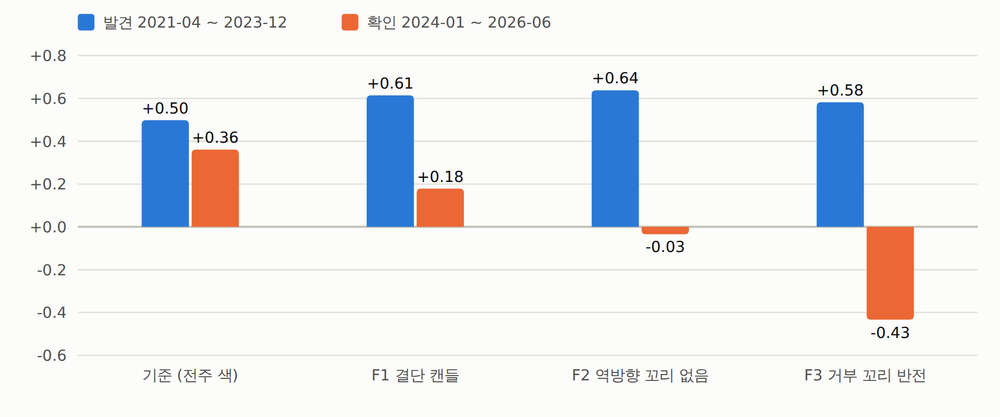
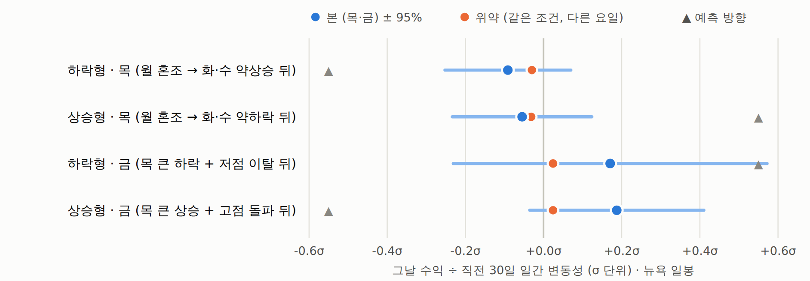
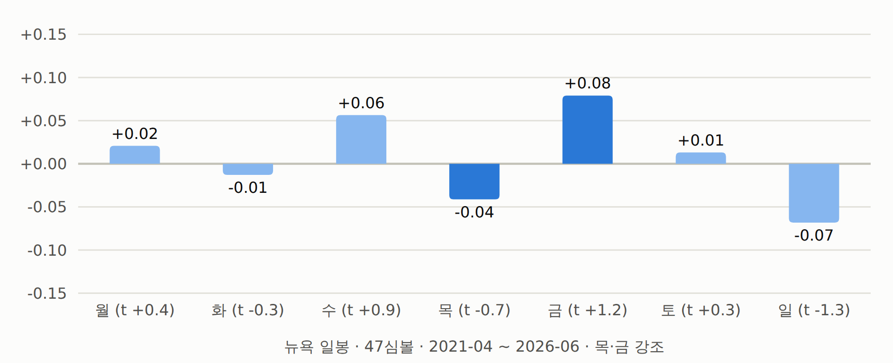

# 주봉 캔들(몸통·꼬리) 패턴 + TGIF 요일 패턴 — 결과: 둘 다 기각 (2026-09-25)

사전등록: [`주봉캔들-꼬리몸통-및-TGIF-사전등록.md`](070_주봉캔들-꼬리몸통-및-TGIF-사전등록.md) (실행 전 작성). 정의·칸·판정 기준을 바꾸지 않고 한 번 실행했다.
OKX 47심볼 · 2021-04 ~ 2026-06 · 봉인 전 · 주봉 = UTC 월 00:00 · 요일 = 뉴욕 자정(DST) · t 는 주 군집.
**봉인 창은 열지 않는다** — 통과가 없다.

## A. 주봉 캔들 — 판정: 기각

코인·주 12,776건 (272주).

| 규칙 | 전체 샤프 | t | 발견 (2021-04~2023-12) | 확인 (2024-01~2026-06) | 최대낙폭 | 판정 |
|---|---:|---:|---:|---:|---:|:-:|
| 기준 — 전주 색 따라가기 | 0.43 | 0.99 | 0.50 | 0.36 | −49% | — |
| F1 결단 캔들 (몸통 ≥ 1/3) | 0.41 | 0.94 | 0.61 | 0.18 | −42% | 기각 |
| F2 역방향 꼬리 없음 | 0.33 | 0.74 | 0.64 | −0.03 | −55% | 기각 |
| F3 거부 꼬리 반전 | 0.09 | 0.20 | 0.58 | **−0.43** | −80% | 기각 |

- **세 필터 모두 발견 구간에서는 기준보다 좋았다가 확인 구간에서 기준보다 나빠졌다** — 발견 구간에 맞춰진 모양.
  필터 효과(확인, 주 군집): F1 남긴 − 버린 거래 −0.27%p/주 (t −0.34) · F2 −1.06%p (t −0.79) ·
  F3 뒤집은 거래의 원래 방향 수익 +1.09% (t 1.14) — 뒤집어서 손해.
- 기준(= 7일 lookback 시계열 추세)은 28일 추세(샤프 0.64)보다 약하다.
- **14칸 지도**: 발견 구간 |t| ≥ 2.5 인 칸이 없어(최대 1.86, 양봉 · 몸통 큼 · 짧음 +4.48%/주) 후보 0개 → 확인할 것이 없다.
  '같은 방향으로 마감' 비율은 칸마다 44 ~ 59% 로 반반에 가깝다.
- **"이번 주가 전주 고점을 먼저 치나, 저점을 먼저 치나" 는 꼬리 모양이 아니라 전주 종가 위치로 전부 설명된다.**
  꼬리 짧은 양봉 뒤 고점 먼저 85% — 종가가 범위의 83% 위치라 고점이 가깝기 때문이다. 종가 위치가 같은 모든 캔들과 비교하면
  여섯 묶음 모두 차이가 2%p 이내(예: 81.5% vs 80.3%, 12.9% vs 12.9%).

| 전주 캔들 | 건수 | 이번 주 고점 돌파 | 저점 이탈 | 전주 종가 위치 | 고점 먼저(닿은 것 중) | 같은 방향 마감 |
|---|---:|---:|---:|---:|---:|---:|
| 양봉 · 아랫꼬리 김 | 1,523 | 73.5% | 26.5% | 0.77 | 81.5% | 47.9% |
| 양봉 · 윗꼬리 김 | 2,234 | 41.7% | 45.0% | 0.46 | 46.6% | 46.8% |
| 양봉 · 꼬리 짧음 | 2,126 | 75.0% | 22.1% | 0.83 | 85.1% | 46.9% |
| 음봉 · 아랫꼬리 김 | 2,412 | 40.4% | 38.6% | 0.51 | 52.6% | 54.1% |
| 음봉 · 윗꼬리 김 | 2,106 | 24.3% | 79.2% | 0.19 | 12.9% | 58.8% |
| 음봉 · 꼬리 짧음 | 2,375 | 14.1% | 72.5% | 0.18 | 9.0% | 53.1% |

## B. TGIF — 판정: 기각 (4가설 모두)

| 가설 | 본(목·금) 평균 σ | t | 건수 | 위약 σ | 차이 t | 반기 (발견 / 확인) | 판정 |
|---|---:|---:|---:|---:|---:|---:|:-:|
| H1 하락형 — 월 혼조 · 화·수 약상승 뒤 목 (예측 −) | −0.091 | −1.11 | 637 · 137주 | −0.030 | −0.69 | −0.20 / +0.04 | 기각 |
| H1 상승형 — 월 혼조 · 화·수 약하락 뒤 목 (예측 +) | −0.055 | −0.60 | 789 · 134주 | −0.032 | −0.24 | +0.09 / −0.17 | 기각 |
| H2 하락형 — 목 큰 하락 + 월~수 저점 이탈 뒤 금 (예측 +) | +0.170 | 0.83 | 1,272 · 108주 | +0.024 | 0.63 | −0.02 / +0.33 | 기각 |
| H2 상승형 — 목 큰 상승 + 월~수 고점 돌파 뒤 금 (예측 −) | +0.187 | 1.65 | 1,112 · 177주 | +0.024 | 1.34 | +0.05 / +0.31 | 기각 |

- **목요일은 특별하지 않다.** 하락형 준비 뒤 목요일은 다른 요일 같은 조건(위약)과 다르지 않다.
- **목요일은 얼마나 떨어지나** (하락형 준비 뒤 637건): 중앙 −0.77% (−0.18σ) · 하위 25% −2.84% · 하위 10% −5.68% (−1.07σ) ·
  상위 10% +4.35%. 큰 하락(−1σ 이하) 12.7% — 목요일 전체(14.7%)보다 적다. 월~수 저점 이탈 12.7% (위약 13.8%, 목요일 전체 28.4% —
  이틀 올라 저점이 멀어진 탓). 상승형의 월~수 고점 돌파 7.7% (위약 10.0%).
- **금요일 되돌림(TGIF)도 없다.** 하락형은 +0.17σ 로 유의하지 않고, 상승형은 되돌리지 않고 오히려 이어갔다(+0.19σ).
- **H3 5일 전체 순서는 우연보다 덜 나온다**: 하락형 22건(17주), 요일별 조건이 독립일 때 기대의 0.65배 [0.35, 1.04] ·
  상승형 25건(16주) 0.77배 [0.41, 1.19].
- 거래(보조, 왕복 12bps): 하락형 목 숏 +0.41% (t 1.01) · 금 롱 +0.49% (t 0.61) / 상승형 목 롱 −0.52% · 금 숏 −0.74% (t −1.59).
- 조건 없는 요일 효과: 목 −0.041σ (t −0.71, 오른 날 46%) · 금 +0.079σ (t 1.25) · 일 −0.068σ (t −1.28) — 방향은 TGIF 처럼 기울지만
  어느 요일도 유의하지 않다(|t| ≤ 1.3).
- UTC 일봉 민감도(판정 외): 넷 다 통과 없음. 상승형 금요일 +0.25σ (t 2.22) 는 예측(되돌림)과 **반대 방향**의 이어가기이고
  여러 검정 중 하나라 우연 범위로 본다.
- 독립 재계산(다른 코드 경로): H1 하락형 목 평균 −0.091σ · 637건 · 전체 패턴 22건 — 일치.

## 결론

- 주봉 몸통·꼬리는 전주 색(1주 추세) 이상의 정보를 주지 않았다. 그럴듯해 보이는 '전주 고저 먼저 치기' 패턴은 종가 위치의 기하학이다.
- TGIF(월 혼조 · 화·수 약상승 · 목 급락 · 금 반등)와 그 역방향은 47심볼 5년 데이터에 없다.
- 지금까지 비용을 넘은 건 여전히 **약 한 달 추세(시장 방향)** 하나뿐이다([`시계열추세-트레이딩방법-상세.md`](083_시계열추세-트레이딩방법-상세.md)).

## 코드 · 산출물

- `qbot/research/weekly.py` — UTC 주봉(전주 고저 선도달 시각) · 뉴욕/UTC 일봉(DST) · 캔들 모양 · 14칸 · σ(인과) · 요일 말
- `tests/test_weekly.py` (7) — 월 00:00 UTC 경계, 선도달 시각, 뉴욕 DST(23시간 날), 몸통+꼬리=1, 칸 규칙, σ 인과성, 말 경계
- `examples/weekly_build.py` → `runs/weekly/{weeks,days_ny,days_utc}.pkl`
- `examples/weekly_candles.py` (A) → `runs/weekly_candles.json` · `examples/tgif.py` (B) → `runs/tgif.json`
- `examples/weekly_report.py` → `out/weekly_tgif.html`

## 그림

보고서: [주봉 캔들 · TGIF 검정](../../out/weekly_tgif.html) (`out/weekly_tgif.html`)

*절: A. 주봉 캔들 — 전주 캔들로 이번 주 맞히기*

*절: B. TGIF — 월 혼조 · 화·수 약상승 · 목 큰 하락 · 금 소폭 상승 (그리고 역방향)*

*절: 요일 효과 자체 (조건 없음)*
