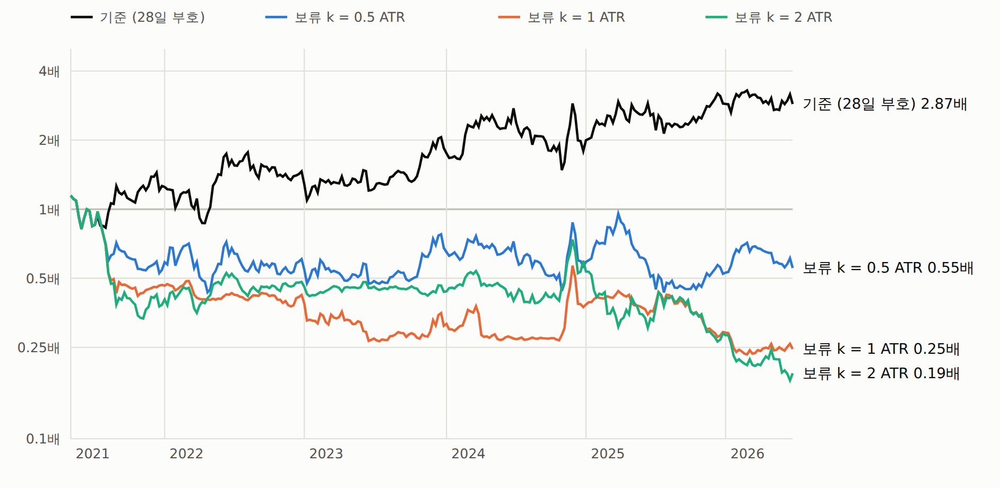
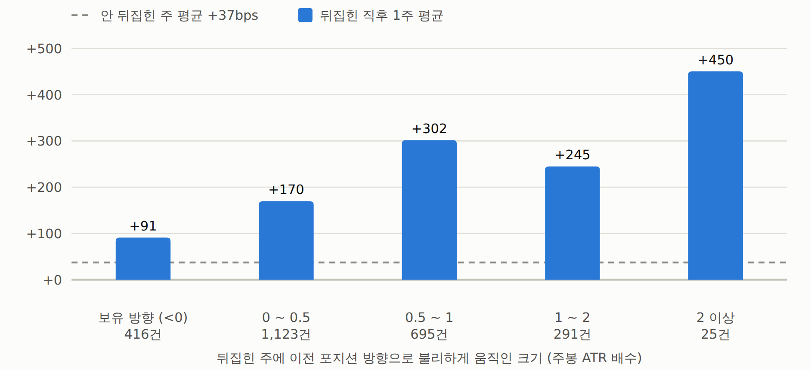

# 시계열 추세 + 뒤집기 보류(주봉 ATR) — 결과: k 0.5 · 1 · 2 모두 기각 (2026-09-25)

사전등록: [`시계열추세-뒤집기보류-ATR-사전등록.md`](072_시계열추세-뒤집기보류-ATR-사전등록.md) (실행 전 작성). 규칙 · k · 판정 기준을 바꾸지 않고 한 번 실행했다.
47심볼 · 2021-05 ~ 2026-06 · 270주 · 롱·숏 대칭 · 주봉 ATR 14주 · 봉인 창은 열지 않는다.

## 판정 — 셋 다 기준보다 확실히 나쁘다

| 규칙 | 샤프 | 전반 | 후반 | 연복리 | 최대낙폭 | 주간 차이 bps (블록 부트스트랩 t) | 뒤집기 보류 | 평균 보유 | 수수료 연 | 판정 |
|---|---:|---:|---:|---:|---:|---:|---:|---:|---:|:-:|
| 기준 (28일 부호) | 0.64 | 0.58 | 0.69 | +22.5% | −46% | — | — | 4.7주 | 1.32% | — |
| 보류 k = 0.5 ATR | 0.04 | −0.19 | 0.25 | −10.7% | −62% | −65 (−2.03) | 65% | 9주 | 0.66% | 기각 |
| 보류 k = 1 ATR | −0.46 | −1.12 | 0.12 | −23.7% | −80% | −104 (−2.26) | 93% | 22주 | 0.26% | 기각 |
| 보류 k = 2 ATR | −0.46 | −0.55 | −0.39 | −27.2% | −84% | −109 (−1.92) | 99% | 54주 | 0.09% | 기각 |

- 사전등록 기준 ①(차이 > 0, t ≥ 2.4) ②(두 반기 샤프 ↑) ③(MDD 5%p 이내)를 세 k 모두 **전부** 실패했다.
- 차이의 95% 구간도 모두 0 아래: k 0.5 [−131, −5.5] · k 1 [−202, −22] · k 2 [−224, −5.5] bps/주.
- 수수료는 줄지만(연 1.32% → 0.66 · 0.26 · 0.09%) 잃는 수익(연 34 ~ 57%p)이 수십 배 크다.
- **lookback 21 · 35 · 56일에서도** 모든 k 가 기준보다 나쁘다 (21일 0.08 → −0.14 · −0.64 · −0.61 / 35일 0.42 → 0.01 · −0.52 · −0.35 /
  56일 0.16 → 0.04 · −0.54 · −0.39) — 28일 특유의 우연이 아니다.
- 연도별(복리): 기준 +26 · +16 · +26 · −3 · +61 · −1% / k 0.5 −46 · +11 · +12 · −17 · −7 · +6%.

## 왜 — 뒤집기 신호는 대부분 조용히 나고, 그 직후가 가장 값지다 (사후 서술)

- **뒤집기 신호의 대부분은 작은 주간 움직임에서 난다.** k = 0.5 만 걸어도 규칙이 적용될 수 있는 뒤집기 신호의 65% 가 보류되고,
  k = 2 면 99% — 사실상 안 뒤집는 전략이 된다(평균 보유 54주, 코인·주의 절반을 신호와 반대로 든다).
- **이 전략의 돈은 '뒤집힌 직후' 에 몰려 있다.** 기준 규칙에서 포지션이 뒤집힌 코인·주 2,652건의 다음 주 평균 **+172bps**
  (t 2.16) vs 안 뒤집힌 주 **+37bps** (t 0.66). 뒤집힌 코인·주는 전체의 21% 인데 주간 수익 합의 55% 를 낸다.
  뒤집힌 뒤 누적은 1주 +161 · 2주 +221 · 3주 +250 · 4주 +223bps (로그) — 2 ~ 3주 안에 끝난다.
- **조용히 뒤집힌 신호도 값지다.** 뒤집힌 주에 이전 포지션 방향으로 불리했던 크기별 다음 주 평균:

| 뒤집힌 주의 역행 (ATR) | 건수 | 다음 주 평균 | t |
|---|---:|---:|---:|
| 보유 방향으로 움직임 (< 0) | 416 | +91bps | 0.67 |
| 0 ~ 0.5 | 1,123 | +170bps | 1.74 |
| 0.5 ~ 1 | 695 | +302bps | 2.59 |
| 1 ~ 2 | 291 | +245bps | 1.71 |
| 2 이상 | 25 | +450bps | 0.76 |

  보류는 이 가장 값진 주를 버리고 신호와 반대로 들고 있게 만든다 — k = 0.5 에서 규칙이 기준과 달라진 코인·주 2,278건은 평균
  **−184bps/주** (t −2.26).
- 휘둘림을 줄이려는 직관은 자연스럽지만, 이 신호에서는 **작은 움직임에 뒤집힌 것이 잡음이 아니라 정보**였다.

> '뒤집힌 직후 가치가 크다' 는 결과를 보고 알게 된 **사후 관찰**이다. 이걸 이용하는 규칙(예: 뒤집힌 뒤 N주만 보유)은
> 새로 사전등록해야 하고, 이미 이 데이터를 봤으므로 검증에는 새 데이터(봉인 창 · 전방 기록)가 필요하다.

## 검증

- 테스트 `tests/test_tsmom_rules.py` (6): 보류 없음 = legacy 기준과 같음, k = ∞ 면 안 뒤집힘, 손계산(롱·숏·보유 방향 움직임),
  주봉 ATR 손계산 · 인과성, 포지션 인과성, 신호 0 = 쉼.
- 기준(k 없음)이 legacy `tsmom_weekly` 와 매주 같음(스크립트 안 assert).
- 독립 재계산(모듈 없이 직접 루프): k = 0.5 샤프 0.041 · 보류 2,278건 — 일치.

## 코드

- `qbot/research/tsmom_rules.py` — `weekly_atr` · `hold_positions` · `book_from_positions`
- `examples/tsmom_hold.py` → `runs/tsmom_hold.json` · `runs/tsmom_hold_weekly.csv` · `runs/tsmom_hold_flips.json`
- `examples/tsmom_hold_report.py` → `out/tsmom_hold.html`

## 그림

보고서: [시계열 추세 뒤집기 보류](../../out/tsmom_hold.html) (`out/tsmom_hold.html`)

*절: 1. 누적 자산 (로그 축)*

*절: 3. 왜 — 뒤집힌 직후 1주의 가치 (사후 서술)*
