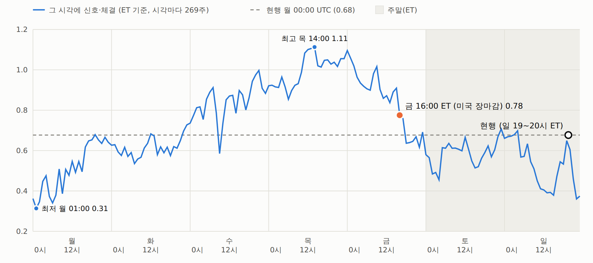

# 시계열 추세 — 체결 시각 지도 (주 168시간) · 금 장마감 체결은 더 나은가 (2026-09-25)

사전등록 없는 **서술**이다. 질문: "금요일 장마감(16:00 ET)에 신호를 보고 바로 체결하면 조금 더 이득 아닌가?"
([`시계열추세-금신호-월시가-주말갭지정가-결과-기각.md`](076_시계열추세-금신호-월시가-주말갭지정가-결과-기각.md) 의 서술용 V1 이 샤프 0.78 로 현행 0.68 보다 높게 나왔다.)
규칙은 현행 그대로(47심볼 · 28일 부호 · 동일가중 롱·숏 · 1주 보유 · 6bps · 펀딩), **신호 = 체결 시각만** 주 168개 시각으로 돌렸다.
시각마다 2021-04-30 00:00 UTC 이후 첫 269주 · 봉인 창은 열지 않는다.

## 답 — 더 낫다는 근거가 없다

| 269주 | 현행 (월 00:00 UTC) | 금 16:00 ET 장마감 |
|---|---:|---:|
| 샤프 | 0.68 | 0.78 |
| 전반 (2021-05 ~ 2023-10) · 후반 | 0.58 · 0.76 | 0.85 · 0.70 |
| 2021 · 2022 · 2023 · 2024 · 2025 · 2026 | +26% · +16% · +41% · -13% · +61% · +10% | +103% · +16% · +38% · +8% · +10% · +11% |
| 2022 ~ 2026-06 누적 | ×2.51 | ×2.10 |

- 주간 차이(같은 주 짝) **+11.2bps/주, 4주 블록 부트스트랩 t +0.42** (95% -39 ~ +64), 이긴 주 50%.
  이 크기를 t 2 로 확인하려면 **약 6,050주 ≈ 116년**이 필요하다 — 봉인 11주 · 전방 기록으로는 영원히 못 가린다.
- **2021년 한 해가 거의 전부다.** 2021 을 빼면 -6.9bps/주 (t -0.25) — 2022 년부터는 현행이 더 벌었다. 후반 샤프도 금 장마감이 낮다.

## 체결 시각 지도 — 시각 선택은 대부분 운이다

- ET 기준 168개 시각의 샤프: **평균 0.70 · 표준편차 0.20 · 10 ~ 90% 0.46 ~ 1.00** ·
  최저 0.31 (월 01:00 ET) · 최고 1.11 (목 14:00 ET). UTC 격자도 거의 같다(평균 0.70, 0.32 ~ 1.12).
- **시각을 옮길 때 샤프가 변하는 크기**(평균 절대 차이): 1시간 0.045 · 3시간 0.075 · 4시간 0.082 ·
  6시간 0.095 · 12시간 0.120 · 24시간 0.183.
- 금요일 주변: 금 15:00 0.91 → **16:00 0.78** → 17:00 0.76 → 18:00 0.64 → 토 00:00 0.58 (ET).
  168개 중 59개 시각이 금 16:00 보다 높다. '장마감' 이 특별한 시각이라는 흔적은 없다.
- 요일 평균(그 요일 24시각): 월 0.51 · 화 0.61 · 수 0.84 · 목 0.99 · 금 0.85 · 토 0.59 · 일 0.53.
- (사후 관찰) 수 ~ 금 시각 − 토 ~ 월 시각 = **+39.8bps/주 (t +1.83)**, 전반 +51.1 · 후반 +28.5.
  시각별 샤프의 전반 · 후반 상관 0.45. 결과를 보고 찾은 패턴이라 **검증 후보이지 근거가 아니다** — 쓰려면 사전등록 + 새 데이터.
- 참고: 현행의 첫 주(2021-05-03)가 +14.7% 라, 첫 주 하나만 빼도 샤프 0.68 → 0.63. 마지막 부분 주 하나로 0.64 ↔ 0.68. 이 전략의 샤프는 주 한두 개에 ±0.05 흔들린다.

## 시각을 고르지 않는 방법 — 나눠 리밸런스 (서술)

자본을 7개로 나눠 요일마다(00:00 UTC) 1/7 씩 리밸런스. 묶음별 일 손익을 달력 주(월 00:00 UTC ~)로 합산, 2021-05-10 ~ 2026-06-28 (268주).

| 방식 | 샤프 | 최대낙폭 |
|---|---:|---:|
| 한 요일만 | 월 0.63 · 화 0.63 · 수 0.61 · 목 0.87 · 금 1.00 · 토 0.60 · 일 0.49 | 월 -46% · 화 -46% · 수 -43% · 목 -33% · 금 -42% · 토 -50% · 일 -62% |
| 한 요일만 쓸 때 평균 | 0.69 | -46% |
| **7개로 나눠 매일 1/7 씩** | **0.74** | **-36%** |

- 기대수익은 한 시각의 평균과 같고(연복리 28.9%), **'어느 시각에 걸렸나' 의 운만 줄인다.** 요일 묶음끼리 주간 수익 상관이 0.86 로
  높아 줄어드는 폭은 크지 않지만, 시각을 데이터로 고르는 것(과최적화)과 달리 **아무것도 고르지 않는** 개선이다.
- 합친 포지션 = 코인마다 '지난 7일 동안 매일 낸 28일 부호의 평균' (−1 ~ +1, 1/7 단위). 매일 00:00 UTC 에 1/7 씩 거래하므로 총 회전 · 수수료는 같다.
  자산이 작으면 코인당 1/7 묶음이 거래소 최소 수량에 걸릴 수 있다.
- **채택하려면 운용 명세 사전등록에 넣는다.** 이 숫자 자체는 이미 본 데이터라 확인이 아니다.

## 실무 메모

- 금 16:00 ET = 한국 토 05:00 (미국 서머타임) · 06:00, 현행 월 00:00 UTC = 한국 월 09:00. 봇이면 시각은 상관없다.
- 금 장마감으로 **바꿀 이유는 없지만, 바꿔도 나빠진다는 근거도 없다** — 편한 시각을 한 번 정하고 고정하면 된다. 결과를 보고 시각을 옮기지 않는다.

## 검증

- 시간 가격표(5m → 매 정시 직전 5m 종가, 47심볼 × 46,080시간, 빈 칸 0)에서 **월 00:00 UTC 시각 = 현행 V0, 금 16:00 ET 시각 = V1** 과
  269주 주간 수익이 정확히 같다(스크립트 안 assert). 나눠 리밸런스의 월 묶음(달력 주 합산) = V0 (assert).
- 일 02:00 ET 는 봄 서머타임 전환 날 없는 시각이라 주가 적다(239주). 가을 전환의 겹치는 시각은 첫 번째를 쓴다.

## 코드

- `examples/tsmom_anchor_build.py` → `runs/tsmom_anchor/hourly_close.pkl`
- `examples/tsmom_anchor_sweep.py` → `runs/tsmom_anchor.json` (시각 지도 · V1 vs V0 · 나눠 리밸런스 · 요일 대비)
- `examples/tsmom_anchor_report.py` → `out/tsmom_anchor.html`

## 그림

보고서: [체결 시각 지도](../../out/tsmom_anchor.html) (`out/tsmom_anchor.html`)

*절: 1. 주 168개 시각의 샤프 (ET)*
