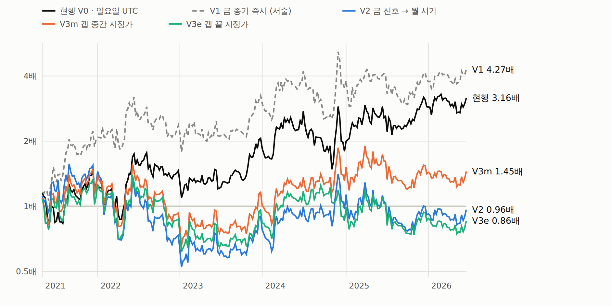
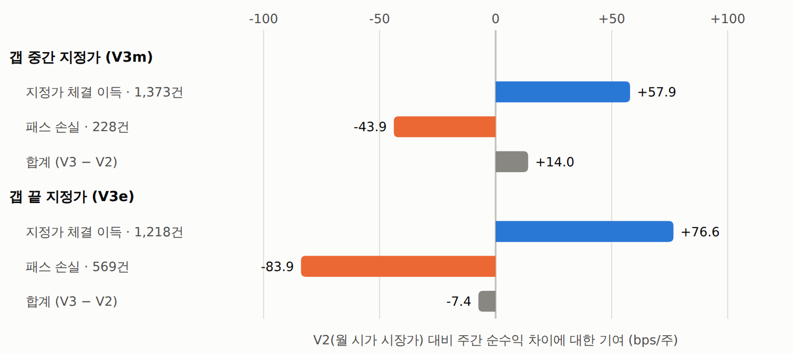
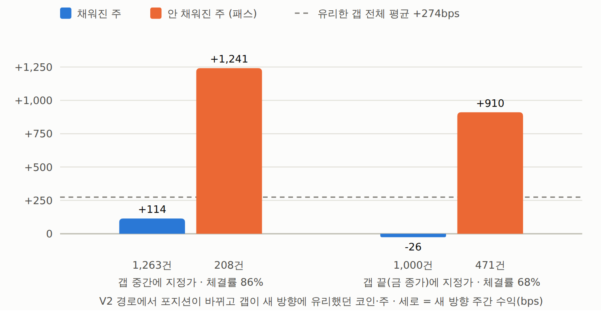
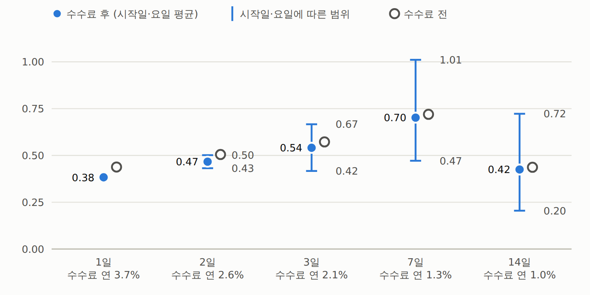

# 시계열 추세 — 금 종가 신호 · 월 시가 · 주말갭 지정가 — 결과: 셋 다 기각 (2026-09-25)

사전등록: [`시계열추세-금신호-월시가-주말갭지정가-사전등록.md`](074_시계열추세-금신호-월시가-주말갭지정가-사전등록.md) (실행 전 작성). 규칙 · 판정 기준을 바꾸지 않고 한 번 실행했다.
47심볼 · 공통 269주 (월요일 2021-05-03 ~ 2026-06-22) · 28일 부호 · 동일가중 롱·숏 · 시장가 6bps · 지정가 2bps · 봉인 창은 열지 않는다.

## 판정 — 통과 없음

| 비교 | 주간 차이 bps (4주 블록 부트스트랩 t) | 95% 구간 | 전반 샤프 | 후반 샤프 | 최대낙폭 | ①②③ | 판정 |
|---|---:|---:|---:|---:|---:|:-:|:-:|
| ① V2 금 신호 → 월 시가 vs 현행 V0 | −36.4 (−1.47) | −84 ~ +13 | 0.09 vs 0.58 | 0.53 vs 0.76 | −67% vs −46% | ✕ ✕ ✕ | 기각 |
| ② V3m 갭 중간 지정가 vs V2 | +14.0 (+1.55) | −1 ~ +34 | 0.22 vs 0.09 | 0.66 vs 0.53 | −58% vs −67% | ✕ ○ ○ | 기각 |
| ③ V3e 갭 끝 지정가 vs V2 | −7.4 (−0.39) | −46 ~ +28 | 0.10 vs 0.09 | 0.44 vs 0.53 | −56% vs −67% | ✕ ✕ ○ | 기각 |

| 규칙 | 샤프 | t | 전반 | 후반 | 연복리 | 최대낙폭 | 수수료 전 연수익 | 수수료 연 |
|---|---:|---:|---:|---:|---:|---:|---:|---:|
| 현행 V0 (일요일 UTC 종가 신호 · 체결) | 0.68 | 1.54 | 0.58 | 0.76 | +24.9% | −46% | +38.6% | 1.32% |
| V1 금 16:00 ET 종가 신호 · 즉시 체결 (사전등록 밖 서술) | 0.78 | 1.76 | 0.85 | 0.70 | +32.4% | −44% | +44.5% | 1.34% |
| V2 금 신호 → 월 09:30 ET 시가 시장가 | 0.30 | 0.67 | 0.09 | 0.53 | −0.7% | −67% | +19.7% | 1.34% |
| V3m 갭 중간 (O+F)/2 지정가 | 0.42 | 0.95 | 0.22 | 0.66 | +7.4% | −58% | +26.6% | 0.89% |
| V3e 갭 끝 F 지정가 | 0.25 | 0.56 | 0.10 | 0.44 | −3.0% | −56% | +15.5% | 0.93% |

- V3m 은 V2 대비 ②(두 반기 샤프 ↑) ③(MDD) 은 통과했지만 ①(t ≥ 2.4) 에서 떨어졌다. 끝과 끝 비교로는 V3m − V0 = −22.4bps/주 (t −0.98), V3e − V0 = −43.8 (t −1.43).
- 연도별(복리): V0 +26 · +16 · +41 · −13 · +61 · +10% / V2 +26 · −42 · +23 · +8 · −6 · +6% / V3m +21 · −23 · +25 · +13 · +8 · +2% / V3e +10 · −21 · +10 · −11 · +1 · −0%.

## 왜 V2 가 나쁜가 — 주말을 기다리는 비용 (사후 서술)

- 금 16:00 ET 에 신호가 **바뀐** 코인·주 2,754건: 주말(금 16:00 → 월 09:30 ET) 동안 새 방향으로 평균 **+110bps** (주 군집 t 2.20).
  안 바뀐 코인·주 9,889건은 보유 방향으로 +41bps (t 1.26).
- 바뀐 것의 **98% 가 뒤집기**(롱 ↔ 숏)라서, 월 시가까지 기다리면 그 주말 움직임을 반대 포지션으로 맞는다 → 포트폴리오 주당 약 **−46bps**.
- 확인: 신호는 같고 체결만 금 종가에 바로 하는 V1 과 V2 의 차이 = **−47.6bps/주** (t −1.62). 주말 대기 비용(−46)과 거의 같다.
- V1 은 V0 와 구별되지 않는다: +11.2bps/주 (t 0.42, 95% −41 ~ +62). 연도별로도 2021 +103% vs +26% 처럼 들쭉날쭉 — 요일 기준점의 잡음이다.
  추가 점검(주 168개 체결 시각 · 나눠 리밸런스): [`시계열추세-체결시각-168시간-지도.md`](075_시계열추세-체결시각-168시간-지도.md).
- 뜻: 금요일 기준으로 옮기는 것 자체는 나쁘지 않을 수 있지만(V1), **신호를 보고 주말을 기다렸다 체결하는 것**이 이 표본에서 손해였다.
  '뒤집힌 직후 1주가 가장 값지다' ([`시계열추세-뒤집기보류-ATR-결과-기각.md`](073_시계열추세-뒤집기보류-ATR-결과-기각.md)) 와 같은 방향의 관찰이다.

**요일 × 지연 격자** (일 종가 · 28일 부호 · 시장가, 그 요일 UTC 일봉 종가에 신호 → k 일 뒤 종가에 체결, 1주 보유 · 서술):

| 신호 요일 | 즉시 | 1일 뒤 | 2일 뒤 | 3일 뒤 |
|---|---:|---:|---:|---:|
| 월 | 0.63 | 0.81 | 1.01 | 0.64 |
| 화 | 0.59 | 0.91 | 0.65 | 0.37 |
| 수 | 0.93 | 0.73 | 0.48 | 0.35 |
| 목 | 1.01 | 0.66 | 0.49 | 0.68 |
| 금 | 0.60 | 0.40 | 0.52 | 0.45 |
| 토 | 0.47 | 0.61 | 0.56 | 0.66 |
| 일 (현행 = 즉시) | 0.68 | 0.74 | 0.88 | 0.95 |
| **7요일 평균** | **0.70** | **0.69** | **0.66** | **0.59** |
| 즉시 대비 주간 차이 평균 | — | −0.9bps | −5.7bps | −13.9bps |

- 지연은 **평균적으로 약간** 손해이고(3일 늦으면 주 −14bps), 요일마다 크게 흔들린다. V2 의 −48bps(주말 2.7일 대기)는 그 분포의 나쁜 쪽 끝이다.
- 방법 문서의 '하루 · 이틀 늦어도 괜찮다(0.74 · 0.88)' 는 **일요일 줄만** 본 것이었다 — 7요일 평균으로는 성립하지 않는다. 방법 문서를 고쳤다.
- 칸마다 잡음이 크다(같은 7일 주기에서 요일만 바꿔도 0.47 ~ 1.01). 한 칸을 골라 규칙으로 삼으면 안 된다.

## 갭 지정가 — 싸게 사지만 가장 좋은 주를 놓친다 (역선택)

| | 갭 중간 (V3m) | 갭 끝 (V3e) |
|---|---:|---:|
| 포지션 변화 시도 / 주 (47개 중) | 11.0 | 12.2 |
| 진입 방식: 지정가 체결 · 장 시가(불리한 갭) · 패스 | 46% · 46% · 8% | 37% · 46% · 17% |
| 지정가를 건 경우 체결률 | 85.8% | 68.2% |
| 체결 시 월 시가 대비 가격 개선 | 266bps | 401bps |
| 체결까지 중앙 시간 · 1시간 내 · 24시간 내 | 4.7시간 · 28% · 76% | 11.7시간 · 17% · 61% |
| 관통 1bps 필요 가정 — 체결률 · V2 대비 | 85.8% · +14.0bps | 68.0% · −7.9bps |

**역선택** (V2 경로에서 포지션이 바뀌고 갭이 새 방향에 유리했던 코인·주 1,471건 = 변화의 54%, 월 시가 → 다음 월 시가 새 방향 수익):

| | 채워진 주 | 안 채워진 주 |
|---|---:|---:|
| 갭 중간 | +114bps (t 1.02, 1,263건) | **+1,241bps** (t 6.57, 208건) |
| 갭 끝 | −26bps (t −0.23, 1,000건) | **+910bps** (t 5.68, 471건) |

- 지정가는 가격이 새 방향과 **반대로** 돌아올 때만 채워진다. 안 채워진 주 = 가격이 새 방향으로 달아난 주 = 가장 좋은 주.
- 채워진 주의 지정가 기준 수익은 +382bps(중간) · +368bps(끝)로 괜찮지만, 놓친 주의 크기를 메우지 못한다.
- 참고(사후): 갭이 새 방향에 유리했던 주의 새 방향 수익 +274bps (t 2.52) vs 불리했던 주 +62bps (t 0.55) — 주말에 새 방향으로 간 코인이 그 주에도 더 갔다.

**V3 − V2 분해** (코인·주 차이를 V3 행동별로, bps/주 기여):

| | 갭 중간 (V3m) | 갭 끝 (V3e) |
|---|---:|---:|
| 지정가 체결 이득 | +57.9 (1,373건, 건당 +534bps — 뒤집기는 2단위) | +76.6 (1,218건, 건당 +795bps) |
| 패스 손실 | −43.9 (228건, 건당 **−2,432bps**) | −83.9 (569건, 건당 **−1,863bps**) |
| 장 시가 · 보유 | −0.1 | −0.2 |
| **합계** | **+14.0** | **−7.4** |

패스하면 옛(대부분 반대) 포지션을 달아나는 주 내내 들고 있어서, 놓친 수익 + 반대 포지션 손실을 함께 맞는다.

## 왜 꼭 1주인가 — 리밸런스 주기 (서술)

일 종가(UTC) · 28일 부호 · 시장가 · k 일마다 리밸런스, 가능한 시작일을 모두 돌려 평균:

| 주기 | 샤프 평균 | 시작일·요일 범위 | 수수료 전 샤프 | 연복리 | 최대낙폭 | 회전 / 연 | 수수료 연 |
|---|---:|---:|---:|---:|---:|---:|---:|
| 1일 | 0.38 | — | 0.44 | +5% | −56% | 62 | 3.69% |
| 2일 | 0.47 | 0.43 ~ 0.50 | 0.50 | +11% | −55% | 44 | 2.62% |
| 3일 | 0.54 | 0.42 ~ 0.67 | 0.57 | +16% | −53% | 36 | 2.13% |
| **7일** | **0.70** | **0.47 ~ 1.01** | 0.72 | +28% | −45% | 22 | 1.34% |
| 14일 | 0.42 | 0.20 ~ 0.72 | 0.44 | +9% | −60% | 17 | 1.00% |

- 짧게 할수록 나빠지는데, **수수료 전에도** 낮다 — 매일 따라가면 연 62회(7일은 22회) 바뀌고, 늘어난 뒤집기가 수수료 전에도 손해였다.
- 그러나 7일 안에서도 요일에 따라 0.47 ~ 1.01 (월 0.63 · 화 0.59 · 수 0.93 · 목 1.01 · 금 0.60 · 토 0.47 · 일 0.68). 요일 잡음이 주기 차이만큼 크다.
- 결론: 7일은 '증명된 최적' 이 아니라 '잡음 속에서 무난한 선택'. 표본 수가 주기마다 달라 샤프 추정 잡음도 다르다 — 판정이 아니라 서술.

## 참고 — 현행 샤프 0.64 vs 0.68

- 비교는 V2 가 만들 수 있는 공통 269주만 쓴다. 6/29 주는 다음 월 시가가 봉인 창이라 V2 가 없다.
- 현행 V0 에서 그 주는 분석 창 끝(7/5 00:05 UTC — 봉인 규칙상 00:00 봉까지가 분석 창)까지의 **6일짜리 부분 주**였고 −9.3% 였다.
  270주 샤프 0.64 → 온전한 269주만 쓰면 0.68. **단 한 주가 샤프를 0.04 움직인다** — 이 전략의 샤프 추정이 얼마나 흔들리는지 보여준다.
- 이번 스크립트는 온전한 주·일만 쓰려고 5m 를 봉인 시각 **미만**으로, 일 종가 표는 07-05 부분 일봉을 빼고 썼다(V2 · V3 는 어느 쪽이든 같다).

## 검증

- 테스트 `tests/test_tsmom_gap.py` (4): 손계산(시장가 · 보유 · 뒤집기 2단위 · 지정가 체결 · 패스 · 불리한 갭 → 시장가), 패스 뒤 다음 주 재시도,
  주간 표의 닿음 판정, **DST 주 연결**(월 09:30 ET 가 14:30 → 13:30 UTC 로 바뀌어도 주가 이어지고 4주 전 F 를 날짜로 찾는다). 전체 325 통과.
- 독립 재계산 (`examples/tsmom_gap_verify.py`, 모듈 없이): BTC · DOGE · UMA 원자료에서 pandas 로 F · O · O' · 4주 전 F · 닿음을 다시 만들어 274주 × 3 불일치 0.
  V2 는 벡터로, V3m · V3e 는 배열 루프로 다시 계산 — 주간 수익 최대 차이 1e-16.
- 리밸런스 주기 함수의 7일 · 일요일 = legacy V0 주간 수익과 같음 (스크립트 안 assert).

## 코드

- `qbot/research/tsmom_gap.py` — `et_week` · `week_table` (주별 F · O · O' · 4주 전 F · mid/edge 첫 닿음) · `backtest` (V2 · V3m · V3e 경로 의존 체결)
- `examples/tsmom_gap_build.py` → `runs/tsmom_gap/weeks.pkl` (47심볼 × 274주)
- `examples/tsmom_gap_run.py` → `runs/tsmom_gap.json` · `runs/tsmom_gap_weekly.csv` · `runs/tsmom_gap/R_*.pkl`
- `examples/tsmom_gap_verify.py` — 독립 재계산 · `examples/tsmom_gap_report.py` → `out/tsmom_gapentry.html`

## 그림

보고서: [금 신호 · 주말갭 지정가](../../out/tsmom_gapentry.html) (`out/tsmom_gapentry.html`)

*절: 1. 누적 자산 (로그 축)*

*절: 3. V3 − V2 는 어디서 나오나*

*절: 4. 역선택 — 채워진 주 vs 안 채워진 주*

*절: 6. 왜 꼭 1주인가 — 리밸런스 주기*
