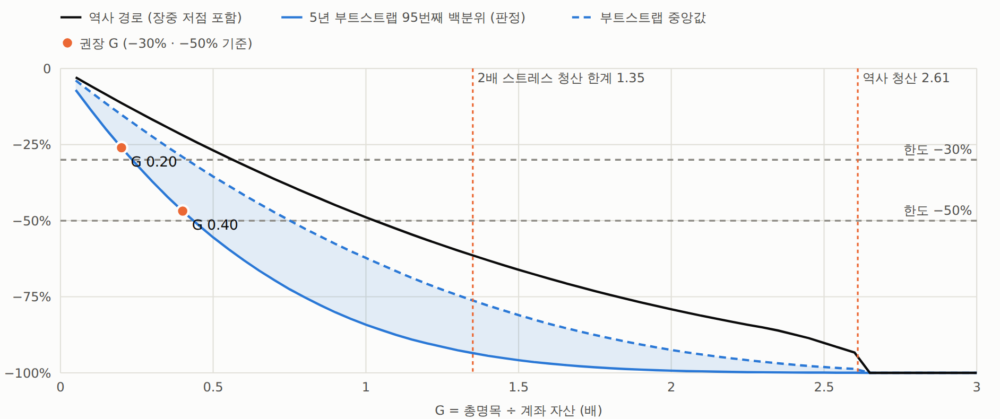
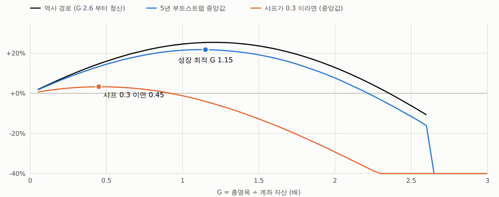
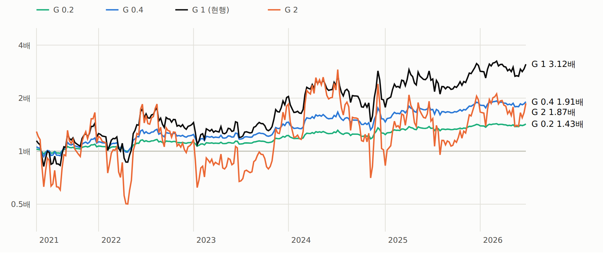

# 시계열 추세 — 코인별 사이징(변동성) · 교차 증거금 레버리지 — 결과 (2026-09-25)

사전등록: [`시계열추세-사이징-레버리지-사전등록.md`](077_시계열추세-사이징-레버리지-사전등록.md) (실행 전 작성). 규칙 · 판정을 바꾸지 않고 한 번 실행했다.
47심볼 · 월 00:00 UTC 주간 리밸런스 · 269주 (2021-05-03 ~ 2026-06-22 시작) · 되맞춤까지 넣은 실제 거래량 수수료 6bps · 봉인 창은 열지 않는다.
보고서 `out/tsmom_sizing.html`.

## 요약

- **사이징: 변동성으로 코인 비중을 바꿔도 결과가 사실상 같다 — 사전등록 기준으로 셋 다 채택 안 됨.** 차이는 전부 잡음 범위다.
  47개가 한 방향(시장 추세) 베팅이라 코인 사이 비중으로는 위험이 거의 안 바뀐다(사전 변동성 52% → 역변동성 49%).
  **결과를 정하는 건 총노출 G 다.**
- **교차 증거금 청산은 늦게 온다**: 역사 경로에서 G ≥ **2.61** 부터 청산. 장중 최악을 2배로 키워도 버티는 한계 **1.35**.
- **낙폭 한계가 훨씬 먼저 막는다**: 권장(사전등록 규칙) **−30% 한도 → G 0.20, −50% 한도 → G 0.40**. 레버리지가 필요 없는 수준.
- **성장 최적 G 는 약 1.15** (표본 샤프 그대로일 때) — 샤프가 0.3 이면 0.45. 표본 샤프가 유의하지 않아 켈리를 따르면 위험하다.

## 1부 — 사이징

| 방식 | 샤프 | 전반 | 후반 | 변동성 30% 로 맞춘 연복리 | 그때 최대낙폭 | 수수료 연 | 평균 G |
|---|---:|---:|---:|---:|---:|---:|---:|
| S0 동일 명목 (현행) | 0.672 | 0.58 | 0.76 | +17.0% | -27% | 1.62% | 1.00 |
| S1 역변동성 (위험 균등) | 0.676 | 0.56 | 0.78 | +17.1% | -26% | 1.65% | 1.00 |
| S2 변동성 비례 | 0.727 | 0.72 | 0.73 | +18.9% | -28% | 1.64% | 1.00 |
| S0 + 포트폴리오 변동성 타깃 | 0.723 | 0.72 | 0.73 | +18.8% | -27% | 2.16% | 0.77 |
| S1 + 변동성 타깃 (서술) | 0.681 | 0.70 | 0.67 | +17.3% | -30% | 2.41% | 0.84 |
| S2 + 변동성 타깃 (서술) | 0.812 | 0.83 | 0.79 | +22.1% | -24% | 1.77% | 0.69 |

| 사전등록 판정 | 샤프 차이 | 블록 부트스트랩 t | 95% 구간 | 떨어진 조건 | 결과 |
|---|---:|---:|---:|---|:-:|
| S1 vs S0 | +0.004 | +0.12 | -0.07 ~ +0.07 | 전반 0.56 < 0.58 | **기각** |
| S2 vs S0 (기준 t ≥ 2) | +0.055 | +1.06 | -0.04 ~ +0.17 | t 1.06 · 후반 0.73 < 0.76 | **기각** |
| S0+VT vs S0 | +0.052 | +0.27 | -0.34 ~ +0.42 | 후반 0.73 < 0.76 | **기각** |

- VT 는 채택된 비중이 없어 S0 에 대해 판정했다. S1+VT · S2+VT 는 서술 (S2+VT 0.81 이 가장 높지만 S2 가 채택되지 않아 판정 대상이 아니다 — 여러 조합 중 최고를 고르는 것).
- 역변동성 창 민감도: 20일 0.727 · 90일 0.669 / 변동성 비례 20일 0.682 · 90일 0.723.
- **반기 샤프는 한 주에 흔들린다**: 경계 주(2023-10-30, +10%)를 어느 쪽에 넣느냐로 반기 샤프가 0.07 씩 움직인다. 세 판정 모두 이 정도 차이에서 갈렸다.
- 위험 균등은 저변동 코인 비중이 커진다 (평균 TRX 4.1% · BTC 3.7% · ETH 2.8%, 동일 명목은 2.1%).
  성과가 같으니 **유동성이 얇은 고변동 소형 코인 비중을 줄이고 싶다면** 고를 수는 있다 — 성과 근거가 아니라 실무 근거다.
- 수수료를 되맞춤까지 넣으면 현행도 연 1.32% → 1.62%, 샤프 0.677 → 0.672 (예전 백테스트는 부호가 바뀐 몫만 매겼다).

## 2부 — 교차 증거금 레버리지 (현행 S0 · 고정 G)

모형: 매주 월 00:00 UTC 에 G 로 맞추고 수량 고정, 5분봉으로 장중 자산을 따라가며 자산 ≤ 유지증거금(MMR × 현재 총명목)이면 청산.
MMR 2% (OKX 1단계 0.5 ~ 2% 보다 보수적). OKX 교차 증거금은 유지증거금률 100% 이하에서 청산하고, 레버리지 설정은 개시증거금에만 영향을 준다.

**청산 한계 (그 G 이상이면 역사 경로에서 청산)**

| 경로 · 가정 | 한계 G |
|---|---:|
| 5분 종가 · MMR 2% | 2.61 |
| 5분 종가 · MMR 2% · **장중 손실 2배 (L1)** | **1.36** |
| 보수적(롱 저가 · 숏 고가 동시) · MMR 2% | 2.58 |
| 5분 종가 · MMR 5% | 2.35 |
| 보수적 · MMR 5% · 손실 2배 | 1.27 |

모든 한계가 **2021-05-24 주**에서 나온다: 롱 3 · 숏 44 (5월 폭락 뒤 신호가 거의 다 숏). 수요일 00:00 UTC 까지 알트가 반등해
(UNI +76% · LINK +72% · TRB +71%) G 1 기준 장중 **-35.45%**, 주말엔 −14.8%. 주 종가 기준 최악의 주는 2024-12-16 (-22.3%).

**낙폭 한계 (L2) 와 권장**

- 4주 블록 부트스트랩 5년 경로 10,000개, 장중 저점 포함 최대낙폭의 95번째 백분위 ≤ 30% → **G 0.20**, ≤ 50% → **G 0.40**.
- 권장 = min(L1, L2) = **−30% 기준 G 0.20 · −50% 기준 G 0.40**.
- 블록 길이 민감도(서술): 12주 블록 0.30 · 0.55, 26주 블록 0.35 · 0.60.
  긴 블록은 과거 순서를 더 많이 보존한다 — 추세 전략의 손실 뒤 회복 패턴이 섞이지 않아 낙폭이 덜 나온다. 권장 범위: **−30% → 0.2 ~ 0.35, −50% → 0.4 ~ 0.6**.
- 역사 경로의 낙폭은 섞은 경로 분포의 하위 12% (G 1: −49% vs 중앙 −62%) — 실제 순서가 운 좋은 편이었다.
- 주말 종가 기준 95% 낙폭(서술): G 0.2 −25% · G 0.4 −46% · G 1 −83%.

| G | 역사 연복리 | 역사 최대낙폭 (장중) | 최악의 주 | 5년 중앙 연복리 | 5년 중앙 낙폭 | 95% 낙폭 | 5년 손실 확률 | 청산 확률 |
|---:|---:|---:|---:|---:|---:|---:|---:|---:|
| 0.2 | +7.1% | −11% | -4% | +6.5% | −15% | −26% | 7% | 0% |
| 0.4 | +13.3% | −22% | -9% | +12.1% | −29% | −47% | 9% | 0% |
| 0.5 | +16.0% | −27% | -11% | +14.5% | −35% | −56% | 11% | 0% |
| 0.75 | +21.4% | −39% | -17% | +19.1% | −50% | −73% | 15% | 0% |
| 1 | +24.6% | −49% | -22% | +21.5% | −62% | −84% | 19% | 0% |
| 1.25 | +25.4% | −58% | -28% | +21.5% | −73% | −91% | 24% | 0% |
| 1.5 | +23.7% | −66% | -33% | +19.2% | −81% | −96% | 30% | 0% |
| 2 | +12.9% | −79% | -45% | +7.7% | −92% | −99% | 43% | 0% |
| 2.5 | -6.2% | −90% | -56% | -11.5% | −98% | −100% | 58% | 0% |
| 3 | 청산 | 100% | -67% | -100.0% | −100% | −100% | 88% | 64% |

**성장 최적 · 샤프 0.3 시나리오**

- 연복리가 가장 큰 G: 역사 1.20 · 부트스트랩 중앙 1.15. 그 너머는 변동성 끌림으로 오히려 준다 (G 2.5 역사 −6.2%/년).
- 주 수익에서 39.7bps 를 빼 샤프를 0.3 으로 낮추면: 성장 최적 0.45, 권장 −30% 0.15 · −50% 0.30,
  G 1 의 5년 중앙 연복리 −1.2% · 5년 손실 확률 52%.

**변동성 타깃으로 G 를 자동 조절 (서술)** — 매주 G = min(3, 목표 ÷ 직전 60일 포트폴리오 변동성)

| 목표 변동성 | 평균 G | 최대 G | 역사 연복리 | 역사 최대낙폭 | 5년 중앙 연복리 | 95% 낙폭 |
|---|---:|---:|---:|---:|---:|---:|
| 10% | 0.26 | 1.37 | +7.4% | −10% | +6.7% | −25% |
| 20% | 0.52 | 2.73 | +14.0% | −20% | +12.7% | −46% |
| 22.5% | 0.59 | 3.00 | +15.5% | −23% | +14.0% | −50% |
| 30% | 0.77 | 3.00 | +19.7% | −30% | +17.7% | −61% |
| 40% | 1.01 | 3.00 | +25.4% | −38% | +22.6% | −71% |

같은 95% 낙폭에서 고정 G 와 수익이 거의 같다. 조용한 시기에 G 를 3배 가까이 올리므로 조용함 뒤 급변에는 고정 G 보다 약하다.

**교차 증거금 환산** — 레버리지 L 로 설정하고 G 만큼 열면 개시증거금 (100 − n)% 가 묶이고 n% 가 남는다 (n = 1 − G ÷ L). 청산은 G 로만 정해진다.

| 거래소 레버리지 L | G 0.20 일 때 잉여 n | G 0.40 일 때 잉여 n | G 1 일 때 잉여 n |
|---|---:|---:|---:|
| 1배 | 80% | 60% | 0% |
| 2배 | 90% | 80% | 50% |
| 3배 | 93% | 87% | 67% |
| 5배 | 96% | 92% | 80% |
| 10배 | 98% | 96% | 90% |

## 뜻

- 코인 비중은 현행(동일 명목) 그대로 둔다 — 변동성 사이징은 개선 근거가 없다.
- 총노출은 **낙폭 한도로 정한다**: −30% 면 G 0.2 ~ 0.35, −50% 면 0.4 ~ 0.6. 청산 한계(1.35)는 그보다 훨씬 위라 교차 증거금에선 청산이 먼저 문제되지 않는다.
- 레버리지로 수익을 늘리는 건 표본 샤프(0.68, t 1.5)가 진짜라는 가정에 기댄다. 샤프가 0.3 이면 G 0.45 를 넘는 순간 기대 복리가 줄어든다.

## 검증

- 테스트 `tests/test_sizing.py` (5): 비중 정규화 · 되맞춤 거래량 수수료 손계산 · G 배수와 펀딩 · 장중 경로와 청산 임계 손계산 · 자산 경로와 낙폭 손계산. 전체 330 통과.
- 동일 명목 + 부호 수수료 = 예전 V0 (269주 정확히 같음). 장중 경로의 주 끝 = 주간 수익 (float32 오차 2e-5 안).
- 독립 재계산: 2021-05-24 주 장중 최저 −35.45% 를 원자료 5분봉에서 pandas 로 따로 계산해 같음 · 1부 샤프 0.672 · 0.676 · 0.727 · 0.723 을 모듈 없이 반복문으로 같음 ·
  부트스트랩을 단순 반복문으로 다시 뽑아 G 1 중앙 62.3% · 95% 84.5% (본 계산 62.3% · 84.2%).
- 고정 G 근사: 부트스트랩은 G 1 의 총노출당 수익을 G 배 한다 — G 2 에서 연복리 13.2% vs 장부 재계산 12.9% (역사 표는 G 마다 장부를 다시 계산했다).

## 코드

- `qbot/research/sizing.py` — `unit_weights` · `book` · `week_paths` · `liq_threshold` · `equity_path` · `mdd`
- `examples/tsmom_size_build.py` → `runs/tsmom_size/{close,high,low}.npy` (47 × 542,305 봉)
- `examples/tsmom_size_run.py` (1부) → `runs/tsmom_size/part1.json` · `examples/tsmom_lev_run.py` (2부) → `runs/tsmom_size/part2.json`
- `examples/tsmom_size_report.py` → `out/tsmom_sizing.html`

출처: [OKX 교차 증거금 청산 규칙](https://www.okx.com/en-us/help/iii-single-currency-margin-cross-margin-trading) · [OKX 유지증거금률 단계](https://www.okx.com/en-gb/help/adjustment-of-perpetual-swap-tiered-maintenance-margin-ratio-schedule)

## 그림

보고서: [사이징과 레버리지](../../out/tsmom_sizing.html) (`out/tsmom_sizing.html`)

*절: 1. G 별 최대낙폭 — 청산보다 낙폭이 먼저 막는다*

*절: 2. G 별 연복리 — 더 걸면 오히려 준다*

*절: 3. G 별 누적 자산 (로그 축)*
