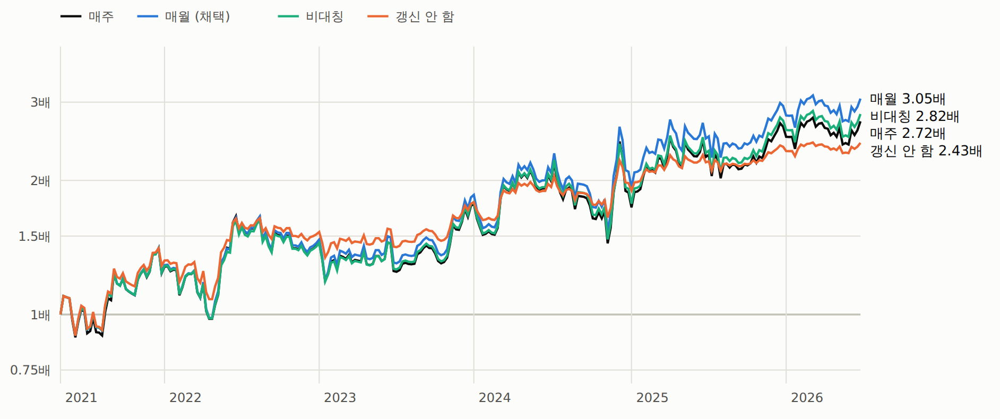
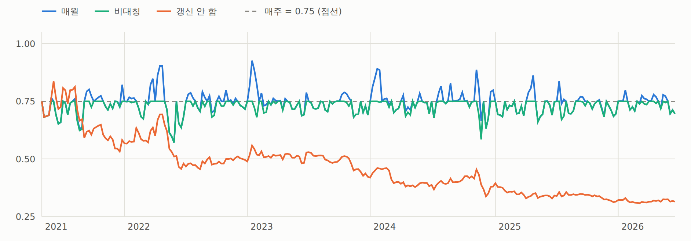
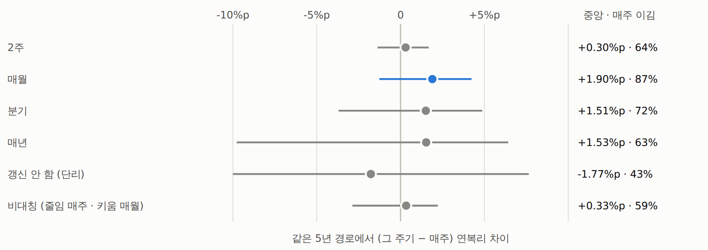
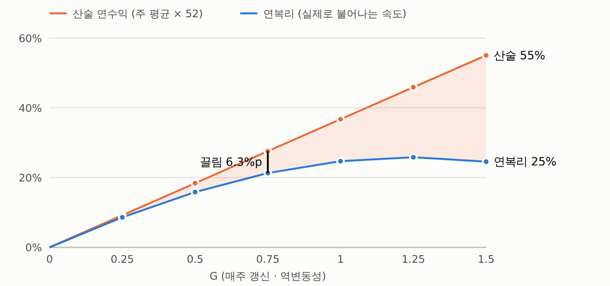

# 시계열 추세 — 복리 주기(사이징 기준 자산 갱신) — 결과: 매월 갱신 채택 (2026-09-26)

사전등록: [`시계열추세-복리주기-사전등록.md`](079_시계열추세-복리주기-사전등록.md) (실행 전 작성). 규칙 · 판정을 바꾸지 않고 한 번 실행했다.
역변동성(S1, 60일) · **G 0.75** · 47심볼 · 269주 · 되맞춤 수수료 6bps · 펀딩 · 교차 증거금(MMR 2%) · 봉인 창은 열지 않는다.
매주 신호 · 비중은 그대로 바꾸고, **명목을 계산하는 자산 B** 를 언제 지금 자산으로 바꾸느냐만 달리했다 (코인 명목 = 0.75 × B × w, 실효 G = 0.75 × B ÷ 지금 자산).
보고서 `out/tsmom_compound.html`.

## 판정 — 매월 갱신 채택 (세 조건 모두 통과)

| 조건 | 매월 | 매주 | 통과 |
|---|---:|---:|:-:|
| ① 역사 연복리 ≥ 매주 | 24.1% (3.05배) | 21.3% (2.72배) | ○ |
| ② 최대낙폭(장중 포함) 2%p 넘게 나빠지지 않음 | −35.5% | −36.5% | ○ |
| ③ 부트스트랩: 매주를 이길 확률 ≥ 60% · 낙폭 중앙 1%p 넘게 나빠지지 않음 | 87% · 낙폭 중앙 -1.3%p | — | ○ |

## 주기별

| 갱신 주기 | 횟수 | 5년 | 연복리 | 최대낙폭 | 샤프 | 실효 G | 섞은 연복리 중앙 | 섞은 낙폭 중앙 · 95% | 매주 이김 | 차이 중앙 | 섞은 실효 G 최대 95% |
|---|---:|---:|---:|---:|---:|---:|---:|---:|---:|---:|---:|
| 매주 | 269 | 2.72배 | +21.3% | −36.5% | 0.68 | 0.75 ~ 0.75 | +18.9% | −49% · −72% | 0% | +0.00%p | 0.75 |
| 2주 | 135 | 2.73배 | +21.5% | −35.9% | 0.68 | 0.67 ~ 0.86 | +19.1% | −49% · −71% | 64% | +0.30%p | 0.89 |
| **매월** | 62 | 3.05배 | +24.1% | −35.5% | 0.73 | 0.57 ~ 0.93 | +20.9% | −48% · −70% | 87% | +1.90%p | 1.00 |
| 분기 | 21 | 3.28배 | +25.8% | −35.5% | 0.77 | 0.52 ~ 0.93 | +20.6% | −48% · −72% | 72% | +1.51%p | 1.34 |
| 매년 | 6 | 3.51배 | +27.5% | −33.2% | 0.82 | 0.50 ~ 0.99 | +20.9% | −47% · −77% | 63% | +1.53%p | 2.11 |
| 갱신 안 함 (단리) | 1 | 2.43배 | +18.7% | −25.3% | 0.77 | 0.31 ~ 0.84 | +17.6% | −35% · −77% | 43% | -1.77%p | 2.47 |
| 비대칭 (줄임 매주 · 키움 매월) | 62 | 2.82배 | +22.2% | −35.8% | 0.70 | 0.57 ~ 0.75 | +19.3% | −47% · −70% | 59% | +0.33%p | 0.75 |

역사 = 실제 269주 (매월 = 달력 월 첫 월요일 · 분기 = 1·4·7·10월 · 매년 = 1월). 섞은 = 4주 블록 부트스트랩 5년 경로 10,000개 (4 · 13 · 52주마다 갱신), 같은 경로에서 매주와 짝 비교.
역사 경로에서 청산 없음 (청산 임계 G 2.64). 분기 · 매년 · 갱신 안 함 · 비대칭은 서술 — 표본 안에서 더 좋아 보여도 채택하지 않는다.

## 왜 — 전략 손익이 몇 달 단위로 되돌아온다 (사후 서술)

- 전략(S1, 총노출 1배당) 주간 수익의 자기상관 1 ~ 4주: -0.020 · -0.092 · -0.064 · -0.107.
- 분산비(q주 합의 분산 ÷ q × 주간 분산, 1 이면 무작위): 4주 **0.85** (p 0.11) · 13주 **0.52** (p 0.014) ·
  26주 **0.36** (p 0.015). p = 주 순서를 3,000번 섞었을 때 이만큼 작을 확률.
- 손실 구간 뒤에 이익이 오는 경향이 있으면, 매주 갱신은 손실 직후 크기를 줄이고 이익 직후 키워 '싸게 팔고 비싸게 사는' 셈이 된다.
  매월 갱신은 한 달 안에선 크기를 그대로 둬서 그 손해를 덜 본다 — 한 달 단위의 분산이 주 단위 분산 × 4 보다 작아 **변동성 끌림이 줄어드는 것**과 같은 얘기다.
- 비대칭(손실 땐 매주 줄임)의 이점이 작은 것(22.2%)도 같은 이유 — 이점은 '손실 뒤 크기를 유지하는 것' 에서 나온다.

## 얼마나 믿을 만한가

| 섞는 블록 길이 | 매월 · 블록 경계에 맞춤 | 매월 · 2주 어긋남 | 분기 · 맞춤 | 분기 · 어긋남 |
|---|---:|---:|---:|---:|
| 1주 (IID) | 49% · -0.03%p | 49% · -0.04%p | 49% · -0.07%p | 49% · -0.08%p |
| 4주 | 86% · +1.92%p | 58% · +0.32%p | 72% · +1.56%p | 72% · +1.57%p |
| 8주 | 84% · +1.96%p | 77% · +1.20%p | 87% · +2.72%p | 87% · +2.73%p |
| 13주 | 81% · +1.60%p | 80% · +1.61%p | 99% · +4.33%p | 96% · +3.54%p |

(칸 = 매주 이김 비율 · 연복리 차이 중앙)

- **주를 하나씩 섞으면(IID) 차이가 사라진다** — 효과는 전부 순서(되돌림)에서 나온다. 그래서 매월로 바꿔 잃을 건 거의 없고(−0.03%p),
  되돌림이 앞으로도 이어지면 연 1 ~ 3%p 를 더 얻는다.
- 4주 블록에서 갱신 시점을 블록과 어긋나게 하면 이점이 58% · +0.3%p 로 준다 — 한 달 안 되돌림만으론 약하고(4주 분산비 p 0.11), 몇 달 단위 되돌림이 더 뚜렷하다.
  블록을 8 · 13주로 늘려 과거 순서를 더 살리면 어긋나도 77 ~ 80% · +1.2 ~ 1.6%p.
- 되돌림은 **결과를 보고 찾은 성질**이다. 5년에 반년짜리 구간이 10개뿐이라, 계속된다는 보장은 없다.
- 동일 명목(S0)에서도 같은 순서: 매주 21.4% · 매월 24.4% · 분기 26.1%.

## G 에 따라 (연복리 · 최대낙폭)

| | 매주 | 매월 | 비대칭 | 갱신 안 함 |
|---|---:|---:|---:|---:|
| G 0.5 | +15.9% · −25% | +17.0% · −25% | +16.1% · −25% | +13.8% · −19% |
| G 0.75 | +21.3% · −37% | +24.1% · −35% | +22.2% · −36% | +18.7% · −25% |
| G 1.0 | +24.7% · −47% | +30.1% · −45% | +26.7% · −45% | +22.9% · −33% |

G 가 클수록 주기 효과도 커진다. G 1 매월은 실효 G 가 1.34 까지 오른다.

## 복리와 변동성 끌림 (매주 갱신 · 역변동성)

| G | 산술 연수익 | 연복리 | 끌림 | 5년 |
|---:|---:|---:|---:|---:|
| 0.25 | 9.2% | 8.6% | 0.6%p | 1.53배 |
| 0.5 | 18.4% | 15.9% | 2.5%p | 2.14배 |
| 0.75 | 27.6% | 21.3% | 6.3%p | 2.72배 |
| 1 | 36.7% | 24.7% | 12.0%p | 3.13배 |
| 1.25 | 45.9% | 25.8% | 20.1%p | 3.28배 |
| 1.5 | 55.0% | 24.6% | 30.5%p | 3.12배 |

연복리 ≈ 산술 − 분산 ÷ 2. 산술 수익은 G 에 비례하지만 끌림은 G² 로 커져 G 1.25 근처가 꼭대기다.
**복리를 가장 크게 좌우하는 건 G 자체**이고, 매월 갱신은 G 0.75 의 끌림 6.3%p 중 일부를 되찾는다.

## 연도별 (복리)

| 연도 | 매주 | 매월 | 비대칭 | 갱신 안 함 |
|---|---:|---:|---:|---:|
| 2021 | +28.1% | +29.2% | +28.5% | +32.2% |
| 2022 | +13.5% | +14.0% | +12.7% | +16.0% |
| 2023 | +22.3% | +26.0% | +23.7% | +16.6% |
| 2024 | -2.1% | +3.8% | -0.9% | +6.2% |
| 2025 | +44.1% | +45.3% | +46.4% | +22.7% |
| 2026 | +8.4% | +9.1% | +8.6% | +4.3% |

## 운용 (매월 갱신)

1. 매달 **첫 월요일 00:00 UTC** 에 계좌 총자산(미실현 손익 포함, USDT)을 읽어 **B** 로 저장한다.
2. **매주 월요일**: 28일 부호와 60일 역변동성 비중 w 를 계산하고, 코인별 목표 명목 = **0.75 × B × w** 로 주문한다. B 는 그 달 내내 그대로.
3. **이익금은 인출하지 않는다** — 다음 달 B 에 들어가야 복리가 붙는다. 입출금이 있었으면 그 달 B 에 반영한다.
4. 참고: 실효 G 가 1 을 넘으면 B 를 앞당겨 갱신하는 안전장치는 역사 경로에서 한 번도 걸리지 않는다(최대 0.93) — 걸어도 결과는 같다. 섞은 경로에선 약 5% 에서 걸린다.
5. G 0.75 자체의 위험은 그대로다: 역사 최대낙폭 −35%, 섞은 경로 중앙 −48% · 95% −70% ([`시계열추세-사이징-레버리지-결과.md`](078_시계열추세-사이징-레버리지-결과.md)).

## 검증

- 테스트 `tests/test_sizing.py` (+2 = 7): 매주 갱신 = 기존 장부, 매월 · 비대칭 · 갱신 안 함의 실효 G 손계산, 장중 저점 · 청산. 전체 332 통과.
- 독립 재계산(모듈 없이 반복문, 일 가격표에서 직접): 매주 2.716배 · 매월 3.054배(실효 G 0.57 ~ 0.93) · 갱신 안 함 2.428배 — 일치.

## 코드

- `qbot/research/sizing.py::book_cadence`
- `examples/tsmom_compound_run.py` → `runs/tsmom_compound.json` · `runs/tsmom_compound_weekly.csv`
- `examples/tsmom_compound_report.py` → `out/tsmom_compound.html`

## 그림

보고서: [복리 주기](../../out/tsmom_compound.html) (`out/tsmom_compound.html`)

*절: 1. 누적 자산 (로그 축)*

*절: 2. 실효 G — 명목 ÷ 지금 자산*

*절: 3. 매주 대비 — 같은 5년 경로에서 짝 비교*

*절: 7. 복리와 변동성 끌림*
