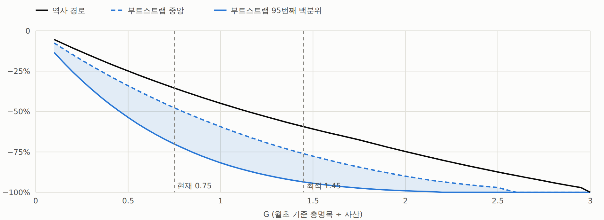
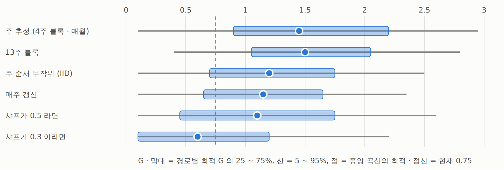

# 시계열 추세 — 매월 갱신에서 복리가 가장 큰 G — 결과 (2026-09-26)

사전등록: [`시계열추세-매월갱신-최적G-사전등록.md`](081_시계열추세-매월갱신-최적G-사전등록.md) (실행 전 작성). 추정 방법을 바꾸지 않고 한 번 실행했다.
역변동성(S1) · 매월 갱신 · 교차 증거금(MMR 2%, 장중 5분 청산 = 파산) · 47심볼 · 269주 · G 0.10 ~ 3.00 (0.05 간격) · 봉인 창은 열지 않는다.
보고서 `out/tsmom_optg.html`.

## 답 — 꼭대기가 있다

| 추정 | 최적 G | 그때 연복리 |
|---|---:|---:|
| **부트스트랩 중앙 (주 추정)** — 4주 블록 5년 경로 10,000개의 연복리 중앙값 최대 | **1.45** | 29.2% |
| 역사 경로 한 줄 | 1.90 | 39.9% |
| (비교) 매주 갱신 · 부트스트랩 중앙 | 1.15 | 21.9% |
| 경로별 최적 G 분포 (매월) | 5% 0.10 · 25% 0.90 · 50% 1.50 · 75% 2.20 · 95% 2.95 | |

- 산술 수익은 G 에 비례하지만 변동성 끌림(≈ 분산 ÷ 2)이 G² 로 커져 연복리에 꼭대기가 생긴다(켈리). 매월 갱신은 한 달 단위 변동이 작아(되돌림)
  꼭대기가 매주(1.15)보다 오른쪽(1.45)에 있다. 켈리 근사(주 평균 ÷ 주 분산) 1.24 는 매주 최적과 맞는다.
- **꼭대기는 평평하고 위험은 가파르다.** G 1.45: 섞은 경로 낙폭 중앙 −76% · 95% −94%, 5년 손실 확률 20%.
  역사 경로는 1.5 ~ 2.25 가 연 38 ~ 40% 로 거의 평평한데 낙폭은 −61% → −81%.
- **현재 0.75 는 사실상 절반 켈리다.** 섞은 연복리 중앙 20.9% = 최대의 **72%**, 낙폭 중앙 −48%
  (이론: 절반 켈리 = 최대 복리의 3/4, 변동성 절반).
- **최적을 넘으면 급히, 모자라면 천천히 준다.** G 2.2 부터 22.5% 경로가 청산, 2.6 이면 절반 넘게 청산(중앙 −100%). 모를 땐 작게 거는 쪽이 싸다.

## G 표 (매월 갱신)

| G | 역사 연복리 | 5년 | 역사 낙폭 | 역사 실효 G 최대 | 섞은 연복리 중앙 | 5% | 섞은 낙폭 중앙 · 95% | 5년 손실 | 청산 | 섞은 실효 G 최대 95% |
|---:|---:|---:|---:|---:|---:|---:|---:|---:|---:|---:|
| 0.5 | +17.0% | 2.25배 | −25% | 0.57 | +15.1% | -3% | −34% · −54% | 9% | 0.0% | 0.60 |
| 0.75 | +24.1% | 3.05배 | −35% | 0.93 | +20.9% | -7% | −48% · −70% | 11% | 0.0% | 1.00 |
| 1 | +30.1% | 3.90배 | −45% | 1.34 | +25.3% | -11% | −59% · −82% | 14% | 0.0% | 1.49 |
| 1.25 | +34.7% | 4.68배 | −53% | 1.83 | +28.2% | -17% | −69% · −89% | 17% | 0.0% | 2.12 |
| 1.45 | +37.5% | 5.19배 | −59% | 2.29 | +29.2% | -22% | −76% · −94% | 20% | 0.0% | 2.77 |
| 1.75 | +39.7% | 5.63배 | −68% | 3.15 | +28.2% | -32% | −84% · −97% | 25% | 0.0% | 4.13 |
| 1.9 | +39.9% | 5.68배 | −72% | 3.67 | +26.2% | -38% | −88% · −99% | 29% | 0.0% | 5.07 |
| 2.25 | +38.0% | 5.29배 | −81% | 5.24 | +12.8% | -100% | −94% · −100% | 43% | 22.5% | 8.67 |

## 민감도 — 최적 G 는 아주 불확실하다

| 설정 | 최적 G (중앙 곡선) | 그때 연복리 중앙 | 경로별 최적 25 ~ 75% |
|---|---:|---:|---:|
| 주 추정 (4주 블록 · 매월) | 1.45 | +29.2% | 0.90 ~ 2.20 |
| 매주 갱신 (비교) | 1.15 | +21.9% | 0.65 ~ 1.65 |
| 주 순서 무작위 (IID) | 1.20 | +26.0% | 0.70 ~ 1.75 |
| 13주 블록 | 1.50 | +31.2% | 1.05 ~ 2.05 |
| MMR 5% | 1.45 | +29.2% | 0.90 ~ 2.20 |
| 샤프 0.5 (주 18bps 차감) | 1.10 | +14.0% | 0.45 ~ 1.75 |
| 샤프 0.3 (주 39bps 차감) | 0.60 | +4.1% | 0.10 ~ 1.20 |

- **엣지(샤프)가 작으면 최적 G 가 확 준다** — 0.5 면 1.10, 0.3 이면 0.60. 표본 샤프 0.68 은 유의하지 않다(t 1.5).
- 주 순서를 무작위로 섞으면(되돌림 없음) 1.20 — 매월 갱신이 최적 G 를 올리는 몫은 되돌림(사후 발견)에 기댄다.

## 매월 갱신 + 큰 G 의 함정

- 한 달 안에서 손실이 나면 실효 G = G × B ÷ 지금 자산 이 치솟는다: G 1.45 에서 역사 최대 2.29 · 섞은 경로 95% 2.77,
  G 2 에서 역사 4.06 · 95% 5.85. 청산 한계(장중 최악 주 기준 약 2.6)에 가깝다.
- 큰 G 를 쓰려면 달 중간 실효 G 상한(예: 넘으면 B 를 앞당겨 갱신)이 필요하다 — **검증하지 않았다.** G 0.75 에선 역사 최대 0.93 이라 필요 없다.

## 뜻

- '최대 이익 G' 는 약 1.45 (역사 한 줄로는 1.9) 지만 그 값은 추정 오차가 크고, 거기서 얻는 복리는 −76% 안팎의 낙폭 중앙을 대가로 한다.
- 현재 0.75 는 최대 복리의 약 72% 를 얻는 절반 켈리 — 엣지가 과대추정됐을 때(샤프 0.5 → 최적 1.1, 0.3 → 0.6)도 크게 다치지 않는 자리다.
- 올린다면 0.75 → 1.0 (섞은 연복리 중앙 20.9% → 25.3%, 낙폭 중앙 −48% → −59%) 정도가 최적의 약 70% 지점이다. 그 이상은 얻는 복리보다 낙폭이 훨씬 빨리 커진다.

## 검증

- 역사 연복리를 모듈 없이 일 가격표에서 반복문으로 다시 계산: G 0.75 · 1.45 · 1.9 → 24.09% · 37.46% · 39.88%, 실효 G 최대 0.93 · 2.29 · 3.67 — 일치.
- 부트스트랩 중앙을 단순 반복문 3,000 경로(블록 안 명목 고정)로 다시: G 0.75 · 1.15 · 1.45 → 21.2% · 27.5% · 29.5% (본 계산 20.9% · 27.2% · 29.2%).

## 코드

- `examples/tsmom_optg_run.py` → `runs/tsmom_optg.json` · `examples/tsmom_optg_report.py` → `out/tsmom_optg.html`
- 장부 · 부트스트랩: `qbot/research/sizing.py::book_cadence` · `examples/tsmom_compound_run.py::boot_run`

## 그림

보고서: [매월 갱신 최적 G](../../out/tsmom_optg.html) (`out/tsmom_optg.html`)

*절: 1. G 별 연복리*

*절: 2. G 별 최대낙폭 (장중 포함)*

*절: 3. 최적 G 는 얼마나 확실한가*
